<!-- DRAFT. Do not treat as camera-ready.

  TODO (final pass, after content is approved):
   1. Major narrative re-org: move raw-data exploration (parts of Section 7) ahead of
      the propensity model.
   2. Section 9.1 (estimand / non-causal framing) is reserved for M. Schuckers and is
      still unwritten.

  DONE in the copy-edit pass: every figure now carries a #fig- label and caption and is
  cross-referenced in the text in order; all five tables are cross-referenced; Section 7
  numbering gap closed. The M3-pop A/B variant comparison (former Section 5.5) was cut
  as non-central; only the adopted construction is stated, in Section 4.1. The refit
  variant is still fitted and scored in notebooks 03/04 if the comparison is ever needed.
  Bridge paragraphs were added under Sections 4 and 5.

  DONE in the relabel pass: M2 is now the pseudo-label augmented model and M3 the
  IPW-weighted model, matching the order in which the two corrections were developed.
  This was a pure relabel of the notebooks and the manuscript, with no change to any
  model specification, so every number is unchanged from the prior draft.

  NUMBERS: every table and figure in this draft was regenerated from a complete local
  re-run of notebooks 01-05 under the revised specification (humidity added, splined
  weather main effects, centered season trend in the propensity model, both M3-pop
  variants, M2 with and without PATs). No placeholder values remain.
-->

# Abstract

NFL field goal (FG) outcomes are observed under a selective coaching decision process: teams attempt kicks in favorable game states, so the observed attempt distribution over-represents an easier subset of the full universe of possible kicks. We compare the results of an unweighted full GLMM baseline (M1) to two successive attempts at correcting that selection. The first builds a more complete training universe directly, augmenting the observed attempts with point-after-touchdown kicks and with declined fourth-down attempts entered as assumed misses (M2). The second leaves the training universe alone and instead applies inverse probability weighting (IPW) to reweight observed FG attempts by the inverse of their estimated propensity to be attempted (M3). The attempt propensity model is trained on a rolling window of all fourth-down plays ($n = 32,666$ plays) to predict coaching decisions. The success outcome models are trained and evaluated on actual FG attempts ($n = 11,548$ in-sample attempts; $n = 2,251$ held-out test kicks). M2 does not improve on M1 on either split, and heavier augmentation weights degrade its fit further rather than sharpening it. M3 fares better in-sample, achieving the best fit overall (Brier 0.0983, log-loss 0.3217) with calibration gains concentrated at long distances: a 22.3% Brier reduction at 60+ yards and a 5.4% reduction at 50-59 yards versus M1. Out of sample, however, M1 outperforms M3 (Brier 0.1004 vs. 0.1026; log-loss 0.3295 vs. 0.3367). The out-of-sample ordering is the same in the pre-2020 and post-2020 halves of the sample. The in-sample improvements are primarily driven by error reduction on the upweighted longer kicks, though these gains do not generalize to out-of-sample data. In predictive terms, correcting for coaching selection does not improve held-out forecasts of kick success: out-of-sample accuracy remains almost entirely a function of distance and environmental covariates. This is a statement about predictive performance, not about the causal effect of the attempt decision. We recommend M1 as the predictive benchmark, and introduce field goal outcome expectation (FGOE), derived from a population-marginal variant of M3, as a principled kicker evaluation metric.

# 1. Introduction

## 1.1 Motivation

NFL field goal kicking is a high-stakes, discrete skill evaluated routinely by teams, broadcasters, and analysts. Kicker performance metrics typically compare observed make rates or expected points added to league-average baselines derived from models trained on attempted kicks. Prior work has attempted to address these difficulties using expectation-based metrics [@pasteur2014; @osborne2017] and distance-adjusted baselines [@long2019eval; @long2019methods], but nearly all such metrics share a structural limitation: they condition on attempts that coaches chose to take.

Coaching selection is not random. When a team faces fourth down at the opponent's 35-yard line, leading or trailing by a few points, the decision to attempt a field goal reflects the coach's assessment of kick distance, weather, the kicker's perceived range, score context, and game leverage. In more favorable situations, kicks are more likely to be attempted. As a result, the observed distribution of FG attempts may systematically over-represent favorable situations and under-represent long, difficult, or weather-degraded attempts.

This motivates a hypothesis that the remainder of the paper tests rather than assumes. If the selection process is sufficiently structured, models trained exclusively on observed attempts may inherit that structure, and kicker evaluation metrics built on them may not fully account for the difficulty distribution each kicker faces. The conjectured mechanism is that coaches who trust their kicker's range assign more difficult kicks, meaning longer attempts, kicks in severe weather, or attempts in high-pressure game states where a more conservative coach would punt or go for it. This is a conjecture about the data-generating process rather than a quantity we estimate, and nothing in what follows should be read as evidence that coaches behave this way. Should the effect be meaningful, raw make rates or simple distance-based baselines would penalize trusted players by ignoring the selective difficulty of their attempts.

This paper investigates whether correcting for coaching selection bias through inverse probability weighting improves field goal outcome models, and whether such corrections produce fairer kicker evaluation metrics. We test whether the selection mechanism is strong enough to warrant a propensity-based correction, and whether the resulting adjustments translate into predictive gains.

## 1.2 Research Questions

Three research questions guide this analysis:

1. Are coaching decisions concerning field goal attempts sufficiently structured to support a propensity-based correction? Specifically, can a multinomial model trained on game-state features predict whether a team will kick with high accuracy?
2. Does augmenting the outcome model training set with non-attempt pseudo-labels (assumed misses) improve long-distance calibration and, if so, at what predictive cost?
3. Does Inverse Probability Weighting (IPW) of observed FG attempts, based on attempt likelihood, improve out-of-sample predictive accuracy relative to an unweighted full GLMM baseline?

# 2. Data

## 2.1 Data Universe

Play-by-play data were obtained via the nflfastR R package [@nflfastr] covering the 2015-2025 NFL regular and post-seasons. The in-sample training set comprised 11,548 FG attempts. Blocked kicks were explicitly excluded from both training and evaluation, as they represent a team-level defensive protection outcome rather than individual kicker success or skill.

We trace the exact 4th-down filtering logic: out of 78,563 raw fourth-down situations, filtering for field position within plausible kicking range (kick distance $\leq$ 70 yards) leaves 32,666 plays used as non-attempt situations for propensity model training and M2 augmentation. An additional 14,073 point-after-touchdown (PAT) attempts were used for M2 data augmentation.

A 20% stratified random sample of games (593 games) formed the held-out test set ($n = 2,251$ kicks). This test set contains only actual field goal attempts (not fourth-down non-attempts or PATs) drawn from disjoint games which otherwise maintain player and season overlaps with the training set ($n = 9,297$ training attempts). The analysis spans 11 seasons (2015-2025), covering the modern NFL kicking environment following rule changes that shifted PAT distance.

## 2.2 Feature Engineering

The primary distance covariate was encoded as a seven-column cubic B-spline basis using `bSpline()` from the splines2 R package. Interior knots were placed at 28, 38, 48, and 58 yards; boundary knots at 18 and 70 yards; the intercept column was excluded from the spline basis, yielding seven identifiable basis vectors spanning the relevant distance range.

Wind speed (mph), temperature ($^\circ$F), and relative humidity (%) were standardized to z-scores globally across the entire attempted kick set (the training attempts combined) to capture standard environmental difficulty. Humidity is parsed from the same game-level weather string as temperature and wind, with indoor games assigned a fixed climate-controlled value and remaining gaps imputed by stadium-month median. Surface type (turf vs. grass), precipitation category (rain showers, snow/sleet), game-clock context (clock running, within last two minutes of a half), iced kicker indicator, and playoff indicator were included as binary covariates.

The weather fields are parsed from free-text game weather strings, and the wind field in particular contained a small number of values that are almost certainly parsing errors rather than real readings, most notably 71 mph in a 2016 game and 70 mph in a 2008 game. Rather than apply a broad statistical cap, which would also touch genuinely windy but plausible games, we correct only values that fail a fixed physical-plausibility threshold of 40 mph. The correction is applied during data preparation, before any downstream standardization or model fitting. Affected rows are treated as missing and re-imputed with the median wind among outdoor attempted kicks below the threshold (8 mph) rather than clipped to the threshold itself. This affects 58 of 137,668 rows across 3 distinct games (0.04%), comprising 7 field goal attempts, 14 PATs, and 37 fourth-down non-attempts. Temperature and humidity showed no comparable outlier and are not corrected.

@fig-weather-raw shows the unadjusted relationships in the raw data. The marginal effects are modest in all three variables, and none is dramatically non-linear over the range where the data are dense. Make rate declines gently and close to monotonically with humidity, from roughly 0.89 at the dry end to roughly 0.85 at the humid end. Temperature is close to flat across its central range. Wind is the least monotone of the three, sitting near 0.87 to 0.88 in calm conditions, falling to roughly 0.845 by 10-12 mph, and then turning modestly upward, although that upturn rests on few kicks and carries wide intervals. The binned points and the LOESS agree closely in all three panels. These panels are not adjusted for distance, which is the dominant confounder, because longer attempts are taken disproportionately in worse conditions. They therefore establish the shape of the marginal relationships rather than the size of any weather effect. @fig-weather-band repeats the exercise within a fixed 40-54 yard band, where the distance mix is roughly held constant.

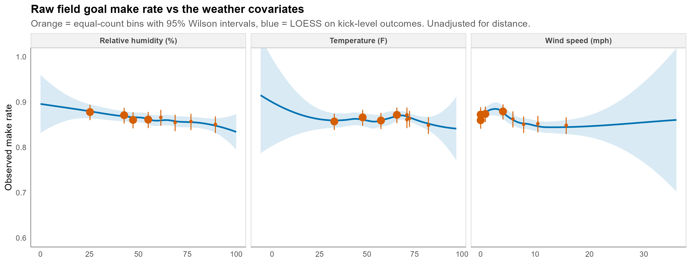{#fig-weather-raw}

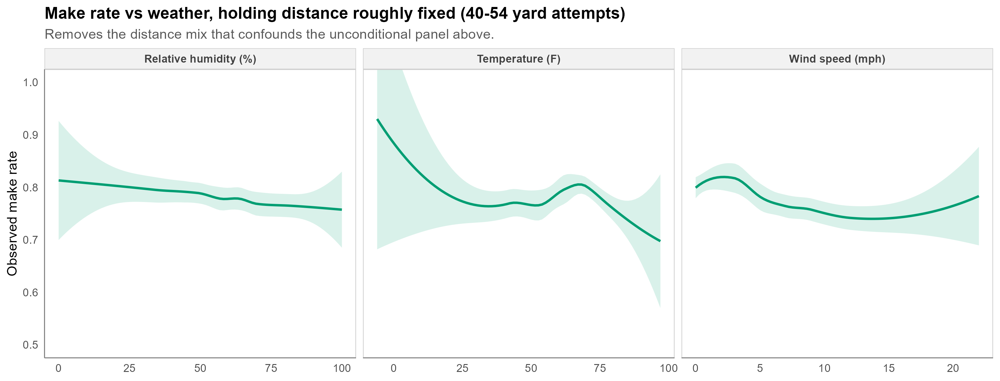{#fig-weather-band}

The three continuous weather covariates enter the outcome model as natural cubic spline main effects with three degrees of freedom each rather than as linear terms. The physics of ball flight gives no reason to expect a constant per-unit effect. A crosswind that is negligible at 10 mph is not merely three times as costly at 30 mph, and temperature acts on the ball partly through air density and partly through its effect on the ball itself, so we let the data determine the shape. The spline bases are constructed once from the distribution of attempted kicks and then applied unchanged to every row used anywhere in the analysis, so that field goals, PATs, non-attempts, and all held-out prediction sets are mapped through an identical basis. An earlier specification instead interacted wind with each distance-spline column, allowing wind sensitivity to vary with distance. We drop those interactions in favor of the simpler additive-on-the-logit treatment described in Section 4.1.

Stadium-level effects (dome, climate, altitude) were modeled with a stadium random intercept. Kicker ability and season-to-season variation were captured with a nested kicker-season random intercept.

## 2.3 Weighting Method

Stabilized inverse probability weights (IPW) were computed for each attempted kick play:

$$w_i^{\text{raw}} = \frac{\bar{\pi}}{\hat{\pi}(X_i)}$$

where $\bar{\pi}$ is the marginal FG attempt prevalence over all plays, and $\hat{\pi}(X_i)$ is the clipped propensity score.

The weight-building process has three stages:

1. **Clipped propensity**: Propensity scores are clipped to the $[0.02, 0.98]$ interval to avoid arithmetic division errors, and stabilized IPW case weights are computed from the clipped scores.
2. **Normalize $\rightarrow$ cap $\rightarrow$ renormalize**: The raw weights are Hajek-normalized to mean one within each season, capped at three standard deviations above the seasonal mean ($\bar{w}_s + 3\sigma_{w,s}$), and then renormalized per season. The two normalizations are not redundant. The cap is defined relative to the seasonal mean and standard deviation, so the first normalization puts every season on a common scale before the cap is applied, and the second restores the per-season mean of exactly 1.0 that the cap necessarily perturbs by truncating the upper tail. The cap is therefore bracketed by the two normalizations, and removing either one changes what the cap does or leaves the seasonal means unequal.
3. **Result**: A per-kick case weight with mean 1.0 in every season and a bounded upper tail.

The resulting case weight, `weight_multinom_hajek`, concentrates weight on long-range, weather-degraded, or contextually unfavorable attempts that coaches selectively avoid, correcting the under-representation of those conditions in the raw sample. As shown in @fig-weights, kick distance is the primary determinant of weight magnitude, with longer kicks receiving larger weights because they are less likely to be attempted. Environmental factors (wind, temperature) and game-state context introduce further variance around this distance trend. The propensity model used to estimate these attempt probabilities is described in the following section.

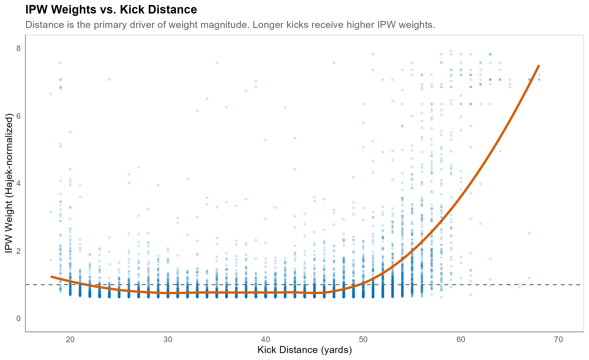{#fig-weights}

# 3. Attempt Propensity Model

## 3.1 Decision Framework

The coaching choice on fourth down represents a three-option decision landscape: attempt a field goal, punt, or "go for it" (defined as choosing to run a pass or rush play on fourth down). Formally, let $D_i \in \{\text{FG}, \text{Punt}, \text{Go}\}$ denote the coaching decision on play $i$. The attempt propensity model estimates the conditional probability of each decision given the game-state feature vector $X_i$:

$$P(D_i = d \mid X_i), \quad d \in \{\text{FG}, \text{Punt}, \text{Go}\}$$

The quantity of interest for the IPW framework is $\hat{\pi}(X_i) = P(D_i = \text{FG} \mid X_i)$, the estimated probability that a field goal is attempted. Because coaches weigh the win-probability consequences of the kick when making this choice, $X_i$ includes a win-probability-based leverage term in addition to field position, clock, and score state. Its construction, and our reasons for building it rather than adopting an existing win probability model, are described in Section 3.2.

## 3.2 Model Specification

A multinomial logistic regression was fitted using the `nnet::multinom` function in R, with "go for it" as the reference category. The model predicts the log-odds of each non-reference category (FG, Punt) relative to "go for it."

The feature set includes:

- **Field position**: A cubic B-spline basis on kick distance with interior knots at 25, 35, 45, and 55 yards and boundary knots at 15 and 70 yards, yielding seven basis columns.
- **Time remaining**: A natural cubic spline on `game_seconds_remaining` with 4 degrees of freedom, capturing the nonlinear effect of game clock on coaching urgency.
- **Quarter-time interactions**: Log-transformed quarter seconds remaining interacted with second-quarter and fourth-quarter indicator flags, capturing the heightened time sensitivity in end-of-half and end-of-game situations.
- **Yards to go**: `ydstogo`, reflecting the conversion difficulty that drives the go-for-it vs. kick tradeoff.
- **Score state**: Binary indicators for game-state categories, including go-ahead (within 2 points), to-tie (down by 3), one-score-down (down 4-8), extend-lead (ahead by 1+), and two-score-down (down 9-11).
- **Venue and weather**: Indicators for indoor stadium, turf surface, and high altitude.
- **Game leverage**: A standardized leverage metric (`leverage_z`); see the discussion below.
- **Wind and temperature**: Standardized z-scores for wind speed and temperature.

**Win probability enters the propensity model through `leverage_z`.** Expected points and win probability are the standard inputs to fourth-down decision analysis, and the propensity model uses win-probability information, but in a purpose-built form rather than through an off-the-shelf EP/WP model. `leverage_z` is a standardized estimate of the *post-kick win-probability gap*. For each fourth-down situation we estimate the win probability the kicking team would hold immediately after a made field goal and immediately after a missed one, and take the difference. It is built from custom fractional-logit models on win probability with explicit endgame rule overrides, so that situations with a deterministic answer (for example, a kick that ends the game, or a trailing team for whom a field goal cannot change the outcome) are assigned their logically correct values rather than a smoothed model estimate.

We use this bespoke quantity rather than a published EP or WP model for two reasons. First, the quantity that actually drives the fourth-down kick decision is not the current win probability but the make-versus-miss *differential*, meaning how much a coach stands to gain by kicking successfully relative to what they stand to lose by failing. A general-purpose WP model reports the level, not this contrast, and recovering the contrast from it requires exactly the counterfactual post-kick state construction we perform here. Second, an off-the-shelf model is estimated on a general play population and is not tuned to the endgame situations where the kick decision is most sharply determined. The explicit rule overrides handle those cases without relying on the model to extrapolate. The cost of this choice is that `leverage_z` is not externally validated in the way a widely-used public WP model would be. We treat it as a decision-relevant feature in a predictive propensity model, not as a win-probability estimate to be reported on its own.

The full model formula is:

$$\log\frac{P(D_i = d)}{P(D_i = \text{Go})} = \alpha_d + \sum_{k=1}^{7} \beta_{d,k}\, b_k(\text{dist}_i) + \sum_{j=1}^{4} \gamma_{d,j}\, \text{ns}_j(t_i) + \delta_{d}\, \text{ydstogo}_i + \boldsymbol{\theta}_d^\top \mathbf{S}_i + \boldsymbol{\phi}_d^\top \mathbf{V}_i + \psi_d\, L_i + \text{time interactions}$$

where $b_k$ are B-spline basis functions evaluated at kick distance, $\text{ns}_j$ are natural spline basis functions evaluated at game seconds remaining $t_i$, $\mathbf{S}_i$ is the vector of score-state indicators, $\mathbf{V}_i$ contains venue/weather indicators, and $L_i$ is game leverage. Each non-reference category $d \in \{\text{FG}, \text{Punt}\}$ has its own set of coefficients.

## 3.3 Training Protocol

A rolling-origin training protocol with a three-season window produced out-of-fold (OOF) predictions for each held-out season. For each target season $s$ (from 2015 onward), the model was trained on all fourth-down plays from seasons $\{s-3, s-2, s-1\}$ and predicted on season $s$. This protocol prevents propensity score leakage into the outcome models and allows the propensity model to adapt to era-level shifts in coaching behavior over the 11-season sample.

The rolling window adapts to era drift only between folds, and within a fold it treats all three training seasons as exchangeable. Because fourth-down decision-making has moved steadily over the study period, the model additionally carries an explicit linear season trend, centered on each fold's training-window mean and applied with the same centering constant to the held-out season. A linear term rather than a spline or a season random effect is a deliberate consequence of the estimator, since `nnet::multinom` is fixed-effects only and with three training seasons per fold anything richer is not identifiable. Adding the trend produces a small but consistent improvement in out-of-fold fit (mean Brier 0.0895 to 0.0893, mean log-loss 0.2851 to 0.2843, mean AUC unchanged at 0.949) and a modestly less extreme weight distribution (maximum FG-attempt weight 8.62 to 8.17; effective sample size 6,176 to 6,452). The estimated propensities are nearly identical either way ($r = 0.999$), so the season term refines rather than reshapes the correction.

## 3.4 Propensity Model Results

The propensity model consistently and accurately predicted coaching FG decisions across all 11 seasons (@tbl-propensity-auc). AUC ranged from 0.938 in 2022 to 0.961 in 2015, with a slight downward trend in the post-2020 period, possibly reflecting increased fourth-down conversion attempts as coaches absorbed analytics-driven guidance. The stability of propensity AUC across seasons validates the core assumption of the IPW framework, namely that attempt selection is a structured, predictable process rather than idiosyncratic noise.

| Season | AUC | Brier |
|-------:|----:|------:|
| 2015 | 0.961 | 0.075 |
| 2016 | 0.958 | 0.078 |
| 2017 | 0.958 | 0.079 |
| 2018 | 0.959 | 0.079 |
| 2019 | 0.950 | 0.089 |
| 2020 | 0.944 | 0.094 |
| 2021 | 0.940 | 0.098 |
| 2022 | 0.938 | 0.100 |
| 2023 | 0.944 | 0.094 |
| 2024 | 0.941 | 0.098 |
| 2025 | 0.943 | 0.098 |

: Propensity model (multinomial, rolling-origin OOF) AUC and Brier score by season. {#tbl-propensity-auc}

The rationality of coaching decisions is further illustrated by @fig-propensity-density, which shows the distribution of propensity scores across decision types and demonstrates a clear separation in utility-driven coaching behavior.

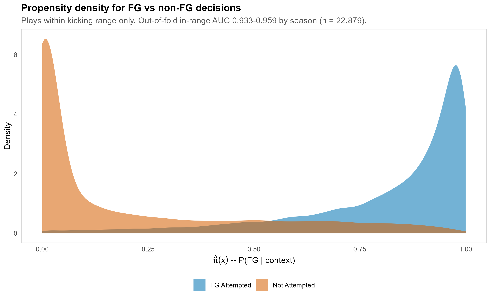{#fig-propensity-density}

Both high-propensity and low-propensity field goal situations conform neatly to expectation and are clearly distinguishable. As will be demonstrated later in the coaching decision-making section, high-propensity situations correspond to shorter field positions, particularly where yards to go exceeds 5 yards, and close, late-game scenarios where a field goal could tie or give a team the lead. Low-propensity situations correspond to long range field goals and two-score deficits where coaches favor punts or 4th down conversions.

# 4. Models and Methods

This section specifies the four outcome models and the rules under which they are compared. Section 4.1 defines them in the order they were developed, from the distance-only baseline through the two corrections for coaching selection, and defines the population-marginal variant used later for kicker evaluation. Section 4.2 states the metrics and the standard a model must meet to be described as an improvement, and Section 4.3 states which results we treat as confirmatory and which as exploratory.

## 4.1 Success Models

All outcome models were fitted using the glmmTMB R package with a logit link. Kick distance was encoded with the B-spline basis $\mathbf{b}(d_i) = (b_1(d_i), \ldots, b_7(d_i))^\top$ described in Section 2.2.

**M0 (distance baseline):** A fixed-effects-only logistic regression on the B-spline distance basis, with no random effects and no environmental covariates. Serves as the distance-only predictive ceiling.

$$\text{logit}\bigl(P(Y_i = 1 \mid d_i)\bigr) = \sum_{k=1}^{7} \alpha_k b_k(d_i)$$

**M1 (full GLMM):** The primary predictive model. Extends M0 with splined environmental covariates, contextual covariates, and two nested random effects:

$$\begin{aligned}
\text{logit}\bigl(P(Y_i=1 \mid X_i)\bigr) &= \sum_{k=1}^{7}\alpha_k b_k(d_i)
  + \sum_{j=1}^{3}\beta^{w}_j\, n_j(w_i)
  + \sum_{j=1}^{3}\beta^{T}_j\, n_j(T_i)
  + \sum_{j=1}^{3}\beta^{H}_j\, n_j(H_i) \\
&\quad + \gamma_1\,\text{turf}_i + \gamma_2\,\text{snow\_sleet}_i + \gamma_3\,\text{rain\_showers}_i + \gamma_4\,\text{clock\_running}_i \\
&\quad + \gamma_5\,\text{iced}_i + \gamma_6\,\text{l2m}_i + \gamma_7(\text{clock\_running}_i \cdot \text{l2m}_i) + \gamma_8\,\text{playoffs}_i \\
&\quad + u_{s(i)} + v_{g(i)}
\end{aligned}$$

where $b_k(d_i)$ is the $k$-th B-spline basis function at distance $d_i$ (interior knots 28/38/48/58 yds, boundary knots 18/70 yds); $n_j(\cdot)$ denotes the $j$-th natural cubic spline basis function (3 df) applied to standardized wind speed $w_i$, standardized temperature $T_i$, and standardized relative humidity $H_i$ respectively; $u_{s(i)} \sim N(0, \sigma_s^2)$ is a kicker-season random intercept; $v_{g(i)} \sim N(0, \sigma_g^2)$ is a stadium random intercept.

The weather covariates enter as additive spline main effects. A previous specification carried a wind-by-temperature product and a full set of wind-by-distance-spline interactions, and both are removed here. The interaction terms let wind sensitivity grow with distance, which is physically plausible, but they are estimated almost entirely from the sparse long-distance tail where the sample is thinnest, and the resulting model was not better out of sample. The present specification therefore assumes weather acts additively on the logit rather than amplifying with distance. We regard this as the more defensible default given the available sample and flag it as a modeling assumption rather than a finding.

**M2 (augmented GLMM):** Our first attempt at the selection problem, and the one that motivated everything after it. If the difficulty with training only on observed attempts is that the declined kicks are missing, the direct remedy is to put them back. M2 is therefore the M1 formula fitted on a training set augmented with two additional sources of kicks. First, PAT attempts enter with their real, observed make/miss outcomes, carrying a reduced case weight (`aug_weight` = 0.10) rather than a weight of 1. They are not relabeled, so a missed PAT enters as a miss. Second, non-attempt fourth-down situations enter as pseudo-misses ($Y_i = 0$) at the same reduced case weight, restricted to plays with estimated attempt propensity $\hat{\pi}(X_i) \geq 0.25$ and kick distance strictly greater than 33 yards. The propensity and distance restrictions apply to the non-attempts only, and all PATs are included. M2 is classified as exploratory throughout.

The augmentation targets the two places where the observed FG sample is thinnest or most selected. PATs are a large, essentially unselected population of kicks at a fixed short distance, since every touchdown produces one regardless of weather, score, or coach preference, so they sharpen the model where short-range field goals are informative but comparatively rare. Non-attempts are the observations that the selection process removes, and including them, even imperfectly labeled, pushes the fitted curve back toward the difficulty distribution the coach declined.

The propensity floor of $\hat{\pi} \geq 0.25$ restricts the non-attempt pool to situations a coach could plausibly have kicked from. Below that threshold we take the coach at their word, because the decision not to kick was driven by sound game-context reasons such as field position far out of range, a large deficit, or a short yards-to-go situation where converting dominates, and the play carries little information about kicker difficulty. The distance floor of 33 yards is set just beyond PAT range, since the post-2015 extra point is a roughly 33-yard kick. Inside that distance makes are near-certain and already well predicted, and a fourth-down non-attempt there reflects an aggressive strategic choice to go for it rather than any judgment about the kick, so labeling those plays as misses would inject pure noise.

The non-attempt labeling is an approximation rather than ground truth. Every qualifying beyond-33 non-attempt is entered as a miss even though some fraction of those kicks would have been made, so the M2 training set is deliberately pessimistic in exactly the distance range the model is meant to learn about. This is the principal reason M2 is reported as exploratory rather than as a candidate predictor. The direction of its bias is known, and its magnitude is not identified from the data.

A declined kick with a true success probability near 0.3 should arguably not be scored as a 0. The outcome model requires a binary Bernoulli response, so a label must be assigned, and we damp the resulting distortion through the case weight rather than through the label. This is why `aug_weight` is a tuned hyperparameter rather than a fixed constant. Section 5.2 reports the sensitivity of M2 to that weight across a grid, and no configuration achieved a lower out-of-sample Brier score than M1. Fractional or model-imputed soft labels are a reasonable alternative that we did not adopt here, since they would make the pseudo-label depend on the very outcome model being fitted, and we preferred an approximation whose bias is transparent.

**M3 (IPW-weighted GLMM):** The revised attempt at the same target, designed to reach a fuller universe of kickable situations without fabricating any outcome. Rather than imputing labels for kicks that never happened, M3 reweights the kicks that did happen so that the observed sample stands in for that fuller universe. It is the M1 formula fitted with case weights $w_i^H$ (Hajek-normalized, $3\sigma$-capped stabilized propensity weights, as defined in Section 2.3). By upweighting rare difficult attempts, M3 is designed to estimate probabilities closer to the population-average distribution rather than the coaching-selected attempt distribution. Every observation it uses carries an outcome that was actually observed, which is precisely the weakness of M2 that it was built to answer. The price is variance rather than bias: a handful of long, low-propensity attempts carry weights several times those of a routine kick, so the tail of the distance curve is estimated from an effectively smaller sample than the raw counts suggest.

**M3-pop (population marginal, for FGOE):** A kicker-neutral baseline that estimates the kick probability for a given context $X_i$ independent of individual kicker ability, used to compute FGOE (Section 6). It is the fitted M3 evaluated with the kicker-season random intercept $u_{s(i)}$ set to zero and the stadium random effect $v_{g(i)}$ retained, which requires no separate refit. On the link scale this is $\hat{\eta}_i = \mathbf{x}_i^\top\hat{\boldsymbol{\beta}} + \hat{v}_{g(i)}$. We zero the kicker term rather than refit the model without it, because a refit must re-absorb the systematic component of kicker ability into whatever covariates remain, and the distance basis is the natural place for it to land. One caveat applies. Zeroing a random intercept yields the prediction for a typical kicker rather than a true average over the kicker population, and for a nonlinear link these two quantities differ, so M3-pop should be read as a zeroed-coefficient baseline rather than as a marginal expectation.

## 4.2 Evaluation Metrics

Primary predictive metrics are Brier score (lower is better), log-loss (lower is better), and AUC (higher is better), computed separately on the in-sample (IS) training set and the held-out test set (OOS). Brier score and log-loss are both proper scoring rules. Log-loss is reported alongside Brier because it penalizes confident errors more sharply and is the more sensitive of the two to miscalibration in the probability tails, which is precisely where the IPW correction is expected to act. A secondary metric is calibration error by distance band, defined as the mean absolute difference between the observed make rate and the mean predicted probability within five distance bands (<30, 30-39, 40-49, 50-59, 60+ yards).

**IS vs. OOS claim policy:** A model is claimed to improve on M1 only if it achieves a strictly lower Brier score on the held-out test set. In-sample Brier improvements alone are treated as descriptive evidence of bias correction, not predictive improvement.

## 4.3 Inference and Robustness Policy

M2 is classified as exploratory for two reasons: it does not achieve a lower OOS Brier score than M1 under any tested weighting configuration (Section 5.2), and its non-attempt pseudo-labels are a known-biased approximation rather than observed outcomes (Section 4.1). Distance-band calibration diagnostics (Section 5.3) are interpreted as directional evidence only, not as formal inference. The 60+ yard band contains $n = 77$ in-sample observations, so point estimates in this cell carry high uncertainty. All evaluation is restricted to non-blocked FG attempts.

# 5. Modeling Results

This section reports the four-model comparison and then takes each correction in turn. Section 5.1 establishes the predictive benchmark across all four models on both splits. Section 5.2 examines M2, the augmentation approach, and the two ways it fails to deliver. Section 5.3 examines M3, the IPW approach, and the distance-tail behavior that motivates it. Section 5.4 checks that the headline finding is stable across the two halves of the study period.

## 5.1 Predictive Benchmark Across Models

The in-sample (IS) metrics reported throughout this section are calculated over the full dataset ($n = 11{,}548$) using predictions from the models fitted on the full dataset (Option B). For the augmented model (M2), these metrics are evaluated exclusively on actual field goal attempts, omitting the PAT and non-attempt rows used during training. All reported Brier scores are standard, unweighted metrics to maintain direct comparability.

@tbl-model-metrics presents global predictive metrics on the IS and OOS splits for all four models. M3 achieves the best IS fit on every metric (Brier 0.0983, log-loss 0.3217, AUC 0.806). On the OOS test set the ordering reverses and M1 outperforms all models on every metric (Brier 0.1004, log-loss 0.3295, AUC 0.769). M3 OOS Brier (0.1026) exceeds even M0 (0.1012), confirming that IPW variance inflation from extreme long-range weights is not recoverable in the 2,251-observation test set. M2 sits between the two, never best and never worst, improving on neither M1 split. Log-loss and Brier agree on the ranking in both splits, so the reversal is not an artifact of the choice of proper scoring rule.

| Model | IS Brier | IS Log-Loss | IS AUC | OOS Brier | OOS Log-Loss | OOS AUC |
|---|---:|---:|---:|---:|---:|---:|
| M0 (distance only) | 0.1045 | 0.3387 | 0.774 | 0.1012 | 0.3323 | 0.762 |
| M1 (full GLMM) | 0.1004 | 0.3259 | 0.804 | **0.1004** | **0.3295** | **0.769** |
| M2 (augmented) | 0.1009 | 0.3281 | 0.800 | 0.1015 | 0.3325 | 0.766 |
| M3 (IPW) | **0.0983** | **0.3217** | **0.806** | 0.1026 | 0.3367 | 0.761 |

: Model performance on in-sample (IS, $n = 11{,}548$) and held-out test set (OOS, $n = 2{,}251$). Brier and log-loss: lower is better. AUC: higher is better. Blocked kicks excluded. Bold indicates best value in column. {#tbl-model-metrics}

The calibration of each model is shown directly in @fig-calibration. Predicted probabilities are binned into deciles of predicted value and plotted against the observed make rate within each bin, with 95% Wilson intervals so that departures from the diagonal can be read against their own sampling error, and with the distribution of predicted probabilities shown beneath each panel. Two features are worth noting. First, all four models are well calibrated in the high-probability bins, which is where the great majority of kicks sit. Second, all four sit above the diagonal through the middle of the range, roughly 0.70 to 0.90 predicted, meaning they modestly under-predict success on kicks of intermediate difficulty. Individual bin deviations are mostly within their Wilson intervals, but the sign is consistent across bins and across models, so the pattern is systematic rather than noise. It is also common to all four specifications, including the distance-only M0, which indicates it reflects something about the outcome model family rather than anything introduced by the IPW correction. M3 shows the largest deviation in its lowest bin (observed 0.664 against 0.563 predicted), consistent with the upweighting of difficult attempts pulling its predictions downward in the tail.

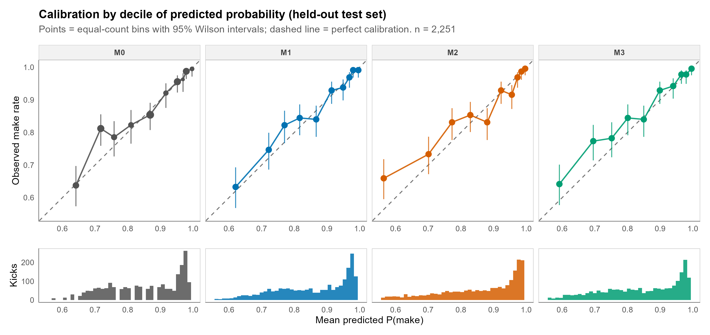{#fig-calibration}

@fig-metrics summarizes the same comparison across all three scoring metrics and both splits, making the reversal explicit: M3 is the best of the four models on every in-sample metric and the worst of the four on every out-of-sample metric.

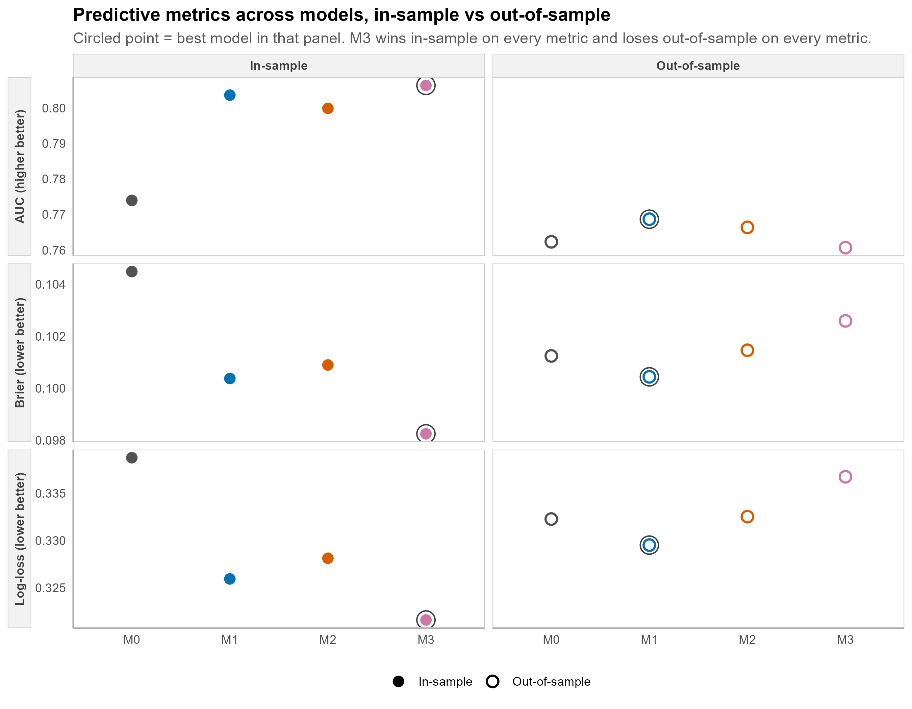{#fig-metrics}

@fig-separation illustrates the in-sample distribution of predicted probabilities for made versus missed kicks across models, indicating how well M1 and M3 distinguish outcomes. M3 pushes low-probability kicks leftward, clarifying the distinct separation profile for missed kicks.

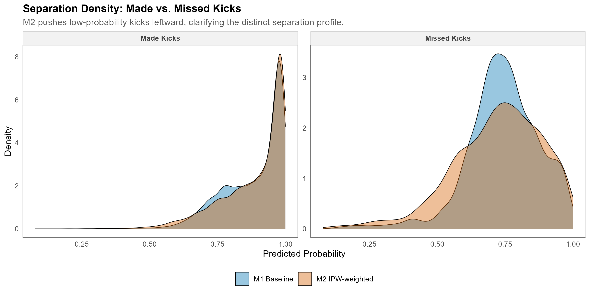{#fig-separation}

## 5.2 M2: Augmentation with Pseudo-Labels

M2 was the first correction we built, and the four-model table above already shows that it does not do what it was designed to do. Its in-sample Brier (0.1009) is worse than M1's (0.1004) despite training on roughly four times as many rows, and its out-of-sample Brier (0.1015) is worse again. Adding the declined kicks back into the training universe did not recover the difficulty distribution the coach removed. Two specific findings explain why, and both point at the pseudo-labels rather than at the augmentation idea in general.

The first is that more augmentation makes matters worse, not better. M2 was evaluated across a grid of augmentation case weights, applied symmetrically to the PAT rows (which carry observed outcomes) and the non-attempt rows (which carry pseudo-miss labels). Across all configurations, M2 did not achieve a lower OOS Brier score than M1, confirming its exploratory classification. Within the grid the degradation is monotone in the weight (@tbl-m2-grid): in-sample Brier rises from 0.1007 at weight 0.05 to 0.1009 at 0.10 and 0.1015 at 0.25, log-loss rises in step from 0.3272 to 0.3303, and in-sample calibration error nearly doubles from 0.0148 to 0.0285. If the pseudo-misses carried real information about the declined kicks, leaning on them harder should help. It does the opposite, which is the signature of a label that is systematically wrong rather than merely noisy. The primary configuration (weight = 0.10) produced OOS Brier 0.1015, which underperforms M1. M2 is retained as an exploratory lens for long-distance tail behavior but should not be used as a production predictor.

| PAT/Non Weight | IS Brier | IS Log-Loss | IS AUC | IS Calib. Error |
|---:|---:|---:|---:|---:|
| 0.05 | 0.1007 | 0.3272 | 0.801 | 0.0148 |
| 0.10 | 0.1009 | 0.3281 | 0.800 | 0.0167 |
| 0.25 | 0.1015 | 0.3303 | 0.801 | 0.0285 |

: M2 weight sensitivity grid (PAT weight = Non-attempt weight). IS metrics only. OOS Brier for the primary 0.10 configuration is 0.1015. {#tbl-m2-grid}

The second finding concerns the PAT block, which turns out to contribute essentially nothing. The augmentation combines two very different sources, namely PATs with observed outcomes and non-attempts with imputed pseudo-miss labels, so we refit M2 with the PAT block removed to isolate what each contributes. The two variants are near-indistinguishable, and if anything the PAT-free version is marginally the better of the two. In sample its Brier is 0.1005 versus 0.1009 and its log-loss 0.3270 versus 0.3281, and out of sample its Brier is 0.1013 versus 0.1015 and its log-loss 0.3321 versus 0.3325. Neither approaches M1 out of sample. The motivating intuition for including PATs, that a dense block of short and essentially unselected kicks would sharpen the model where the FG sample is thin, is therefore not borne out. The plausible reason is that the region PATs inform (roughly 33 yards, where make probability is near 0.95) is already the best-determined part of the distance curve, so the additional rows contribute little beyond what the 3,017 sub-30-yard field goals already supply. Removing the PATs also removes the one part of the augmented sample whose labels are real, which is why the PAT-free variant is not merely as good but very slightly better: the block that was doing no work was still costing a little. The non-attempt pseudo-misses, not the PATs, do essentially all of the work in M2, and their labels are the part we cannot verify.

Taken together, these two results are what moved us off the augmentation approach. The problem is not the size of the augmented sample or the tuning of its weight but the labels themselves, since every declined kick beyond 33 yards is entered as a miss when some fraction of them would have been made. No choice of weight fixes a label that is wrong in a known direction. That is what M3 is designed to avoid.

## 5.3 M3: Inverse Probability Weighting and the Distance Tail

M3 reaches the same target without inventing any outcome, and in-sample it does what the augmentation could not. @tbl-dist-brier reports in-sample Brier score within each distance band.

| Distance Band | Sample Count (N) | M0 | M1 | M2 | M3 |
|---|---|---:|---:|---:|---:|
| < 30 yds | 3,017 | 0.0171 | 0.0171 | 0.0171 | 0.0171 |
| 30-39 yds | 3,314 | 0.0624 | **0.0611** | 0.0614 | 0.0614 |
| 40-49 yds | 3,407 | 0.1643 | 0.1575 | 0.1581 | **0.1567** |
| 50-59 yds | 1,733 | 0.2141 | 0.2030 | 0.2044 | **0.1920** |
| 60+ yds | 77 | 0.2249 | 0.2172 | 0.2208 | **0.1687** |

: In-sample Brier score by distance band. Lower is better. Bold: best value in row. {#tbl-dist-brier}

M3 achieves a 5.4% Brier reduction versus M1 at 50-59 yards and a 22.3% reduction at 60+ yards in-sample.

The models diverge at 50+ yards, where the IPW correction in M3 has the most leverage. M2 is flat to slightly worse than M1 across the same bands, so the tail gain belongs to the reweighting rather than to bias correction in general. However, the 60+ yard distance band contains only $n = 77$ in-sample observations, meaning point estimates in this range carry high uncertainty.

To evaluate model performance across the distance spectrum, @fig-brier-curve plots continuous squared residuals (Brier error) smoothed using a LOESS fit, side by side for in-sample training and out-of-sample test data.

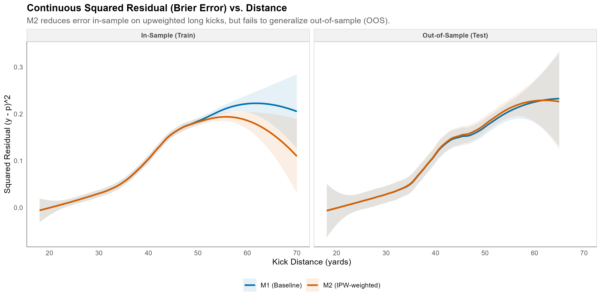{#fig-brier-curve}

In-sample, M3 achieves lower squared error than M1 at long distances, demonstrating the effect of the IPW correction. However, out-of-sample, the error curves cross, and M1 outperforms M3, confirming that M3's fit to tail noise in the training set does not generalize. The correction is therefore real and visible where it was designed to act, and it still does not buy held-out accuracy.

## 5.4 Era Stability of the Selection-Bias Result

Coaching fourth-down behavior changed materially over the study window, which raises the possibility that the selection-bias question has different answers in different eras. If coaches selected attempts more idiosyncratically early in the sample and more systematically later, the value of a propensity correction could differ between the two. We therefore re-ran the M1-versus-M3 comparison separately on pre-2020 (2015-2019) and post-2020 (2020-2025) held-out kicks, reported in @tbl-era-oos.

| Era | Test kicks | M1 Brier | M3 Brier | M1 Log-Loss | M3 Log-Loss | Better model |
|---|---:|---:|---:|---:|---:|---|
| Pre-2020 (2015-2019) | 976 | **0.1105** | 0.1131 | **0.3583** | 0.3675 | M1 |
| Post-2020 (2020-2025) | 1,275 | **0.0928** | 0.0945 | **0.3074** | 0.3131 | M1 |

: Out-of-sample M1 vs. M3 by era. Lower is better; bold indicates the better value. {#tbl-era-oos}

The answer does not change. M1 is the better out-of-sample model in both eras, on both scoring rules, and the margin is of similar size in each (Brier gap 0.0027 pre-2020, 0.0018 post-2020). The absolute error level differs substantially between eras, since every model predicts post-2020 kicks better than pre-2020 kicks, which is consistent with the increased consistency of modern kicking documented in Section 7. That is a change in the difficulty of the prediction problem rather than in the usefulness of the selection correction. We therefore report the selection-bias finding as stable across the sample rather than era-dependent.

# 6. FGOE and Player Evaluations

FGOE is a per-kick residual metric that quantifies how much a kicker outperformed (or underperformed) the context-neutral expected make probability. Over the 11-season period analyzed (2015-2025), FGOE is defined as:

$$\text{FGOE}_i = Y_i - \hat{p}_{\text{M3-pop}}(X_i)$$

where $\hat{p}_{\text{M3-pop}}(X_i)$ is the M3-pop predicted probability for kick $i$, computed from the fitted M3 with the kicker-season random intercept set to zero and the stadium effect retained (Section 4.1). Because the kicker term is removed, $\hat{p}_{\text{M3-pop}}$ reflects the probability a typical kicker would achieve for a kick of context $X_i$ at that venue, independent of the individual kicker's ability. This design ensures that FGOE is attributable to the kicker rather than confounded by stadium effects.

Cumulative FGOE over a kicker-season $(k, s)$ is:

$$\text{FGOE}_{k,s} = \sum_{i:\,\text{kicker}=k,\,\text{season}=s} \text{FGOE}_i$$

A kicker with $\text{FGOE}_{k,s} > 0$ made more kicks than the context-adjusted baseline predicted; $\text{FGOE}_{k,s} < 0$ indicates underperformance. Unlike raw make rate, FGOE is adjusted for distance distribution, weather, and surface, making it a fairer basis for cross-kicker comparison.

The FGOE leaderboard ranks kicker-seasons by cumulative FGOE. Top-ranked kicker-seasons are concentrated among kickers with consistently high make rates across a variety of distance and weather profiles, not simply those who attempted the most kicks. @fig-fgoe-total and @fig-fgoe-rate present the career-level rankings on a total and a per-kick basis respectively.

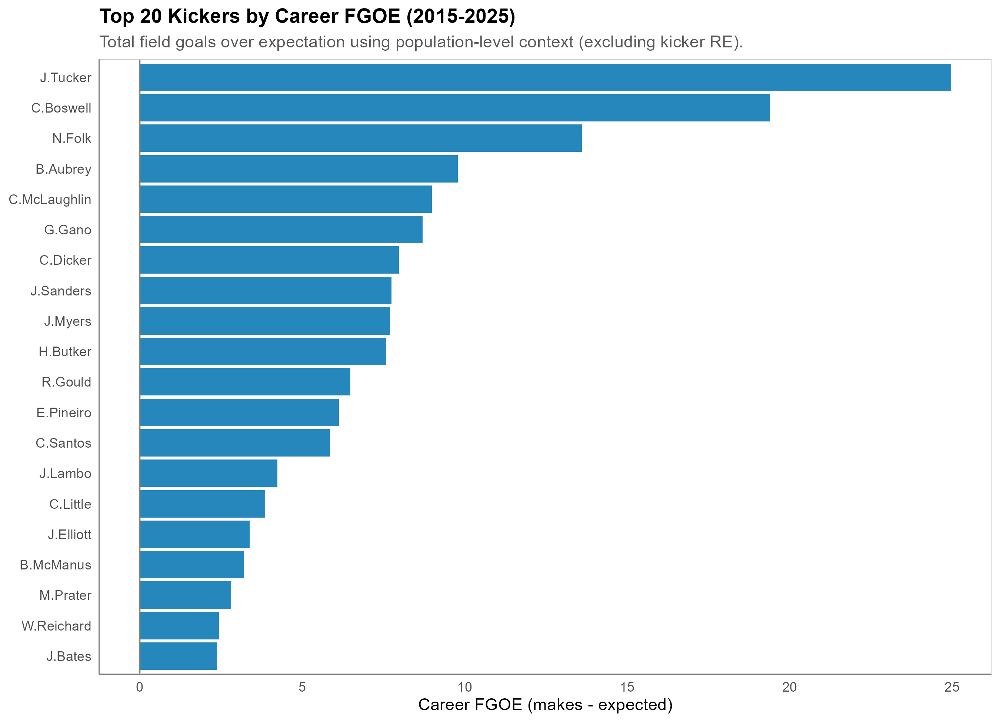{#fig-fgoe-total}

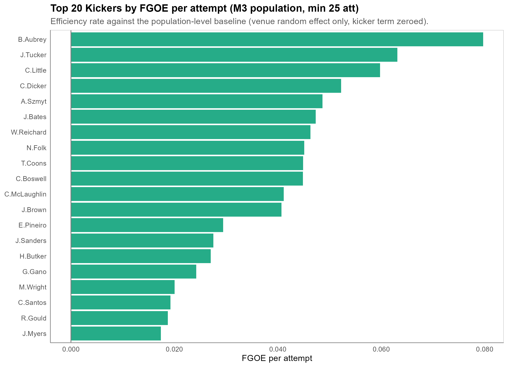{#fig-fgoe-rate}

@fig-skill-workload confirms that high-FGOE kickers appear across workload levels, suggesting FGOE captures ability independently of attempt volume.

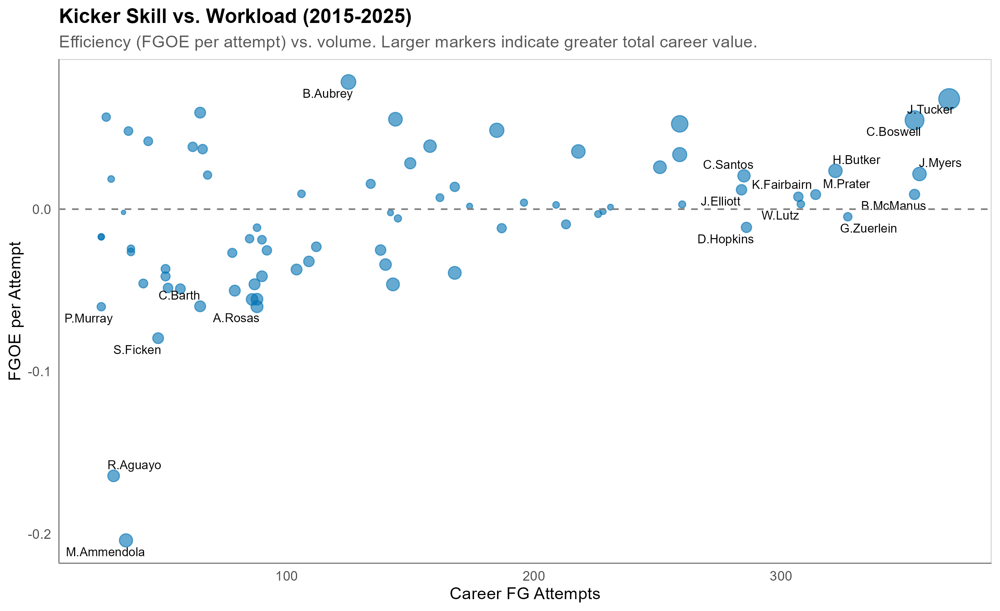{#fig-skill-workload}

To examine this workload distribution itself, @fig-workload-propensity plots average attempt distance against the mean propensity to attempt kicks.

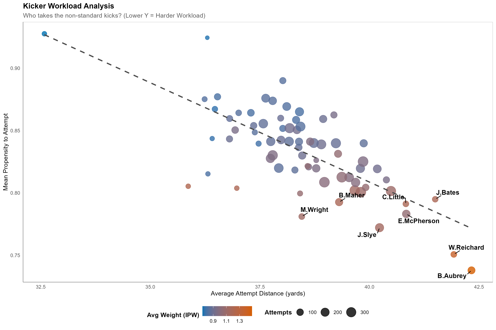{#fig-workload-propensity}

The relationship is clearly negative. Kickers who average longer-range attempts also face a lower mean attempt propensity, and consequently higher average IPW weights. This highlights how FGOE controls for the selective difficulty distribution faced by trusted kickers.

# 7. Field Goal Kicking Trends

A major influence on the coaching decision framework has been the steady improvement in kicker accuracy and range over the past decade. Average field goal attempt distances have risen, and the share of attempts from beyond 50 yards has grown substantially. This shift is visible in the season-level kicking trends in @fig-season-trends, with the 2015-2025 modeling period shaded.

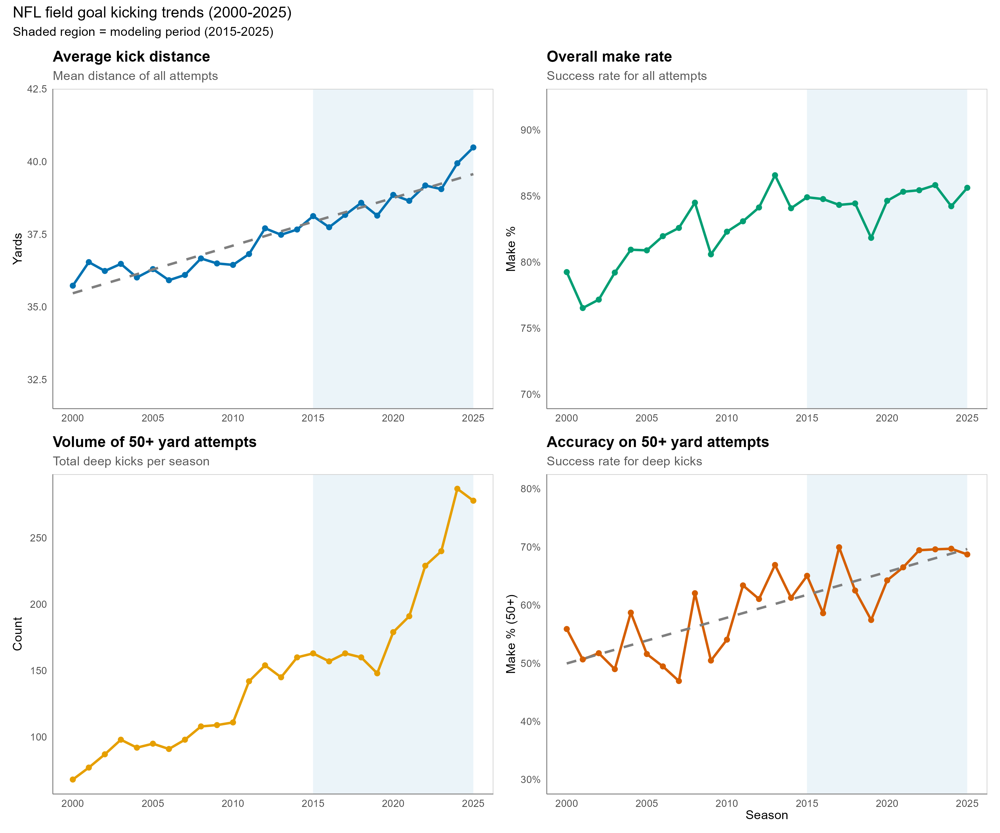{#fig-season-trends}

The average field goal attempt distance has steadily increased over time, climbing by nearly 5 yards since 2000. While overall make rates improved consistently up to 2015 (the beginning of the modeling period), they have largely stabilized since. This stabilization has occurred despite the ongoing rise in average kick distance, particularly for attempts from 50 yards or more, which have increased substantially since the 2020 season. Kickers have maintained their overall accuracy and even demonstrated continued improvement on 50-plus yard kicks, converting longer and more difficult attempts on average. Given the distinct shift in attempt frequency and accuracy for deep kicks starting around 2020, subsequent visual analyses are partitioned into pre-2020 and post-2020 eras.

As kickers have improved, the distribution of field goal attempt distances has shifted rightward over the study period, as @fig-dist-shift shows.

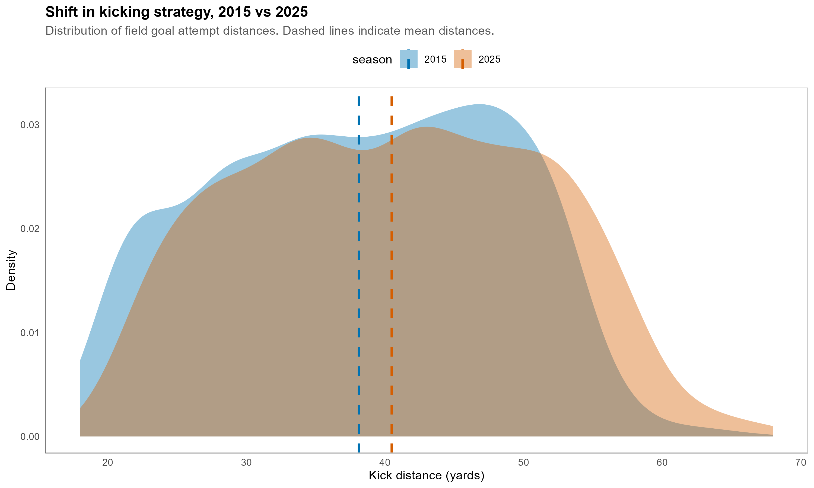{#fig-dist-shift}

To further illustrate how the kicking environment has changed, @fig-make-rate-era shows that post-2020 kickers convert at higher rates from long range relative to the pre-2020 period.

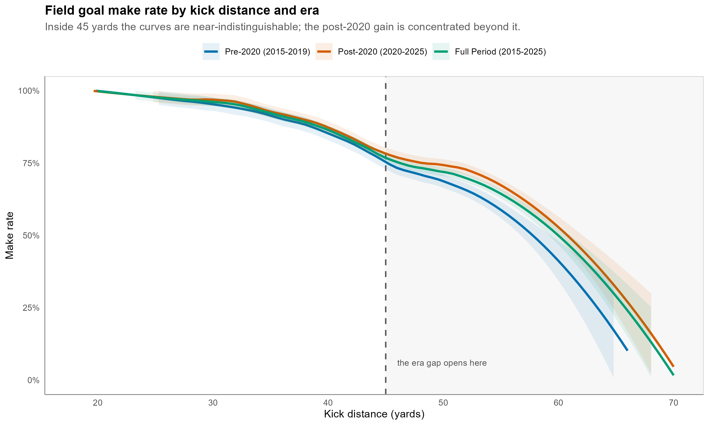{#fig-make-rate-era}

These improvements in kicker capability have shifted the boundaries of what coaches consider a viable attempt, changing the composition of the observed kick sample over time.

## 7.1 Decision Evolution by Yardage Context

Coaching fourth-down decisions are not driven by a single universal calculus. The strategic trade-offs differ substantially depending on how many yards remain to gain a first down, which is entirely distinct from kick distance or field position. To capture this, we split fourth-down situations in @fig-decision-evolution by whether the team faces a long-yardage situation (5 or more yards to go) or a short-yardage situation (4 or fewer yards to go).

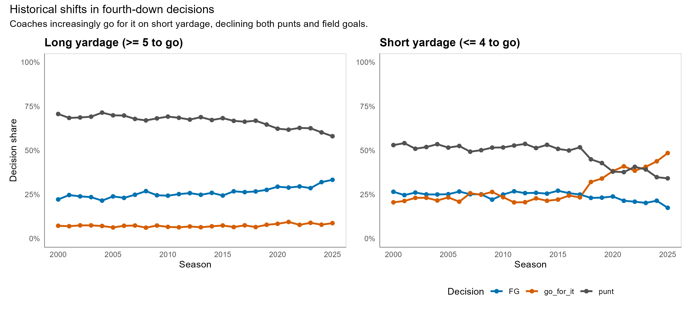{#fig-decision-evolution}

On long-yardage fourth downs (5+ yards to go for a first down), punting has historically been and remains the dominant choice when the team is far from field goal range. Inside kicking range, however, field goals have gained share from punts over the observed period as kicker range and accuracy improved. Go-for-it rates on long-yardage downs have not increased dramatically, which is expected: converting 5 or more yards on a single play is a difficult proposition, and the expected value of going for it does not typically exceed the value of a makeable field goal attempt.

On short-yardage fourth downs (4 or fewer yards to go), the story is markedly different. Coaches have dramatically shifted away from both punts and field goals in favor of go-for-it conversion attempts. This shift reflects the analytics-driven recognition that when a conversion is likely (short yardage), the expected value of gaining a first down or touchdown often exceeds the certain-but-limited value of a field goal. The field position decision profiles in @fig-decision-fieldpos confirm how these patterns play out across the field.

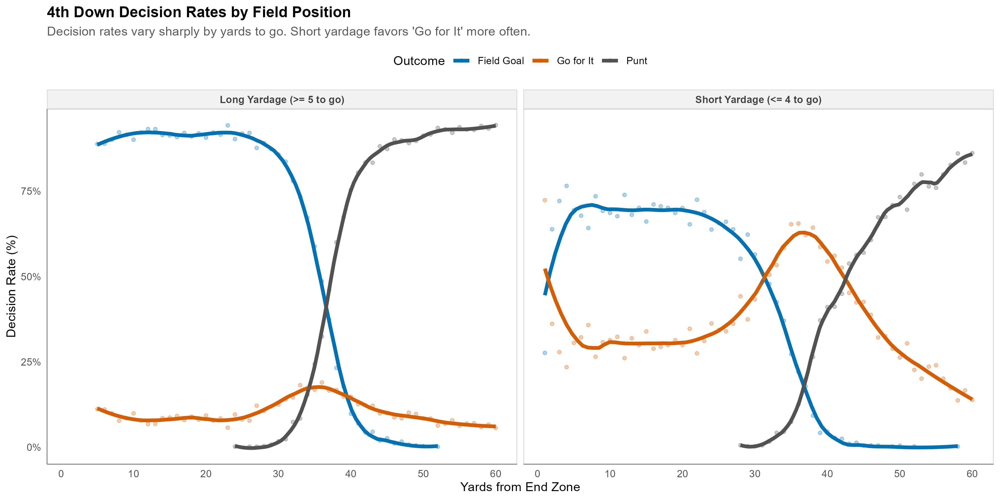{#fig-decision-fieldpos}

Under long-yardage conditions, field goals are the preferred choice inside approximately 35 yards from the end zone, whereas punting dominates at longer distances. Under short-yardage conditions, kicking remains the primary option until about 30 yards from the end zone, with the notable exception of the 1-yard line, where going for it dominates. Go-for-it rates peak around 40 yards from the end zone, where a field goal attempt would require a difficult 55-plus yard kick with a lower conversion probability.

The era comparison for short-yardage situations in @fig-short-yardage-era illustrates how pronounced the post-2020 shift has been.

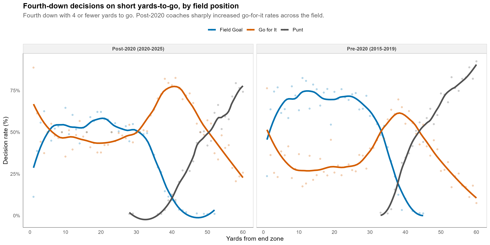{#fig-short-yardage-era}

Post-2020 coaches are far more likely to go for it on short-yardage fourth downs at almost every field position relative to the pre-2020 era, with field goal and punt rates declining accordingly.

## 7.2 Win Probability Added and the Decision Framework

To analyze how coaching decisions on fourth down align with observed results, we use win probability added (WPA). The WPA curves in @fig-wpa-era compare the average win probability gained from field goals, punts, and go-for-it plays across field positions, split by era.

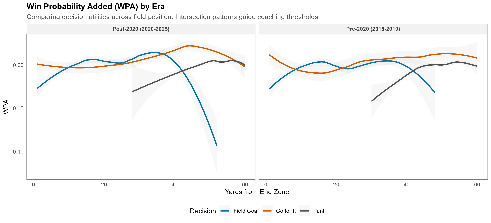{#fig-wpa-era}

WPA from long field goals has increased alongside kicker improvement, and the post-2020 era shows the highest expected WPA from go-for-it plays concentrated around midfield. The differences between eras in the WPA curves, while real, are modest in magnitude, which is consistent with the finding that kicker selection bias does not substantially distort model performance.

Stratifying WPA by yards-to-go regime in @fig-wpa-ytg reveals the distinct decision logic more clearly.

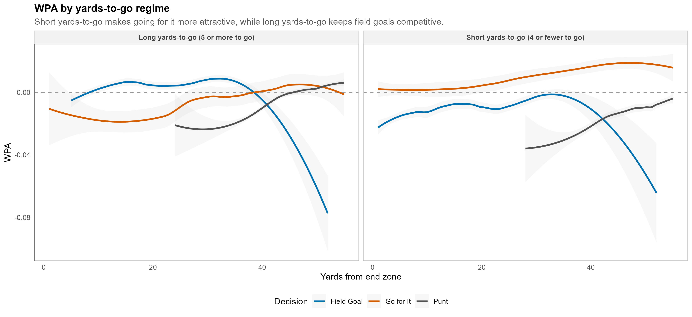{#fig-wpa-ytg}

When facing a long-yardage fourth down, the field goal is the better-expected-value option until roughly 40 yards from the end zone, where the WPA curves begin to converge. In short-yardage situations, the go-for-it option carries positive WPA across the entire field within 70 yards, and field goal attempts are associated with negative WPA at virtually all distances. This would suggest that even more aggressive short-yardage behavior could be justified by the data, and the post-2020 trend reflects coaches moving in that direction.

@fig-density-wpa maps the post-2020 kick attempt density onto the corresponding WPA curve for field goals, illustrating where in the distance distribution coaches are actually operating relative to where the WPA advantage lies.

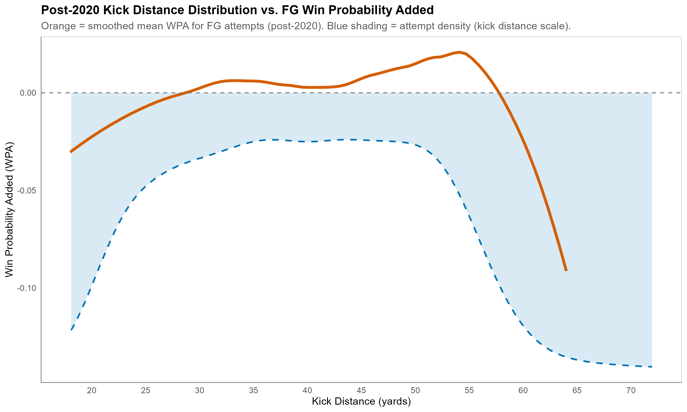{#fig-density-wpa}

Coaches' decisions and the expected win probability added display highly consistent patterns across distances. This alignment suggests that coaches possess a structured understanding of the distance thresholds at which field goal attempts contribute positively to win probability, likely driven by a combination of historical intuition and modern analytics. However, the WPA curves also indicate room for greater aggressiveness beyond 45 yards, as the expected WPA for field goals peaks at approximately 55 yards. The rapid improvement in long-range kicking accuracy in recent years suggests that coaching behavior may still be adapting to this enhanced capability. Additionally, the relationship between decisions and expected value is complex. In short-yardage regimes, for instance, conversion attempts are universally superior to field goals, indicating that simple distance-based guidelines are insufficient. Ultimately, this selective coaching process is the exact mechanism that generates the sample selection bias addressed by the inverse probability weighting framework.

# 8. Discussion

## 8.1 Why Corrective Models Do Not Win Out-of-Sample Prediction

The three models encode qualitatively different estimands. M1 estimates the conditional success probability for observed FG attempts, a quantity well-suited to in-game decision support but one that inherits the selection structure of coaching behavior. M2 approximates the population-average probability across all kickable situations by imputing pseudo-labels for non-attempts, but the pseudo-label mechanism introduces bias in a known direction that prevents any calibration gain from translating into predictive improvement. M3 targets that same population-average quantity by reweighting rather than imputing, which removes the label problem entirely, at the cost of higher variance in the long-distance tail.

We are not persuaded that with more data M3 would eventually outperform M1 out-of-sample. The pattern in our results is consistent with IPW shifting fitting effort toward the sparse, high-variance extreme tails. M3's in-sample gains are concentrated in the 50+ yard bands where weights are largest and sample counts smallest, and its out-of-sample deficit relative to M1 appears at the medium distances that make up the bulk of the test set. We describe this as the pattern the evidence shows rather than as a demonstrated mechanism, since we did not isolate the variance contribution of the weights directly. An alternative explanation, that the reweighted target itself is simply a worse match to the out-of-sample attempt distribution, is equally consistent with these results and is not separable from the variance account with the data at hand. What we can say descriptively is that adjusting for attempt likelihood did not improve held-out predictive accuracy in this sample, and that the selection-inheriting model remained the better forecaster of the kicks coaches actually chose to take.

## 8.2 Operational Implications

The operational implication is that selection-bias adjustment using these IPW methods does not work for predictive modeling. For real-time win probability or in-game decision support, M1 is the recommended model. It has the strongest OOS predictive performance on both proper scoring rules, holds that advantage in both the pre-2020 and post-2020 halves of the sample (Section 5.4), and does not suffer from the weight-driven variance inflation of M3. For kicker evaluation, however, FGOE derived from M3-pop is the recommended metric because it adjusts for the context distribution under which each kicker was evaluated and corrects for the systematic selection bias in the attempt distribution. The baseline is constructed by zeroing the kicker term out of the fitted M3 rather than by refitting without it (Section 4.1).

# 9. Limitations

## 9.1 Estimand and the Relationship to Causal Inference

<!-- RESERVED FOR M. SCHUCKERS: estimand / non-causal framing.
  This subsection is intentionally left unwritten. Do not draft it elsewhere in the paper.

  Intended content (per reviewer Main Comment 1):
   - Precise statement of the estimand we DO target (selection-reweighted,
     population-marginal success probability over kickable situations) vs. what we do
     NOT (a counterfactual).
   - What a fully causal treatment would require: defined counterfactual,
     positivity/overlap, conditional ignorability of the attempt decision, SUTVA,
     and which of these we can and cannot defend.
   - Benefits and drawbacks of selection-reweighting relative to a causal approach.

  Supporting scrub already applied elsewhere: §1.1 motivation marked as hypothesis,
  §8.1 softened to associational language, §10 reworded from "corrects this bias",
  Abstract framed as a predictive-performance claim.
-->

## 9.2 Other Limitations

1. **Observational design**: This study is observational, not causal. FGOE and M3-based evaluations describe how kickers performed relative to a selection-adjusted baseline, but cannot identify whether observed differences reflect true skill differences, variation in team context, or measurement noise.
2. **Pseudo-label sensitivity**: M2 results depend on the PAT weight, non-attempt weight, propensity threshold, and distance threshold used to construct the augmented training set. The parameter grid evaluated in Section 5.2 shows fit degrading monotonically as the augmentation weight rises, and the exploratory classification of M2 reflects genuine sensitivity to these design choices.
3. **Sparse 60+ yard regime**: The 60+ yard distance band contains only $n = 77$ in-sample observations, and only $n = 15$ in the held-out test set. The 22.3% Brier reduction for M3 at 60+ yards therefore carries high uncertainty and should be interpreted as directional evidence rather than a precise estimate.
4. **Additive weather assumption**: The outcome models treat wind, temperature, and humidity as additive spline main effects on the logit. Physically, wind is likely to matter more on longer attempts, and an earlier specification modeled that through wind-by-distance interactions. Those terms are identified almost entirely from the sparse long-distance tail and were dropped (Section 4.1). The present results therefore assume that an interaction which plausibly exists is negligible in this sample.
5. **Single-league scope**: The analysis is restricted to NFL data. The generalizability of the propensity model structure, the IPW weight distribution, and the FGOE evaluation framework to other levels of football (college, CFL) or other sports with similar coaching selection structures has not been tested.

# 10. Conclusion

NFL field goal modeling is a selection problem as well as a prediction problem: coaches choose when to attempt kicks, and models trained only on observed attempts inherit the resulting sample bias. We tried two ways of correcting it. Rebuilding the training universe from imputed pseudo-labels (M2) did not work, and leaning harder on those labels made the fit worse rather than better, because the labels are wrong in a known direction that no choice of weight repairs. Applying inverse probability weighting (M3) reweights the observed sample toward the population of kickable situations without inventing any outcome, and in-sample this produces substantially better-calibrated predictions at long distance, achieving a 22.3% Brier reduction at 60+ yards versus the unweighted baseline. It does not improve out-of-sample global prediction, where the full GLMM (M1) remains the stronger model on both Brier score and log-loss, and remains so in both the pre-2020 and post-2020 eras. For practitioners, the recommended deployment is M1 for in-game prediction and decision support, with M3 informing selection-bias diagnostics, and the M3-pop-based FGOE metric providing a principled, context-adjusted framework for kicker evaluation. Future work should explore doubly robust estimators as alternatives to pure IPW that may better balance bias correction with predictive stability.

# References

::: {#refs}
:::
