## Coaches choose which kicks we see

:::: {.slidebody}
::: {.columns}
::: {.column width="58%"}
Field goal models adjust attempts for difficulty. Distance first, then weather,
venue, game state.

All of them are fit on kicks a coach agreed to take.

Coaches decline potential kicking opportunities in favour of punting or going
for it on fourth down.

These decisions are not random. Actual attempts represent a selected group,
overrepresenting favourable kicking scenarios.
:::

::: {.column width="42%"}
::: {.takeaway}
If a coach declines because they doubt their kicker, that judgment is
information no outcome model observes.
:::
:::
:::
::::

::: {.notes}
Opening line: every field goal model you have ever seen was fit on kicks a coach
agreed to take. We wanted to know what the declined ones would have told us.

- Existing work handles the difficulty adjustment well. Pasteur and Cunningham,
  Osborne, the distance-adjusted baselines. The gap is not the functional form.
- The gap is the sample. A fourth down produces a kick only when the coach
  chooses kick over punt and over going for it.
- State the assumed mechanism plainly, so it can be tested. Coaches who trust
  their kicker hand them harder kicks. Under that assumption the observed
  attempt set is an easier subset of the kickable universe, and the decline
  itself carries information about kicker ability.
- This is an assumption about how coaches behave, not something measured yet.
  That matters, because by the end of the talk the data will point somewhere
  else.

Roughly 55 seconds.
:::

## Three questions {.airy}

:::: {.slidebody}
1. Is the attempt decision **structured enough** to model?

2. Does adding the declined kicks back with **pseudo-miss labels** help?

3. Does **inverse probability weighting** improve out-of-sample prediction?

::: {.takeaway}
And if the answer to two and three is no, what does that tell us about why
coaches decline?
:::
::::

::: {.notes}
Read them and move. 25 seconds. The last line is the one that buys the second
half of the talk, so do not rush past it.
:::

## The analysis sample

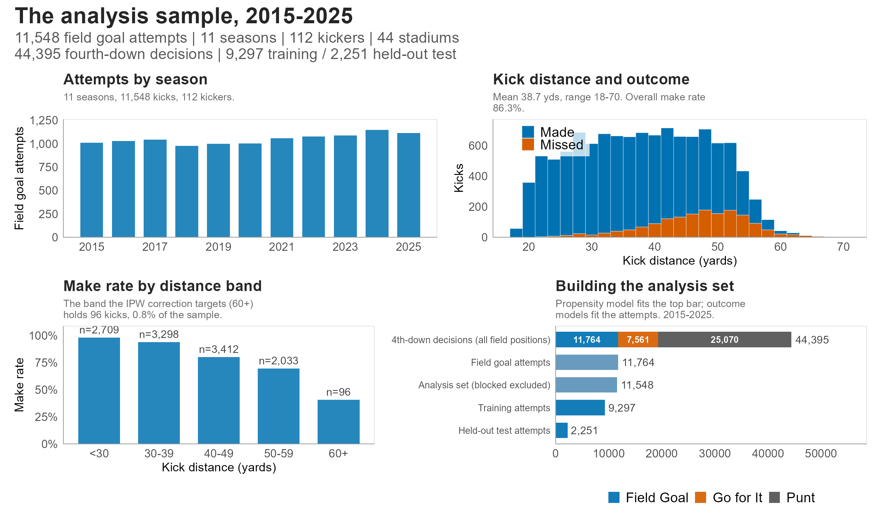

::: {.notes}
2015 to 2025 · 11,548 attempts · 112 kickers · 44 stadiums · 44,395 fourth-down
decisions · 9,297 train / 2,251 held-out.

- Entirely post the 2015 PAT rule change. One kicking era, no rule
  discontinuity inside the window.
- Blocked kicks dropped. A block is a protection failure, not a kicker outcome.
- Two populations, and they are not nested. The propensity model is fit on all
  44,395 fourth-down decisions across the whole field. The outcome models are
  fit on the 11,548 attempts. The coach's choice exists at every field position,
  the kick outcome only where a kick happened.
- The funnel's top bar is broken out by what the coach actually did. The blue
  segment is the second bar.
- Make rate by band is worth a beat. Beyond 60 yards there are 96 kicks. That
  constraint returns at the end of the talk.
- Held-out split is at the game level, 593 disjoint games.

40 seconds.
:::

## Kickers have improved past 45 yards

::: {.columns}
::: {.column width="58%"}
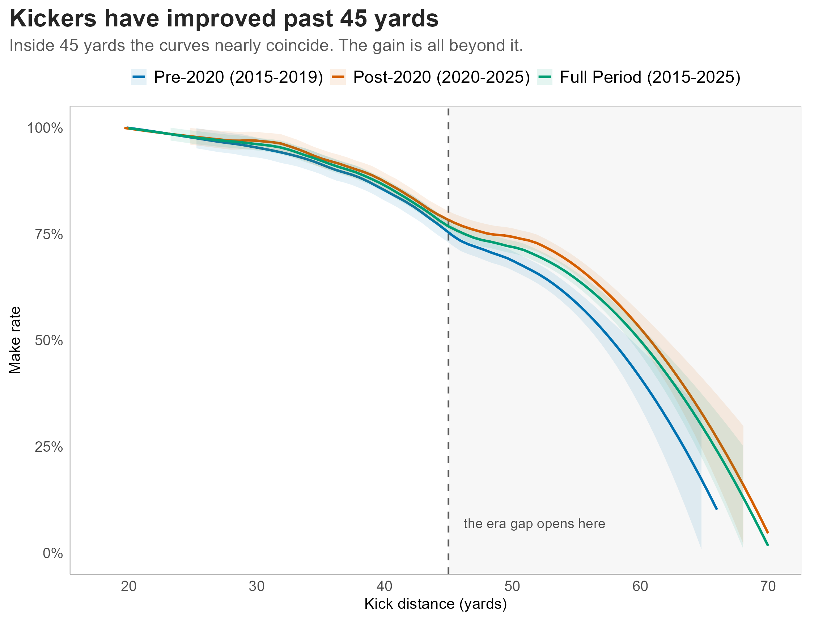
:::

::: {.column width="42%"}
::: {.headline}
\~202 additional makes
:::
::: {.headline-sub}
in 2020 to 2025, against the pre-2020 success curve
:::

::: {.headline}
\~34 makes per season
:::
::: {.headline-sub}
and \~148 of the \~202 come from beyond 45 yards
:::

::: {.smaller}
A LOESS smooth of make rate on distance, span 0.4, is fit to the 2015 to 2019
attempts, then evaluated at the distance of each of the 6,609 attempts from 2020
to 2025. Expected makes are the sum of those fitted probabilities; the excess is
actual minus expected. Descriptive: attempt composition is also moving across
the era boundary.
:::

::: {.takeaway}
Inside 45 yards the curve was already close to its ceiling. The improvement is
concentrated in the long tail.
:::
:::
:::

::: {.notes}
- Conditional on distance, post-2020 kickers convert better, and the gap opens
  around 45 yards.
- Inside 45 the two curves are nearly indistinguishable. That part of the
  success curve was already well established, and there is limited room to
  improve against the variance that comes with distance.
- The headline number is a simple counterfactual. Take the pre-2020 smoothed
  make rate at each distance, apply it to every post-2020 attempt, and compare
  expected makes to what actually happened.
- Frame it as an apparent improvement in ability over the observed period, not
  as a measured skill effect. Attempt composition is also moving, so part of
  the gap is which kicks coaches chose to take.

55 seconds.
:::

## Coaches are asking for longer kicks

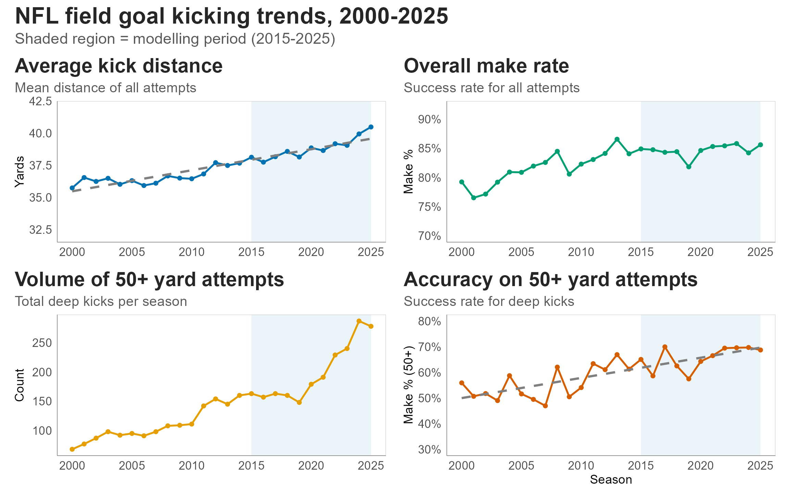

::: {.notes}
- Average attempt distance up nearly five yards since 2000.
- Overall make rate flat since about 2015. That flat line is doing work:
  kickers are holding the rate while being asked for harder kicks.
- Bottom row is where the change is. Deep attempt volume breaks out of trend
  from 2020, and accuracy on those same kicks keeps climbing.
- That 2020 break is why several later figures split pre- and post-2020. The
  split is chosen off the kicking data, not off the decision data.
- Shaded band is the modelling window.

Takeaway: attempts got longer and accuracy held. Coaches appear to have
responded to the improvement on the previous slide.

50 seconds.
:::

## Modelling the attempt decision

:::: {.slidebody}
::: {.columns}
::: {.column width="56%"}
**Multinomial logit** over kick, punt, go. Reference category is go for it.

- Natural spline on **field position**, full field 1 to 100
- **Log game seconds remaining**, quarter-time interactions
- Yards to go, score state, venue, wind, temperature
- **Leverage**, the win probability after a make minus the win probability
  after a miss, estimated before the outcome is known
:::

::: {.column width="44%"}
**Rolling origin.** Train on seasons $s{-}3, s{-}2, s{-}1$, predict season $s$.

::: {.takeaway}
**AUC 0.933 to 0.959** in plausible kicking range, every season

**RMSE 0.045** against realised win probability, after endgame overrides
:::
:::
:::

$$
\log\frac{P(D_i = d)}{P(D_i = \text{Go})} = \alpha_d + \sum_{k=1}^{6} \beta_{d,k}\, n^{\text{fp}}_k(\text{yl}_i) + \gamma_{d} \log(1 + t_i) + \delta_d\, \text{ytg}_i + \boldsymbol{\theta}_d^\top \mathbf{S}_i + \psi_d L_i
$$

::::

::: {.notes}
Research question one is answered on this slide. The decision is highly
structured, so the correction is well founded.

- Leverage is the piece worth defending. nflfastR gives a kick's
  win-probability impact, but that depends on whether it went in. The coach
  decides before knowing. So we estimate the win probability the kicking team
  would hold after a make and after a miss, and take the difference.
  Fractional-logit heads with rule-based overrides at the endgame tails.
- Against 11,615 scored attempts the matching head agrees closely with realised
  post-play win probability. The overrides cut RMSE 21.2% in late-and-close
  situations against 2.5% overall, which is exactly where they are meant to act.
- Quote the in-range AUC, not the full-field figure. Across the whole field it
  is near 0.98, but that mostly reflects knowing that a punt from your own 12 is
  a punt. The honest question is whether kicks and declines separate where both
  were genuinely available.
- If asked why field position rather than kick distance: a fourth down that is
  not kicked has no kick distance, you have to invent one, and the invented
  number only means anything where a kick is possible. Building on it would
  have thrown away most punts from a model of when teams punt.
- Rolling origin prevents propensity leakage into the outcome models. Every
  covariate transform is fixed rather than estimated, so no part of the design
  matrix sees pooled data before the folds are drawn.

70 seconds. The longest slide in the deck.
:::

## From propensities to weights

::: {.columns}
::: {.column width="45%"}
$$w_i = \frac{\bar{\pi}}{\hat{\pi}(X_i)}$$

- Propensities clipped to 0.02 and 0.98 before inversion
- Hajek-normalised to mean 1, capped at three seasonal standard deviations,
  renormalised
- Normalised over **kickable** situations only

::: {.takeaway}
Rare, hard attempts are upweighted so the observed sample better represents
the full kickable population. Final weights span 0.63 to 8.49.
:::
:::

::: {.column width="55%"}
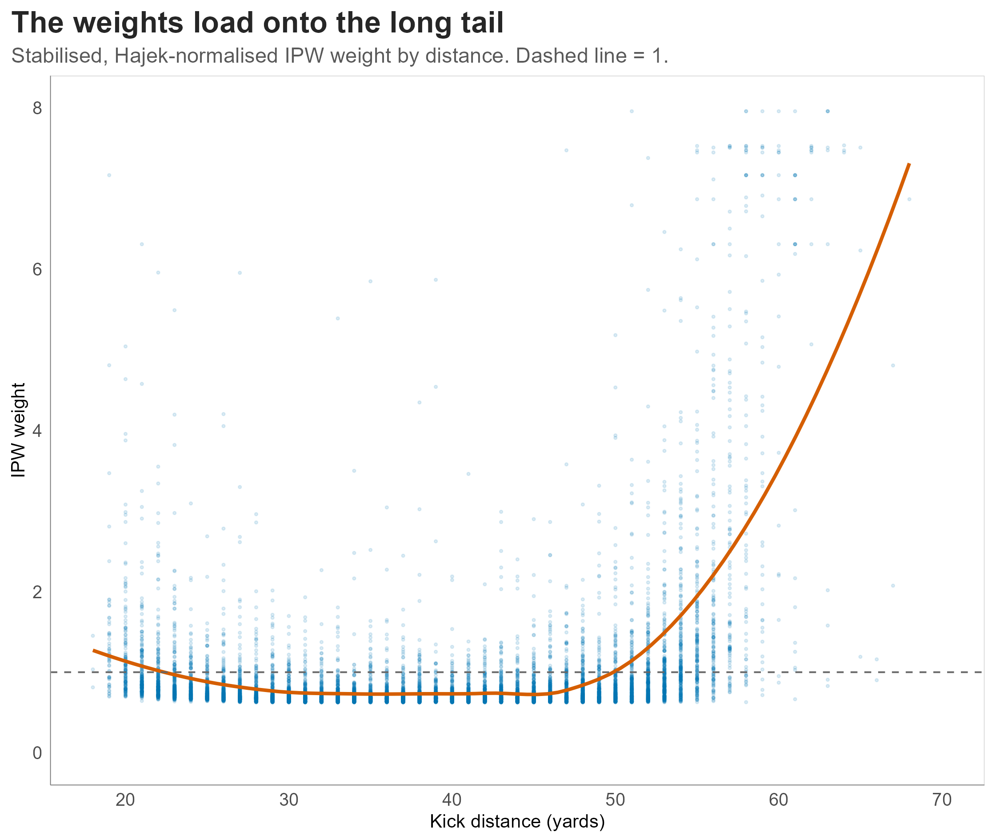
:::
:::

::: {.notes}
- Distance is overwhelmingly the driver of weight magnitude, which is what you
  want. Long kicks are the ones coaches decline, so they are the ones the
  observed sample under-represents. Weather and game state add scatter.
- Normalising over the in-range subset rather than the full field matters for
  what M3 estimates. Normalising over the full field would make M3 target a
  population made mostly of 80 and 90 yard field goals.
- Flag the cost now, because it becomes the explanation later. A handful of
  long, low-propensity kicks carry weights several times a routine kick. That
  is variance, and the cap constrains it but does not remove it. Effective
  sample size falls from 11,764 to about 6,300.
- Full construction detail is in the appendix if anyone wants it.

45 seconds.
:::

## Four outcome models

:::: {.slidebody}
::: {.columns}
::: {.column width="25%"}
### [M0]{.model-m0} distance only
B-spline in distance. Nothing else.

*The predictive floor.*
:::

::: {.column width="25%"}
### [M1]{.model-m1} full GLMM
M0 plus weather splines, contextual indicators, kicker-season and stadium
random intercepts. Unweighted.

*The baseline.*
:::

::: {.column width="25%"}
### [M2]{.model-m2} augmented
M1 fitted on an augmented set. PATs with real outcomes, declined fourth downs
as pseudo-misses, both at reduced weight.

*Impute the unobserved attempts.*

::: {.smaller}
Screens. Propensity at least 0.25. Distance beyond 33 yards. 1,923 of 11,142
candidates admitted. Labels biased in a known direction.
:::
:::

::: {.column width="25%"}
### [M3]{.model-m3} IPW
M1 fitted with stabilised IPW case weights.

*Reweight instead of impute.*

::: {.smaller}
Every row carries an observed outcome. The price is variance, not bias.
:::
:::
:::
::::

::: {.notes}
M2 versus M3 is the intellectual arc. Spend the time here.

- M2 was the first instinct and the obvious one. If declined kicks are missing,
  put them back. But a kick that never happened needs a binary label, and every
  qualifying non-attempt beyond 33 yards is entered as a miss even though some
  fraction would have been made. So M2's training set is deliberately
  pessimistic in exactly the distance range it is meant to learn about.
- The screens are substantive, not cosmetic. Propensity at least 0.25 keeps out
  situations no coach would have kicked from. The 33-yard floor sits just past
  PAT range, so near-certain kicks are not labelled misses. We tested removing
  it: it is the single most damaging change we made.
- M3 reaches the same target without inventing an outcome. That is the whole
  argument for preferring it.

70 seconds.
:::

## The outcome model

:::: {.slidebody}
- Seven-column B-spline in distance. Interior knots 28, 38, 48, 58. Boundaries
  18 and 70.
- Natural splines, 3 df each, in standardised wind, temperature, humidity.
- Contextual indicators. Turf, precipitation, clock running, last two minutes,
  iced, playoffs.
- Kicker-season random intercept $u_{s(i)}$. Stadium random intercept $v_{g(i)}$.

$$
\text{logit}\, P(\text{make}_i) = \sum_{k=1}^{7} \beta_k b_k(d_i) + \sum_{j} \gamma_j n_j(w_i, T_i, H_i) + \boldsymbol{\delta}^\top \mathbf{C}_i + u_{s(i)} + v_{g(i)}
$$

::: {.takeaway}
Identical specification for M1, M2 and M3; only the training set and the case
weights change.
:::
::::

::: {.notes}
Point at the three blocks rather than reading the equation. Distance, then
conditions, then the two random intercepts.

The line that matters is the last one. M1, M2 and M3 are the same model, so the
comparison is clean because nothing else varies.

35 seconds.
:::

## The ordering reverses

:::: {.vcenter}
| Model | IS Brier | OOS Brier | IS Log-Loss | OOS Log-Loss |
|---|---:|---:|---:|---:|
| [M0]{.model-m0} distance only | 0.1045 | 0.1012 | 0.3387 | 0.3323 |
| [M1]{.model-m1} full GLMM | 0.1004 | **0.1004** | 0.3259 | **0.3295** |
| [M2]{.model-m2} augmented | 0.1009 | 0.1013 | 0.3281 | 0.3323 |
| [M3]{.model-m3} IPW | **0.0982** | 0.1030 | **0.3216** | 0.3383 |

::: {.smaller}
In-sample $n = 11{,}548$. Held-out $n = 2{,}251$ from 593 disjoint games. Lower
is better. AUC orders identically.
:::

::: {.takeaway}
**M3 wins in-sample on every metric and loses out-of-sample on every metric.**
Out of sample it is outperformed by the distance-only model.
:::
::::

::: {.notes}
The slide that matters. Read the reversal out loud, then stop talking for a
beat.

- M3 gives the best in-sample fit anyone would want. On held-out games it drops
  behind M1 and behind M0.
- M2 never improves on M1 on either split.
- Both scoring rules agree in both splits, so the reversal is not an artifact of
  the choice of proper scoring rule.
- Era stability and train/test balance are both in the appendix if they come up.
  Short version: M1 beats M3 in both halves of the window, and the realised
  split is an unremarkable draw against 2,000 permutations.

80 seconds.
:::

## Calibration on held-out kicks

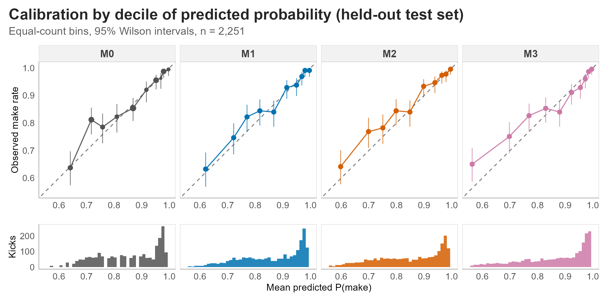

::: {.notes}
- Equal-count deciles, 95% Wilson intervals, predicted-probability histogram
  beneath each panel so the audience can see where the mass is.
- All four models are well calibrated in the high-probability bins, which is
  where the overwhelming majority of kicks sit.
- All four sit slightly above the diagonal from roughly 0.70 to 0.90, a mild
  under-prediction on kicks of intermediate difficulty. The sign is consistent
  across bins and across models, including distance-only M0, so it reflects the
  outcome-model family rather than anything IPW introduced.
- M3's lowest bin shows the largest deviation, 0.668 observed against 0.563
  predicted. That is the upweighting of difficult attempts pulling predictions
  down in the tail.
- The lowest bin is wide and thinly populated. If it draws a question, the
  appendix has the bin-width figure.

50 seconds.
:::

## Why neither correction wins

::: {.columns}
::: {.column width="60%"}
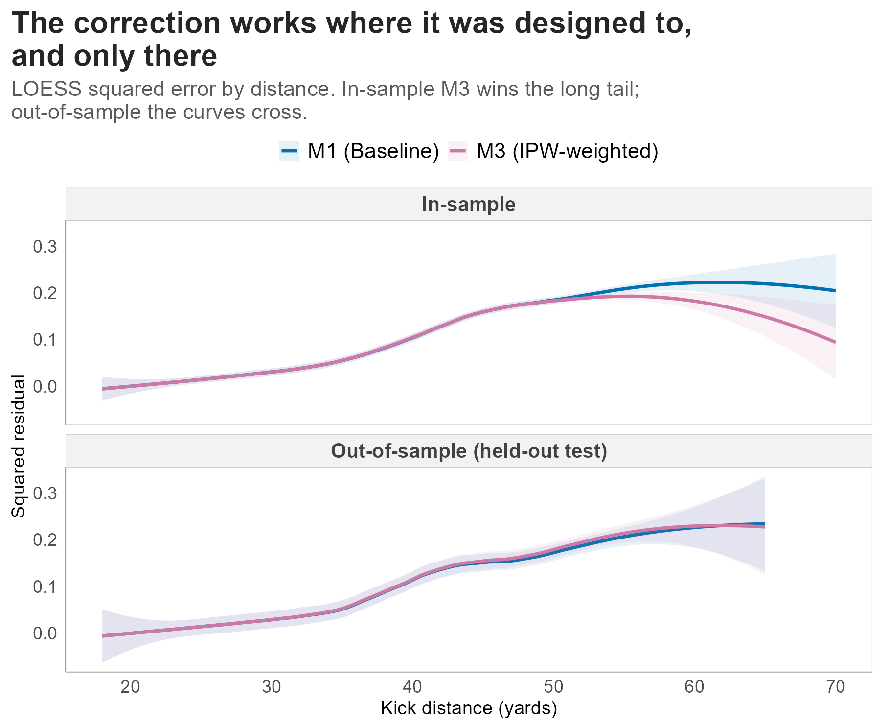
:::

::: {.column width="40%"}
**[M2]{.model-m2}. The labels are systematically wrong.**

Every declined kick beyond 33 yards is entered as a miss. Degradation is
monotone in the augmentation weight.

| Aug. weight | IS Brier |
|---:|---:|
| 0.05 | 0.1007 |
| 0.10 | 0.1009 |
| 0.25 | 0.1013 |

**[M3]{.model-m3}. The weights concentrate fit on the sparsest part of the
curve.**

Weight is concentrated on long, low-propensity attempts. In-sample error drops
exactly there. Out of sample the curves cross.
:::
:::

::: {.notes}
- Left panel, in-sample. M3's error curve sits below M1's at long distance. The
  correction is real and visible precisely where the weights are largest.
- Right panel, out-of-sample. The curves cross, and M1 wins across the range
  that holds most of the test set.
- The in-sample tail gains sound large until you look at the counts. 96 kicks
  in-sample beyond 60 yards, 19 in the test set. Directional evidence, not a
  precise estimate.
- The M2 grid is quick. If the pseudo-misses carried real information, leaning
  on them harder should help. It does the opposite, which is the signature of a
  label that is systematically wrong rather than merely noisy. We also swept the
  propensity threshold: same shape, same direction, and the limit of both is no
  augmentation at all.
- For M3, IPW deliberately shifts fitting effort toward the sparse,
  high-variance tail. Those kicks are the hardest to predict by construction and
  there are very few of them. The model learns the tail better and the bulk
  worse.
- If the deficit came from a few runaway weights, capping would remove it.
  Capping cuts the largest weight by orders of magnitude and the ordering is
  unchanged.

80 seconds.
:::

## To kick or not to kick

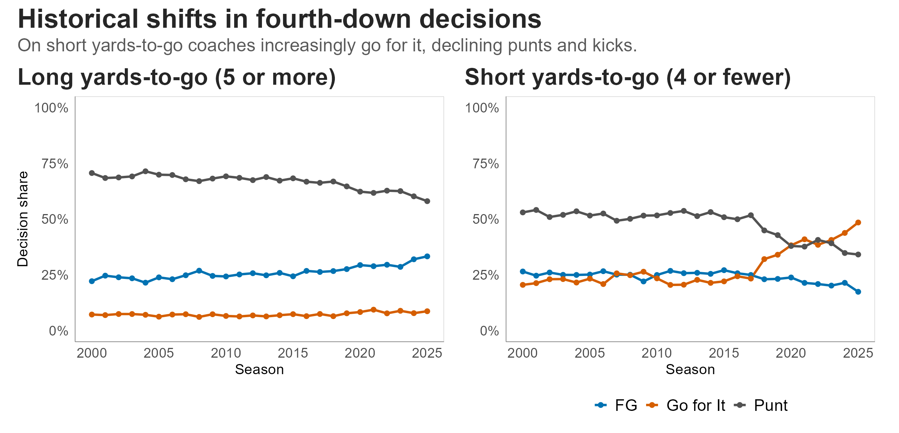

::: {.notes}
Split by yards to go, because the trade-off is completely different.

- Long yards to go. Punting still dominates and always has. Field goals have
  gained on punts steadily. Go-for-it barely moves, which is unsurprising, since
  converting five-plus yards on one play is difficult.
- Longer range appears to buy a team the option to trade a drive-killing punt
  for a realistic chance at three points.
- Short yards to go is the more interesting panel. Going for it takes share from
  both alternatives, and the crossover is sharp around 2018 to 2020. That is not
  explained by kicker improvement.

Takeaway: the first follows from kicker improvement. The second does not.

55 seconds.
:::

## Fourth and short, by era

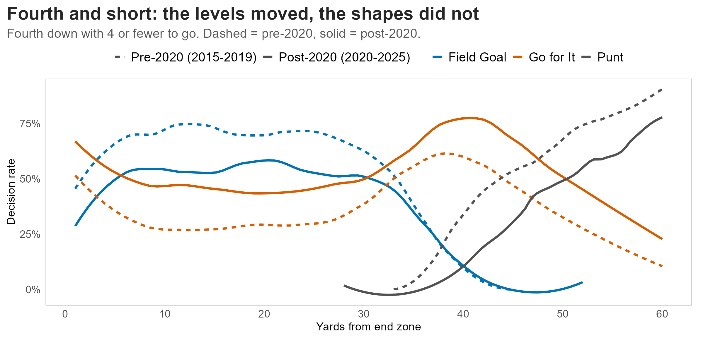

::: {.notes}
- Same short yards-to-go situations, both eras on shared axes. Dashed is
  pre-2020, solid is post-2020.
- Curve shapes hold. Levels move a long way. Kicking is no longer the default
  inside 45 yards.
- Go-for-it rates rise at essentially every field position.
- The point to land: coaches went for it more even as kickers got better. If
  declines were mainly about doubting the kicker, improving kickers should have
  moved these curves the other way.
- Describe the shift as aggressive and risk-tolerant. Greater tolerance for
  variance in pursuit of higher expected value.
- The pool of situations that produces an observed attempt is both shrinking and
  changing shape.

60 seconds.
:::

## The value was in the alternative

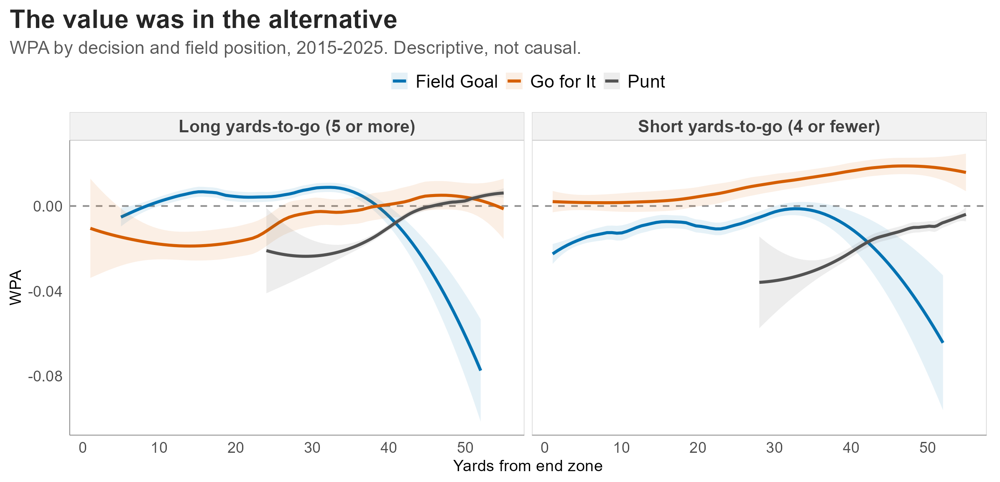

::: {.notes}
- Back to the full 2015 to 2025 sample after the era split, so this is not a
  post-2020 artifact.
- Short yards to go. The go-for-it curve sits above zero at every field position
  and climbs as you move away from the end zone. Field goal WPA is negative
  essentially everywhere in that regime.
- Long yards to go. Field goals hold the advantage until roughly 40 yards out.
- Coaches appear to have internalised this and acted on it.
- Bring it back to the models. We assumed a conservative coaching ethic,
  declining out of doubt about the kicker. What the decision curves and the WPA
  curves show together is consistent with coaches moving toward the
  higher-value option. Under that reading a declined kick is mostly a statement
  about the alternative, so there is little kicker-ability signal in it for
  either correction to recover.
- These curves are descriptive. They do not identify what any coach was
  thinking. Say that out loud.

65 seconds.
:::

## What we take from this

:::: {.slidebody}
::: {.columns}
::: {.column width="50%"}
**Findings**

1. Coaching selection is strongly structured. In-range AUC 0.93 to 0.96 every
   season.
2. Pseudo-label augmentation fails, and fails worse the harder you lean on it.
3. IPW corrects what it claims to in-sample at long distance and still does not
   generalise. M1 is the better forecaster in both eras.

**Recommendation**

For in-game make probability, use the unweighted GLMM.
:::

::: {.column width="50%"}
<!-- Held back to the next slide. The column is declared so the left-hand
     column sits in exactly the same place across the pair. -->
:::
:::
::::

::: {.notes}
- The negative result is the contribution. Two obvious corrections, both
  implemented carefully, and the selection-inheriting model remained the better
  forecaster of the kicks coaches actually take.
- Take the three findings in order, then land the recommendation before
  advancing. The right-hand column arrives on the next slide, so there is
  nothing on screen competing with these.

30 seconds.
:::

## What we take from this

:::: {.slidebody}
::: {.columns}
::: {.column width="50%"}
**Findings**

1. Coaching selection is strongly structured. In-range AUC 0.93 to 0.96 every
   season.
2. Pseudo-label augmentation fails, and fails worse the harder you lean on it.
3. IPW corrects what it claims to in-sample at long distance and still does not
   generalise. M1 is the better forecaster in both eras.

**Recommendation**

For in-game make probability, use the unweighted GLMM.
:::

::: {.column width="50%"}
**What that appears to say about the mechanism**

We assumed coaches decline out of doubt about the kicker. The decision curves
and the WPA landscape point elsewhere. If the decision carries little
information about kicker ability, there is little for a correction to recover.

**Scope**

M1 and M3 target different estimands. This is a predictive comparison. Nothing
here identifies the causal effect of the attempt decision.

**Next**

Kicker evaluation via FGOE. A causal treatment of the attempt decision. A
win-probability-maximising decision model.
:::
:::
::::

::: {.notes}
Same slide, right column revealed. The left column has not moved, so do not
re-read it.

- The mechanism reading is an interpretation. What can be said is that the
  pattern we assumed would produce a correctable bias does not appear to be the
  dominant pattern in the data.
- Scope. This is about predictive performance on observed attempts. It is not a
  claim that selection does not matter, and it is not a causal statement.
- If asked whether more data would change it: M3's in-sample gains sit in the
  sparse tail where the weights are largest, and its out-of-sample deficit shows
  up at the medium distances that make up the bulk of the test set. That is a
  variance pattern, not a sample-size pattern.

Closing line: we assumed coaches were protecting their kickers. What the data
appears to show is coaches taking the better bet. Correcting for a decision that
looks mostly like win maximisation does not tell you much more about whether a
kick goes in.

30 seconds.
:::

## Thank you {.airy}

:::: {.slidebody}
::: {.columns}
::: {.column width="50%"}
**Questions welcome.**

Data via **nflfastR**.

Elliott Kervin · Michael Schuckers
University of North Carolina at Charlotte
:::

::: {.column width="50%"}
::: {.small}
**Key references**

Pasteur and Cunningham-Rhoads, on distance-adjusted kicker evaluation.

Osborne and Levine, on shrinkage estimation of field goal success.

Horvitz and Thompson, on sampling without replacement from a finite universe.

Hernan and Robins, *Causal Inference*, on stabilised weights.
:::
:::
:::
::::

::: {.notes}
10 seconds. The appendix continues from here if a question needs it.
:::

## Train and test balance {visibility="uncounted"}

[Appendix A1]{.appendix-tag}

:::: {.vcenter}
| Distance Band | Train n | Train share | Test n | Test share | Diff (pp) |
|---|---:|---:|---:|---:|---:|
| < 30 | 2,214 | 23.8% | 495 | 22.0% | -1.82 |
| 30-39 | 2,654 | 28.5% | 644 | 28.6% | +0.06 |
| 40-49 | 2,716 | 29.2% | 696 | 30.9% | +1.71 |
| 50-59 | 1,636 | 17.6% | 397 | 17.6% | +0.04 |
| 60+ | 77 | 0.8% | 19 | 0.8% | +0.02 |
| **Mean kick distance** | | 38.68 | | 39.00 | +0.32 yds |

::: {.smaller}
Season-stratified game-level permutation test on the band shares, 2,000 redraws.
Observed total variation distance 0.0182, null median 0.0162, $p = 0.385$.
The realised split is an unremarkable draw.
:::
::::

::: {.notes}
Triggered by "was the split unlucky?". Mean distance differs by a third of a
yard, mean propensity by 0.004, and the observed band imbalance sits inside the
bulk of the permutation null. It is a slightly worse draw than the median, and
nowhere near a significant one.
:::

## Era stability of the result {visibility="uncounted" .airy}

[Appendix A2]{.appendix-tag}

:::: {.vcenter}
| Era | M1 Brier | M3 Brier | M1 Log-Loss | M3 Log-Loss |
|---|---:|---:|---:|---:|
| Pre-2020 (n = 976) | **0.1105** | 0.1141 | **0.3583** | 0.3702 |
| Post-2020 (n = 1,275) | **0.0928** | 0.0945 | **0.3074** | 0.3139 |

::: {.takeaway}
M1 beats M3 in both halves, on both scoring rules. The result is not a
post-2020 artifact.
:::
::::

::: {.notes}
Triggered by "is this a post-2020 artifact?". No. The absolute level differs
between eras because the post-2020 attempt mix is different, but the ordering
is identical.
:::

## Full results {visibility="uncounted"}

[Appendix A3]{.appendix-tag}

:::: {.vcenter}
| Model | IS Brier | IS Log-Loss | IS AUC | OOS Brier | OOS Log-Loss | OOS AUC |
|---|---:|---:|---:|---:|---:|---:|
| M0 distance only | 0.1045 | 0.3387 | 0.774 | 0.1012 | 0.3323 | 0.762 |
| M1 full GLMM | 0.1004 | 0.3259 | 0.804 | **0.1004** | **0.3295** | **0.769** |
| M2 augmented | 0.1009 | 0.3281 | 0.800 | 0.1013 | 0.3323 | 0.766 |
| M3 IPW | **0.0982** | **0.3216** | **0.805** | 0.1030 | 0.3383 | 0.757 |

::: {.smaller}
In-sample $n = 11{,}548$. Held-out $n = 2{,}251$. Brier and log-loss lower is
better, AUC higher is better. Blocked kicks excluded.
:::
::::

::: {.notes}
Triggered by "what about AUC?". It orders identically to Brier and log-loss on
both splits, which is the point of showing it.
:::

## Where exactly M3 improved {visibility="uncounted"}

[Appendix A4]{.appendix-tag}

:::: {.vcenter}
| Distance Band | n | M0 | M1 | M2 | M3 |
|---|---:|---:|---:|---:|---:|
| < 30 | 2,709 | 0.0162 | 0.0161 | 0.0161 | 0.0161 |
| 30-39 | 3,298 | 0.0553 | **0.0543** | 0.0545 | 0.0545 |
| 40-49 | 3,412 | 0.1563 | **0.1502** | 0.1508 | 0.1503 |
| 50-59 | 2,033 | 0.2090 | 0.1981 | 0.1996 | **0.1879** |
| 60+ | 96 | 0.2298 | 0.2188 | 0.2193 | **0.1657** |

::: {.smaller}
In-sample Brier by distance band. Bands are half-open, so 60+ means 60 yards or
more. M3 gains 5.2% at 50-59 and 24.3% at 60+ versus M1.
:::
::::

::: {.notes}
Triggered by "where exactly did M3 improve?". Strictly at 50 yards and beyond.
Inside 50 it is level with M1 or a hair behind. The 60+ cell rests on 96 kicks,
so treat the 24.3% as directional.
:::

## Why the lowest decile sits near 60% {visibility="uncounted"}

[Appendix A5]{.appendix-tag}

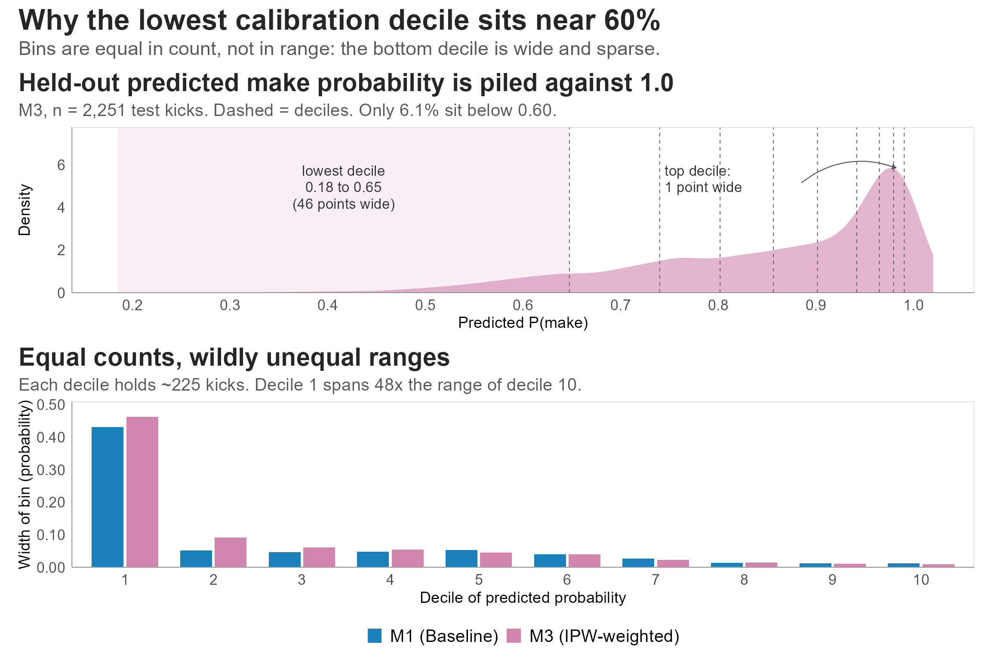

::: {.notes}
Triggered by the lowest calibration bin. The bins are equal in COUNT, not in
RANGE. Predicted make probability piles up against 1.0, so the bottom decile
spans an enormous sparse stretch of the probability scale to collect its 225
kicks, while the top decile collects its 225 from a slice about a point wide.
:::

## Weight construction in full {visibility="uncounted"}

[Appendix A6]{.appendix-tag}

:::: {.slidebody}
::: {.columns}
::: {.column width="52%"}
**Three stages, per season**

1. Stabilise. $w_i = \bar{\pi} / \hat{\pi}(X_i)$, with $\hat{\pi}$ clipped to
   $[0.02, 0.98]$ before inversion.
2. Hajek-normalise to mean 1, then cap at
   $\bar{w}_s + 3\sigma_{w,s}$, then renormalise.
3. $\bar{\pi}$ and both normalisations are computed over the **in-range**
   subset, not the full propensity frame.
:::

::: {.column width="48%"}
**What the cap costs and buys**

Before capping, one attempt carried a case weight of **1,633**.

After capping, weights span **0.63 to 8.49**, median 0.71.

Effective sample size falls from 11,764 to about **6,300**, so the reweighting
costs roughly 46% of the sample.
:::
:::
::::

::: {.notes}
Triggered by "how did you build the weights?". The ESS number is the honest
summary of the price: the weights are not extreme any more, but they still cost
close to half the effective sample, and that is where M3's out-of-sample
variance comes from.

If asked why normalise in-range: normalising over the full field would make M3
target a population made mostly of 80 and 90 yard field goals.
:::

## M2 inclusion criteria {visibility="uncounted"}

[Appendix A7]{.appendix-tag}

::: {.columns}
::: {.column width="58%"}
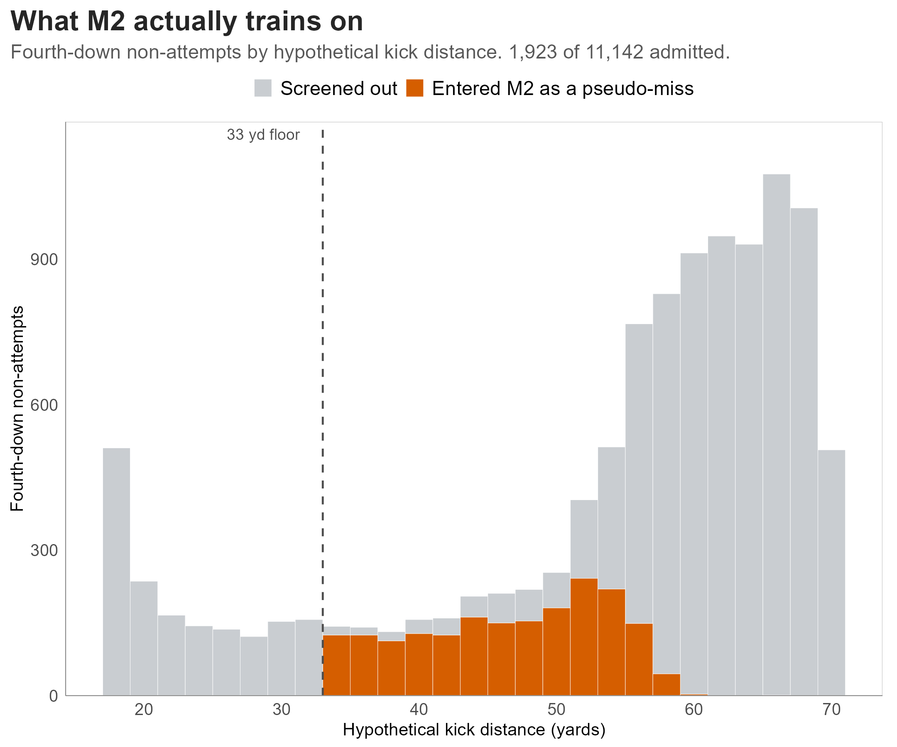
:::

::: {.column width="42%"}
| Propensity floor | Pool | OOS Brier |
|---|---:|---:|
| M1, no augmentation | 0 | **0.1004** |
| 0.50 | 1,087 | 0.1009 |
| 0.35 | 1,543 | 0.1012 |
| 0.25 (primary) | 1,923 | 0.1013 |
| 0.15 | 2,470 | 0.1016 |
| 0.10 | 2,903 | 0.1018 |

::: {.smaller}
Monotone, and in the unhelpful direction. Every step down in the floor makes it
worse, and the limit of the sweep is no augmentation at all.
:::
:::
:::

::: {.notes}
Triggered by "how did you pick the pseudo-miss pool?". We swept it. Every value
fails, and lower values fail worse.

The intuition that fails: lowering the floor admits longer declines, whose
pseudo-miss label is less wrong. It does admit them, but the extra rows
concentrate the label problem where the data is thinnest rather than diluting
it. The first-order effect is how MANY wrong labels you add, not how wrong each
one is.

We also tested removing the 33-yard distance floor. That is the single worst
configuration we ran: it biases the sub-30-yard band down by 2.4 points, in the
one region every model already gets right.
:::

## M2 weight sensitivity in full {visibility="uncounted"}

[Appendix A8]{.appendix-tag}

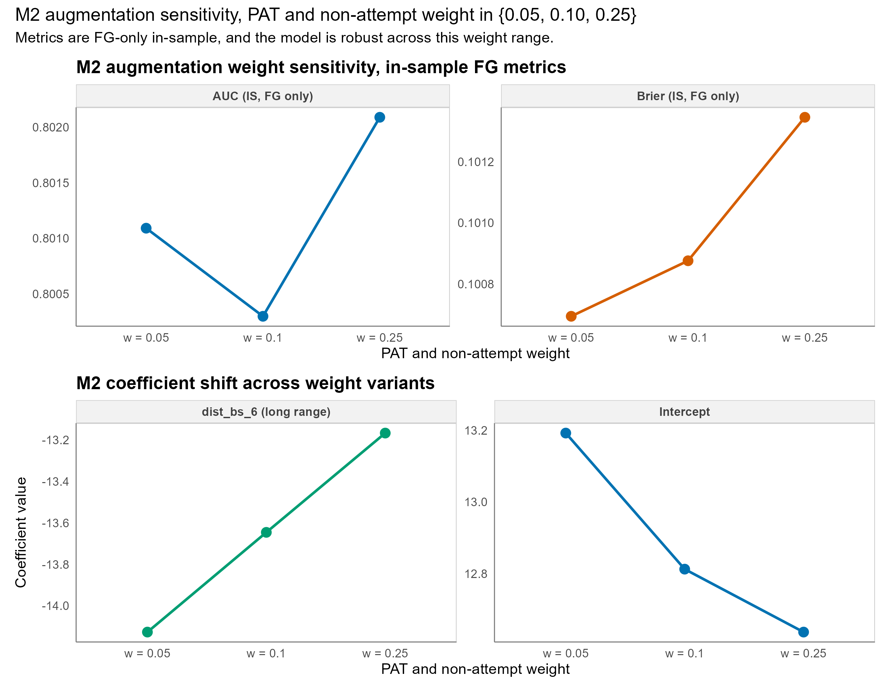

::: {.notes}
Triggered by "did you tune the augmentation?". We ran the grid and reported the
whole thing. Brier, log-loss and calibration error all degrade in order as the
weight rises. Nothing in the grid beats M1 out of sample.
:::

## Weather covariates, raw {visibility="uncounted"}

[Appendix A9a]{.appendix-tag}

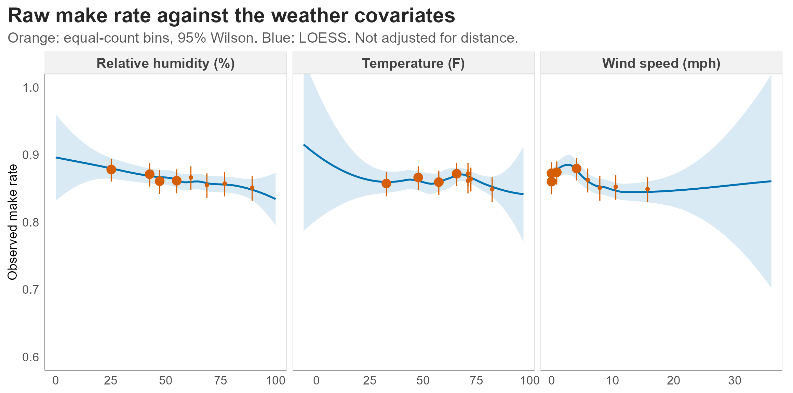

::: {.notes}
Triggered by "how does weather enter?". Natural splines with 3 df each in
standardised wind, temperature and humidity, entered additively.

This is the raw relationship, and it is confounded with distance, because
coaches attempt shorter kicks in bad conditions. The next slide takes distance
out of it.
:::

## Weather covariates, distance held {visibility="uncounted"}

[Appendix A9b]{.appendix-tag}

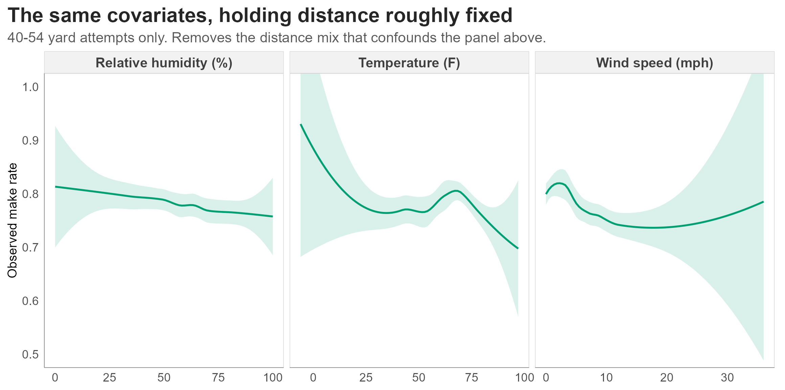

::: {.notes}
The same three covariates inside a 40 to 54 yard band, so distance is roughly
constant across the comparison. The wind effect survives; temperature and
humidity mostly flatten.

That is the honest summary of what the weather terms buy: wind is doing nearly
all of the work.
:::

## Fourth-down decisions by field position {visibility="uncounted"}

[Appendix A10]{.appendix-tag}

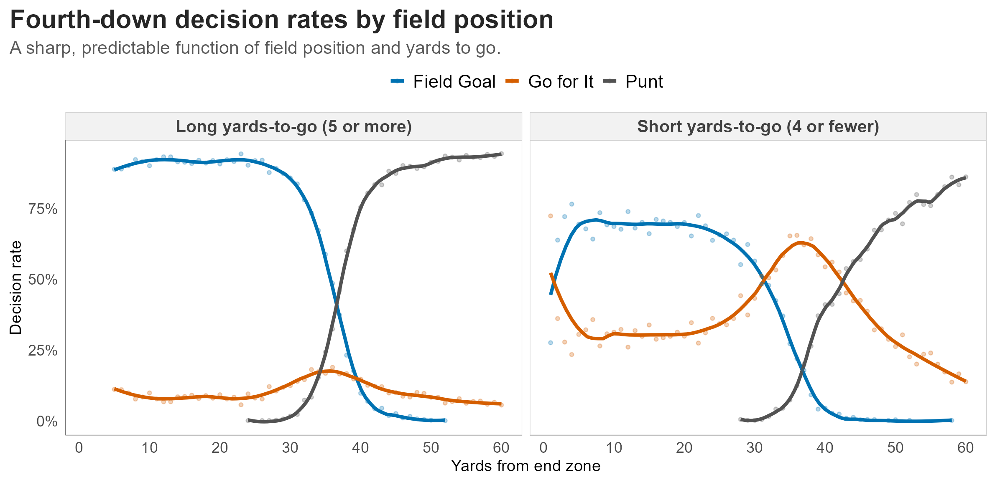

::: {.notes}
Triggered by "what does the decision surface look like?". This is the selection
mechanism made visible, and it is the figure that most directly justifies the
propensity model.

Long yards to go: field goals dominate inside about 35 yards from the end zone,
punts beyond that. Clean crossover. Short yards to go: kicking holds until
roughly 30 yards out, with the striking exception of the 1-yard line where
everyone goes for it. Go-for-it peaks around the 40, because from there a field
goal is a 55-plus yard kick.
:::

## In-sample separation {visibility="uncounted"}

[Appendix A11]{.appendix-tag}

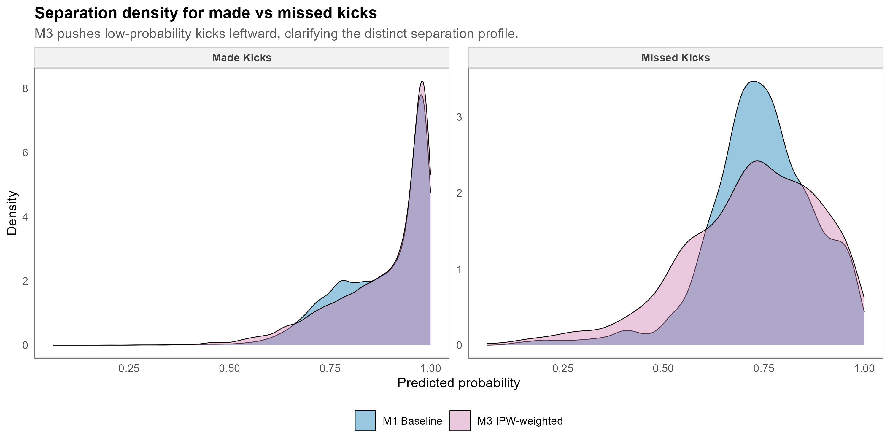

::: {.notes}
Triggered by "how well does it discriminate?". In-sample predicted probability
split by realised outcome. M3 pushes low-probability kicks leftward, which is
the same tail behaviour the distance-band table shows, seen from a different
angle.
:::

## WPA by regime and era {visibility="uncounted"}

[Appendix A12]{.appendix-tag}

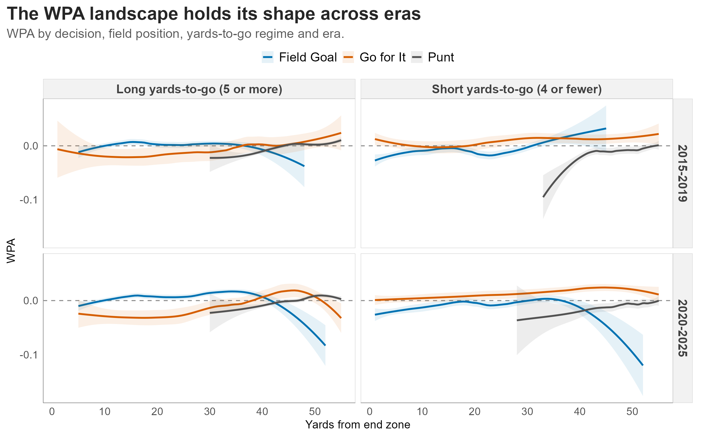

::: {.notes}
Triggered by "did the WPA landscape itself move?". The levels shift a little but
the shapes hold across eras, so the closing argument does not depend on the era
split. The go-for-it advantage on short yards-to-go is present in both halves of
the window.
:::

## Open questions {visibility="uncounted"}

[Appendix A13]{.appendix-tag}

:::: {.slidebody}
::: {.columns}
::: {.column width="50%"}
**Speculation, not analysis**

Why did fourth-down behaviour change so sharply around 2018 to 2020? Coaching
trees, the spread of analytics staff, and public win-probability tools are all
plausible and none of them are tested here.

Whether the shift is better described as a change in beliefs or a change in
willingness to act on beliefs already held.
:::

::: {.column width="50%"}
**What a causal treatment would need**

An estimand defined on the decision itself rather than on the observed
attempts.

An identification argument for unmeasured coach and roster factors, which the
propensity model conditions on only through their observable proxies.

A defensible answer to what "would have happened" means for a kick that was
never taken.
:::
:::
::::

::: {.notes}
Explicitly labelled as speculation. If someone pushes on the coaching-tree
story, agree that it is interesting and say plainly that we have not tested it.

The right closing note on the causal question: this paper is a predictive
comparison. The causal version is the next paper, and it needs a different
design, not a better model.
:::
