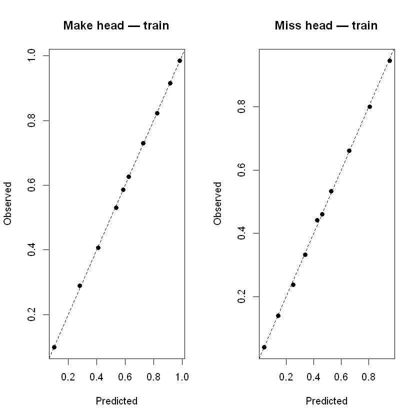
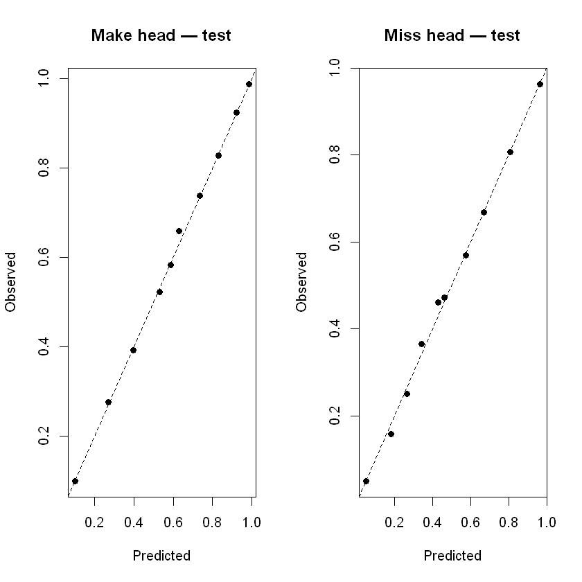
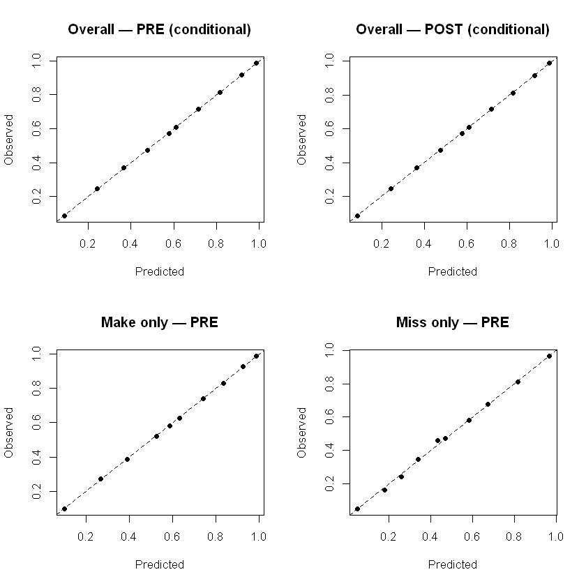
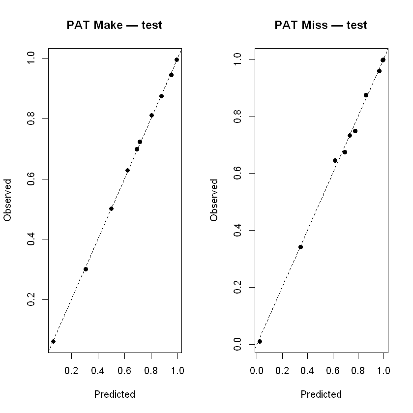
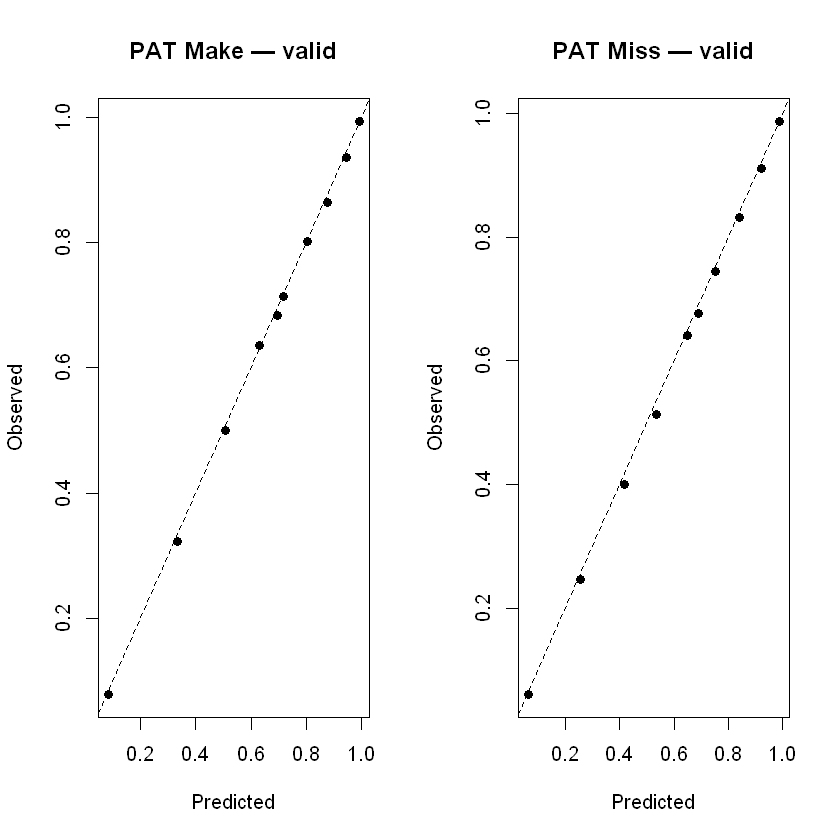
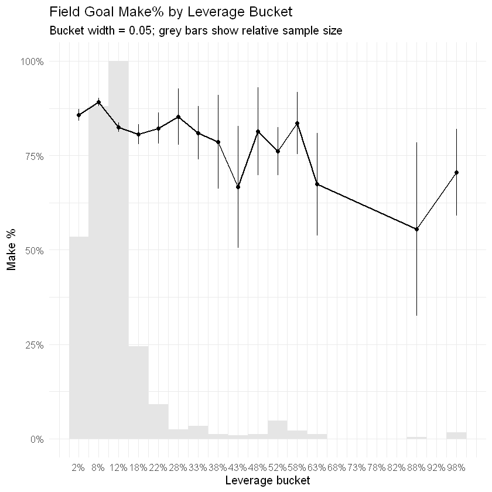

---
jupyter:
  kernelspec:
    display_name: R
    language: R
    name: ir
  language_info:
    codemirror_mode: r
    file_extension: .r
    mimetype: text/x-r-source
    name: R
    pygments_lexer: r
    version: 4.5.1
  nbformat: 4
  nbformat_minor: 5
---

::: {#9b087b55 .cell .code execution_count="1" vscode="{\"languageId\":\"r\"}"}
``` R
# Isotonic calibration
# Install only missing packages
pkgs <- c("tidyverse", "data.table", "nflreadr", "lubridate", "stringr",
      "forcats", "glue", "splines", "splines2", "readr")

installed <- rownames(installed.packages())
to_install <- setdiff(pkgs, installed)

if (length(to_install) > 0) {
  install.packages(to_install)
}

#Load libraries
suppressPackageStartupMessages({
  library(tidyverse)
  library(data.table)
  library(lubridate)
  library(stringr)
  library(forcats)
  library(glue)
  library(splines)
  library(splines2)
  library(readr)
  library(dplyr); library(tidyr); library(purrr); library(readr)
    library(nflreadr)  
    library(rlang)
})
```
:::

::: {#cc497a69 .cell .code execution_count="9" vscode="{\"languageId\":\"r\"}"}
``` R
PROJECT_ROOT <- normalizePath('G:/My files/Python/Sports Analytics Projects/Football/Kickers/NFL-Field-Goal-Kicker-Model', winslash = '\\', mustWork = FALSE)
reference_dir <- file.path(PROJECT_ROOT, 'Reference')
pbp_data_dir <- 'G:/Python/Data/NFL'
data_dir <- file.path(PROJECT_ROOT, 'data')
leverage_dir <- file.path(data_dir, 'leverage')
reports_dir <- file.path(PROJECT_ROOT, 'reports')
config_path <- file.path(PROJECT_ROOT, 'config', 'params.yaml')

SEASONS <- 2000:2024
options(tibble.print_min = 6, tibble.print_max = 6)

print(PROJECT_ROOT)
print(data_dir)
print(leverage_dir)
```

::: {.output .stream .stdout}
    [1] "G:\\My files\\Python\\Sports Analytics Projects\\Football\\Kickers\\NFL-Field-Goal-Kicker-Model"
    [1] "G:\\My files\\Python\\Sports Analytics Projects\\Football\\Kickers\\NFL-Field-Goal-Kicker-Model/data"
    [1] "G:\\My files\\Python\\Sports Analytics Projects\\Football\\Kickers\\NFL-Field-Goal-Kicker-Model/data/leverage"
    [1] "G:\\My files\\Python\\Sports Analytics Projects\\Football\\Kickers\\NFL-Field-Goal-Kicker-Model/data"
    [1] "G:\\My files\\Python\\Sports Analytics Projects\\Football\\Kickers\\NFL-Field-Goal-Kicker-Model/data/leverage"
:::
:::

::: {#80dcbe03 .cell .code execution_count="4" vscode="{\"languageId\":\"r\"}"}
``` R
# ---- Config ----
eps <- 1e-4

clamp01 <- function(x, eps=1e-4) pmin(pmax(x, eps), 1 - eps)

# Predict-like wrapper for isoreg (step function interpolation)
iso_fit <- function(y_hat, y_true) {
  fit <- stats::isoreg(y_hat, y_true)
  # Convert to a monotone step function over sorted x
  xs <- fit$x
  ys <- fit$yf
  list(xs = xs, ys = ys)
}
iso_predict <- function(fit, x) {
  # Right-continuous step function: find interval in xs
  # approx() with method="constant" and rule=2 (extend) is convenient
  y <- approx(fit$xs, fit$ys, x, method = "constant", ties = "ordered", rule = 2)$y
  clamp01(y, eps = 1e-8)
}
```
:::

::: {#176956db .cell .code execution_count="6" vscode="{\"languageId\":\"r\"}"}
``` R
# Data Load
pbp_path <- file.path(pbp_data_dir, 'pbp.rds')


pbp <- readr::read_rds(pbp_path)

glimpse(pbp)
```

::: {.output .stream .stdout}
    Rows: 1,184,721
    Columns: 372
    $ play_id                              <dbl> 34, 70, 106, 131, 148, 165, 190, …
    $ game_id                              <chr> "2000_01_ARI_NYG", "2000_01_ARI_N…
    $ old_game_id                          <dbl> 2000090300, 2000090300, 200009030…
    $ home_team                            <chr> "NYG", "NYG", "NYG", "NYG", "NYG"…
    $ away_team                            <chr> "ARI", "ARI", "ARI", "ARI", "ARI"…
    $ season_type                          <chr> "REG", "REG", "REG", "REG", "REG"…
    $ week                                 <dbl> 1, 1, 1, 1, 1, 1, 1, 1, 1, 1, 1, …
    $ posteam                              <chr> "ARI", "ARI", "ARI", "ARI", "ARI"…
    $ posteam_type                         <chr> "away", "away", "away", "away", "…
    $ defteam                              <chr> "NYG", "NYG", "NYG", "NYG", "NYG"…
    $ side_of_field                        <chr> "NYG", "NYG", "ARI", "ARI", "ARI"…
    $ yardline_100                         <dbl> 30, 25, 65, 63, 63, 63, 78, 70, 6…
    $ game_date                            <date> 2000-09-03, 2000-09-03, 2000-09-…
    $ quarter_seconds_remaining            <dbl> 900, 900, 900, 844, 837, 832, 820…
    $ half_seconds_remaining               <dbl> 1800, 1800, 1800, 1744, 1737, 173…
    $ game_seconds_remaining               <dbl> 3600, 3600, 3600, 3544, 3537, 353…
    $ game_half                            <chr> "Half1", "Half1", "Half1", "Half1…
    $ quarter_end                          <dbl> 0, 0, 0, 0, 0, 0, 0, 0, 0, 0, 0, …
    $ drive                                <dbl> 1, 1, 1, 1, 1, 1, 2, 2, 2, 2, 2, …
    $ sp                                   <dbl> 0, 0, 0, 0, 0, 0, 0, 0, 0, 0, 0, …
    $ qtr                                  <dbl> 1, 1, 1, 1, 1, 1, 1, 1, 1, 1, 1, …
    $ down                                 <dbl> NA, NA, 1, 2, 3, 4, 1, 2, 1, 2, 1…
    $ goal_to_go                           <dbl> 0, 0, 0, 0, 0, 0, 0, 0, 0, 0, 0, …
    $ time                                 <time> 15:00:00, 15:00:00, 15:00:00, 14…
    $ yrdln                                <chr> "NYG 30", "NYG 25", "ARI 35", "AR…
    $ ydstogo                              <dbl> 0, 0, 10, 8, 8, 8, 10, 2, 10, 11,…
    $ ydsnet                               <dbl> 2, 2, 2, 2, 2, 2, 39, 39, 39, 39,…
    $ desc                                 <chr> "B.Daluiso kicks 72 yards from NY…
    $ play_type                            <chr> "no_play", "kickoff", "run", "pas…
    $ yards_gained                         <dbl> 0, 0, 2, 0, 0, 0, 8, 3, -1, 15, 1…
    $ shotgun                              <dbl> 0, 0, 0, 0, 1, 0, 0, 0, 0, 0, 0, …
    $ no_huddle                            <dbl> 0, 0, 0, 0, 0, 0, 0, 0, 0, 0, 0, …
    $ qb_dropback                          <dbl> 0, 0, 0, 1, 1, 0, 0, 0, 0, 1, 1, …
    $ qb_kneel                             <dbl> 0, 0, 0, 0, 0, 0, 0, 0, 0, 0, 0, …
    $ qb_spike                             <dbl> 0, 0, 0, 0, 0, 0, 0, 0, 0, 0, 0, …
    $ qb_scramble                          <dbl> 0, 0, 0, 0, 0, 0, 0, 0, 0, 0, 0, …
    $ pass_length                          <chr> NA, NA, NA, NA, NA, NA, NA, NA, N…
    $ pass_location                        <chr> NA, NA, NA, NA, NA, NA, NA, NA, N…
    $ air_yards                            <dbl> NA, NA, NA, NA, NA, NA, NA, NA, N…
    $ yards_after_catch                    <dbl> NA, NA, NA, NA, NA, NA, NA, NA, N…
    $ run_location                         <chr> NA, NA, "left", NA, NA, NA, "righ…
    $ run_gap                              <chr> NA, NA, "end", NA, NA, NA, "tackl…
    $ field_goal_result                    <chr> NA, NA, NA, NA, NA, NA, NA, NA, N…
    $ kick_distance                        <dbl> NA, 69, NA, NA, NA, 41, NA, NA, N…
    $ extra_point_result                   <chr> NA, NA, NA, NA, NA, NA, NA, NA, N…
    $ two_point_conv_result                <chr> NA, NA, NA, NA, NA, NA, NA, NA, N…
    $ home_timeouts_remaining              <dbl> 3, 3, 3, 3, 3, 3, 3, 3, 3, 3, 3, …
    $ away_timeouts_remaining              <dbl> 3, 3, 3, 3, 3, 3, 3, 3, 3, 3, 3, …
    $ timeout                              <dbl> 0, 0, 0, 0, 0, 0, 0, 0, 0, 0, 0, …
    $ timeout_team                         <chr> NA, NA, NA, NA, NA, NA, NA, NA, N…
    $ td_team                              <chr> NA, NA, NA, NA, NA, NA, NA, NA, N…
    $ td_player_name                       <chr> NA, NA, NA, NA, NA, NA, NA, NA, N…
    $ td_player_id                         <chr> NA, NA, NA, NA, NA, NA, NA, NA, N…
    $ posteam_timeouts_remaining           <dbl> 3, 3, 3, 3, 3, 3, 3, 3, 3, 3, 3, …
    $ defteam_timeouts_remaining           <dbl> 3, 3, 3, 3, 3, 3, 3, 3, 3, 3, 3, …
    $ total_home_score                     <dbl> 0, 0, 0, 0, 0, 0, 0, 0, 0, 0, 0, …
    $ total_away_score                     <dbl> 0, 0, 0, 0, 0, 0, 0, 0, 0, 0, 0, …
    $ posteam_score                        <dbl> NA, 0, 0, 0, 0, 0, 0, 0, 0, 0, 0,…
    $ defteam_score                        <dbl> NA, 0, 0, 0, 0, 0, 0, 0, 0, 0, 0,…
    $ score_differential                   <dbl> NA, 0, 0, 0, 0, 0, 0, 0, 0, 0, 0,…
    $ posteam_score_post                   <dbl> 0, 0, 0, 0, 0, 0, 0, 0, 0, 0, 0, …
    $ defteam_score_post                   <dbl> 0, 0, 0, 0, 0, 0, 0, 0, 0, 0, 0, …
    $ score_differential_post              <dbl> 0, 0, 0, 0, 0, 0, 0, 0, 0, 0, 0, …
    $ no_score_prob                        <dbl> 0.000000000, 0.009370993, 0.00875…
    $ opp_fg_prob                          <dbl> 0.00000000, 0.19370632, 0.1614039…
    $ opp_safety_prob                      <dbl> 0.000000000, 0.006333613, 0.00575…
    $ opp_td_prob                          <dbl> 0.0000000, 0.3074415, 0.2631290, …
    $ fg_prob                              <dbl> 0.0000000, 0.1922670, 0.2261667, …
    $ safety_prob                          <dbl> 0.000000000, 0.003156701, 0.00416…
    $ td_prob                              <dbl> 0.0000000, 0.2877239, 0.3306232, …
    $ extra_point_prob                     <dbl> 0, 0, 0, 0, 0, 0, 0, 0, 0, 0, 0, …
    $ two_point_conversion_prob            <dbl> 0, 0, 0, 0, 0, 0, 0, 0, 0, 0, 0, …
    $ ep                                   <dbl> -0.14869480, -0.14869480, 0.66356…
    $ epa                                  <dbl> 0.00000000, 0.81226313, -0.076851…
    $ total_home_epa                       <dbl> 0.00000000, -0.81226313, -0.73541…
    $ total_away_epa                       <dbl> 0.00000000, 0.81226313, 0.7354115…
    $ total_home_rush_epa                  <dbl> 0.000000000, 0.000000000, 0.07685…
    $ total_away_rush_epa                  <dbl> 0.000000000, 0.000000000, -0.0768…
    $ total_home_pass_epa                  <dbl> 0.0000000, 0.0000000, 0.0000000, …
    $ total_away_pass_epa                  <dbl> 0.0000000, 0.0000000, 0.0000000, …
    $ air_epa                              <dbl> NA, NA, NA, NA, NA, NA, NA, NA, N…
    $ yac_epa                              <dbl> NA, NA, NA, NA, NA, NA, NA, NA, N…
    $ comp_air_epa                         <dbl> NA, NA, NA, NA, NA, NA, NA, NA, N…
    $ comp_yac_epa                         <dbl> NA, NA, NA, NA, NA, NA, NA, NA, N…
    $ total_home_comp_air_epa              <dbl> NA, NA, NA, NA, NA, NA, NA, NA, N…
    $ total_away_comp_air_epa              <dbl> NA, NA, NA, NA, NA, NA, NA, NA, N…
    $ total_home_comp_yac_epa              <dbl> NA, NA, NA, NA, NA, NA, NA, NA, N…
    $ total_away_comp_yac_epa              <dbl> NA, NA, NA, NA, NA, NA, NA, NA, N…
    $ total_home_raw_air_epa               <dbl> NA, NA, NA, NA, NA, NA, NA, NA, N…
    $ total_away_raw_air_epa               <dbl> NA, NA, NA, NA, NA, NA, NA, NA, N…
    $ total_home_raw_yac_epa               <dbl> NA, NA, NA, NA, NA, NA, NA, NA, N…
    $ total_away_raw_yac_epa               <dbl> NA, NA, NA, NA, NA, NA, NA, NA, N…
    $ wp                                   <dbl> 0.4220242, 0.4220242, 0.4486532, …
    $ def_wp                               <dbl> 0.5779758, 0.5779758, 0.5513468, …
    $ home_wp                              <dbl> 0.5779758, 0.5779758, 0.5513468, …
    $ away_wp                              <dbl> 0.4220242, 0.4220242, 0.4486532, …
    $ wpa                                  <dbl> 0.000000e+00, 2.662900e-02, -1.18…
    $ vegas_wpa                            <dbl> 0.0000000000, 0.0170638263, 0.005…
    $ vegas_home_wpa                       <dbl> 0.0000000000, -0.0170638263, -0.0…
    $ home_wp_post                         <dbl> NA, 0.5513468, 0.5632185, 0.59506…
    $ away_wp_post                         <dbl> NA, 0.4486532, 0.4367815, 0.40493…
    $ vegas_wp                             <dbl> 0.2436152, 0.2436152, 0.2606790, …
    $ vegas_home_wp                        <dbl> 0.7563848, 0.7563848, 0.7393210, …
    $ total_home_rush_wpa                  <dbl> 0.000000000, 0.000000000, 0.01187…
    $ total_away_rush_wpa                  <dbl> 0.000000000, 0.000000000, -0.0118…
    $ total_home_pass_wpa                  <dbl> 0.000000000, 0.000000000, 0.00000…
    $ total_away_pass_wpa                  <dbl> 0.000000000, 0.000000000, 0.00000…
    $ air_wpa                              <dbl> NA, NA, NA, NA, NA, NA, NA, NA, N…
    $ yac_wpa                              <dbl> NA, NA, NA, NA, NA, NA, NA, NA, N…
    $ comp_air_wpa                         <dbl> NA, NA, NA, NA, NA, NA, NA, NA, N…
    $ comp_yac_wpa                         <dbl> NA, NA, NA, NA, NA, NA, NA, NA, N…
    $ total_home_comp_air_wpa              <dbl> NA, NA, NA, NA, NA, NA, NA, NA, N…
    $ total_away_comp_air_wpa              <dbl> NA, NA, NA, NA, NA, NA, NA, NA, N…
    $ total_home_comp_yac_wpa              <dbl> NA, NA, NA, NA, NA, NA, NA, NA, N…
    $ total_away_comp_yac_wpa              <dbl> NA, NA, NA, NA, NA, NA, NA, NA, N…
    $ total_home_raw_air_wpa               <dbl> NA, NA, NA, NA, NA, NA, NA, NA, N…
    $ total_away_raw_air_wpa               <dbl> NA, NA, NA, NA, NA, NA, NA, NA, N…
    $ total_home_raw_yac_wpa               <dbl> NA, NA, NA, NA, NA, NA, NA, NA, N…
    $ total_away_raw_yac_wpa               <dbl> NA, NA, NA, NA, NA, NA, NA, NA, N…
    $ punt_blocked                         <dbl> 0, 0, 0, 0, 0, 0, 0, 0, 0, 0, 0, …
    $ first_down_rush                      <dbl> 0, 0, 0, 0, 0, 0, 0, 1, 0, 0, 0, …
    $ first_down_pass                      <dbl> 0, 0, 0, 0, 0, 0, 0, 0, 0, 1, 1, …
    $ first_down_penalty                   <dbl> 0, 0, 0, 0, 0, 0, 0, 0, 0, 0, 0, …
    $ third_down_converted                 <dbl> 0, 0, 0, 0, 0, 0, 0, 0, 0, 0, 0, …
    $ third_down_failed                    <dbl> 0, 0, 0, 0, 1, 0, 0, 0, 0, 0, 0, …
    $ fourth_down_converted                <dbl> 0, 0, 0, 0, 0, 0, 0, 0, 0, 0, 0, …
    $ fourth_down_failed                   <dbl> 0, 0, 0, 0, 0, 0, 0, 0, 0, 0, 0, …
    $ incomplete_pass                      <dbl> 0, 0, 0, 1, 1, 0, 0, 0, 0, 0, 0, …
    $ touchback                            <dbl> 0, 0, 0, 0, 0, 0, 0, 0, 0, 0, 0, …
    $ interception                         <dbl> 0, 0, 0, 0, 0, 0, 0, 0, 0, 0, 0, …
    $ punt_inside_twenty                   <dbl> 0, 0, 0, 0, 0, 0, 0, 0, 0, 0, 0, …
    $ punt_in_endzone                      <dbl> 0, 0, 0, 0, 0, 0, 0, 0, 0, 0, 0, …
    $ punt_out_of_bounds                   <dbl> 0, 0, 0, 0, 0, 0, 0, 0, 0, 0, 0, …
    $ punt_downed                          <dbl> 0, 0, 0, 0, 0, 0, 0, 0, 0, 0, 0, …
    $ punt_fair_catch                      <dbl> 0, 0, 0, 0, 0, 0, 0, 0, 0, 0, 0, …
    $ kickoff_inside_twenty                <dbl> 0, 0, 0, 0, 0, 0, 0, 0, 0, 0, 0, …
    $ kickoff_in_endzone                   <dbl> 0, 0, 0, 0, 0, 0, 0, 0, 0, 0, 0, …
    $ kickoff_out_of_bounds                <dbl> 0, 0, 0, 0, 0, 0, 0, 0, 0, 0, 0, …
    $ kickoff_downed                       <dbl> 0, 0, 0, 0, 0, 0, 0, 0, 0, 0, 0, …
    $ kickoff_fair_catch                   <dbl> 0, 0, 0, 0, 0, 0, 0, 0, 0, 0, 0, …
    $ fumble_forced                        <dbl> 0, 0, 0, 0, 0, 0, 0, 0, 0, 0, 0, …
    $ fumble_not_forced                    <dbl> 0, 0, 0, 0, 0, 0, 0, 0, 0, 0, 0, …
    $ fumble_out_of_bounds                 <dbl> 0, 0, 0, 0, 0, 0, 0, 0, 0, 0, 0, …
    $ solo_tackle                          <dbl> 0, 0, 1, 0, 0, 1, 1, 0, 1, 0, 1, …
    $ safety                               <dbl> 0, 0, 0, 0, 0, 0, 0, 0, 0, 0, 0, …
    $ penalty                              <dbl> 1, 0, 0, 0, 0, 0, 0, 0, 0, 0, 0, …
    $ tackled_for_loss                     <dbl> 0, 0, 0, 0, 0, 0, 0, 0, 1, 0, 0, …
    $ fumble_lost                          <dbl> 0, 0, 0, 0, 0, 0, 0, 0, 0, 0, 0, …
    $ own_kickoff_recovery                 <dbl> 0, 0, 0, 0, 0, 0, 0, 0, 0, 0, 0, …
    $ own_kickoff_recovery_td              <dbl> 0, 0, 0, 0, 0, 0, 0, 0, 0, 0, 0, …
    $ qb_hit                               <dbl> 0, 0, 0, 0, 0, 0, 0, 0, 0, 0, 0, …
    $ rush_attempt                         <dbl> 0, 0, 1, 0, 0, 0, 1, 1, 1, 0, 0, …
    $ pass_attempt                         <dbl> 0, 0, 0, 1, 1, 0, 0, 0, 0, 1, 1, …
    $ sack                                 <dbl> 0, 0, 0, 0, 0, 0, 0, 0, 0, 0, 0, …
    $ touchdown                            <dbl> 0, 0, 0, 0, 0, 0, 0, 0, 0, 0, 0, …
    $ pass_touchdown                       <dbl> 0, 0, 0, 0, 0, 0, 0, 0, 0, 0, 0, …
    $ rush_touchdown                       <dbl> 0, 0, 0, 0, 0, 0, 0, 0, 0, 0, 0, …
    $ return_touchdown                     <dbl> 0, 0, 0, 0, 0, 0, 0, 0, 0, 0, 0, …
    $ extra_point_attempt                  <dbl> 0, 0, 0, 0, 0, 0, 0, 0, 0, 0, 0, …
    $ two_point_attempt                    <dbl> 0, 0, 0, 0, 0, 0, 0, 0, 0, 0, 0, …
    $ field_goal_attempt                   <dbl> 0, 0, 0, 0, 0, 0, 0, 0, 0, 0, 0, …
    $ kickoff_attempt                      <dbl> 0, 1, 0, 0, 0, 0, 0, 0, 0, 0, 0, …
    $ punt_attempt                         <dbl> 0, 0, 0, 0, 0, 1, 0, 0, 0, 0, 0, …
    $ fumble                               <dbl> 0, 0, 0, 0, 0, 0, 0, 0, 0, 0, 0, …
    $ complete_pass                        <dbl> 0, 0, 0, 0, 0, 0, 0, 0, 0, 1, 1, …
    $ assist_tackle                        <dbl> 0, 1, 0, 0, 0, 0, 0, 1, 0, 1, 0, …
    $ lateral_reception                    <dbl> 0, 0, 0, 0, 0, 0, 0, 0, 0, 0, 0, …
    $ lateral_rush                         <dbl> 0, 0, 0, 0, 0, 0, 0, 0, 0, 0, 0, …
    $ lateral_return                       <dbl> 0, 0, 0, 0, 0, 0, 0, 0, 0, 0, 0, …
    $ lateral_recovery                     <dbl> 0, 0, 0, 0, 0, 0, 0, 0, 0, 0, 0, …
    $ passer_player_id                     <chr> NA, NA, NA, "00-0013042", "00-001…
    $ passer_player_name                   <chr> NA, NA, NA, "J.Plummer", "J.Plumm…
    $ passing_yards                        <dbl> NA, NA, NA, NA, NA, NA, NA, NA, N…
    $ receiver_player_id                   <chr> NA, NA, NA, "00-0019641", "00-001…
    $ receiver_player_name                 <chr> NA, NA, NA, "T.Jones", "F.Sanders…
    $ receiving_yards                      <dbl> NA, NA, NA, NA, NA, NA, NA, NA, N…
    $ rusher_player_id                     <chr> NA, NA, "00-0019641", NA, NA, NA,…
    $ rusher_player_name                   <chr> NA, NA, "T.Jones", NA, NA, NA, "T…
    $ rushing_yards                        <dbl> NA, NA, 2, NA, NA, NA, 8, 3, -1, …
    $ lateral_receiver_player_id           <chr> NA, NA, NA, NA, NA, NA, NA, NA, N…
    $ lateral_receiver_player_name         <chr> NA, NA, NA, NA, NA, NA, NA, NA, N…
    $ lateral_receiving_yards              <dbl> NA, NA, NA, NA, NA, NA, NA, NA, N…
    $ lateral_rusher_player_id             <chr> NA, NA, NA, NA, NA, NA, NA, NA, N…
    $ lateral_rusher_player_name           <chr> NA, NA, NA, NA, NA, NA, NA, NA, N…
    $ lateral_rushing_yards                <dbl> NA, NA, NA, NA, NA, NA, NA, NA, N…
    $ lateral_sack_player_id               <lgl> NA, NA, NA, NA, NA, NA, NA, NA, N…
    $ lateral_sack_player_name             <lgl> NA, NA, NA, NA, NA, NA, NA, NA, N…
    $ interception_player_id               <chr> NA, NA, NA, NA, NA, NA, NA, NA, N…
    $ interception_player_name             <chr> NA, NA, NA, NA, NA, NA, NA, NA, N…
    $ lateral_interception_player_id       <lgl> NA, NA, NA, NA, NA, NA, NA, NA, N…
    $ lateral_interception_player_name     <lgl> NA, NA, NA, NA, NA, NA, NA, NA, N…
    $ punt_returner_player_id              <chr> NA, NA, NA, NA, NA, "00-0000745",…
    $ punt_returner_player_name            <chr> NA, NA, NA, NA, NA, "T.Barber", N…
    $ lateral_punt_returner_player_id      <lgl> NA, NA, NA, NA, NA, NA, NA, NA, N…
    $ lateral_punt_returner_player_name    <lgl> NA, NA, NA, NA, NA, NA, NA, NA, N…
    $ kickoff_returner_player_name         <chr> NA, "M.Jenkins", NA, NA, NA, NA, …
    $ kickoff_returner_player_id           <chr> NA, "00-0008357", NA, NA, NA, NA,…
    $ lateral_kickoff_returner_player_id   <lgl> NA, NA, NA, NA, NA, NA, NA, NA, N…
    $ lateral_kickoff_returner_player_name <lgl> NA, NA, NA, NA, NA, NA, NA, NA, N…
    $ punter_player_id                     <chr> NA, NA, NA, NA, NA, "00-0013028",…
    $ punter_player_name                   <chr> NA, NA, NA, NA, NA, "S.Player", N…
    $ kicker_player_name                   <chr> NA, "B.Daluiso", NA, NA, NA, NA, …
    $ kicker_player_id                     <chr> NA, "00-0003841", NA, NA, NA, NA,…
    $ own_kickoff_recovery_player_id       <lgl> NA, NA, NA, NA, NA, NA, NA, NA, N…
    $ own_kickoff_recovery_player_name     <lgl> NA, NA, NA, NA, NA, NA, NA, NA, N…
    $ blocked_player_id                    <chr> NA, NA, NA, NA, NA, NA, NA, NA, N…
    $ blocked_player_name                  <chr> NA, NA, NA, NA, NA, NA, NA, NA, N…
    $ tackle_for_loss_1_player_id          <chr> NA, NA, NA, NA, NA, NA, NA, NA, "…
    $ tackle_for_loss_1_player_name        <chr> NA, NA, NA, NA, NA, NA, NA, NA, "…
    $ tackle_for_loss_2_player_id          <chr> NA, NA, NA, NA, NA, NA, NA, NA, N…
    $ tackle_for_loss_2_player_name        <chr> NA, NA, NA, NA, NA, NA, NA, NA, N…
    $ qb_hit_1_player_id                   <chr> NA, NA, NA, NA, NA, NA, NA, NA, N…
    $ qb_hit_1_player_name                 <chr> NA, NA, NA, NA, NA, NA, NA, NA, N…
    $ qb_hit_2_player_id                   <chr> NA, NA, NA, NA, NA, NA, NA, NA, N…
    $ qb_hit_2_player_name                 <chr> NA, NA, NA, NA, NA, NA, NA, NA, N…
    $ forced_fumble_player_1_team          <chr> NA, NA, NA, NA, NA, NA, NA, NA, N…
    $ forced_fumble_player_1_player_id     <chr> NA, NA, NA, NA, NA, NA, NA, NA, N…
    $ forced_fumble_player_1_player_name   <chr> NA, NA, NA, NA, NA, NA, NA, NA, N…
    $ forced_fumble_player_2_team          <chr> NA, NA, NA, NA, NA, NA, NA, NA, N…
    $ forced_fumble_player_2_player_id     <chr> NA, NA, NA, NA, NA, NA, NA, NA, N…
    $ forced_fumble_player_2_player_name   <chr> NA, NA, NA, NA, NA, NA, NA, NA, N…
    $ solo_tackle_1_team                   <chr> NA, NA, "NYG", NA, NA, "ARI", "AR…
    $ solo_tackle_2_team                   <chr> NA, NA, NA, NA, NA, NA, NA, NA, N…
    $ solo_tackle_1_player_id              <chr> NA, NA, "00-0008703", NA, NA, "00…
    $ solo_tackle_2_player_id              <chr> NA, NA, NA, NA, NA, NA, NA, NA, N…
    $ solo_tackle_1_player_name            <chr> NA, NA, "C.Jones", NA, NA, "M.Jen…
    $ solo_tackle_2_player_name            <chr> NA, NA, NA, NA, NA, NA, NA, NA, N…
    $ assist_tackle_1_player_id            <chr> NA, "00-0011516", NA, NA, NA, NA,…
    $ assist_tackle_1_player_name          <chr> NA, "P.Monty", NA, NA, NA, NA, NA…
    $ assist_tackle_1_team                 <chr> NA, "NYG", NA, NA, NA, NA, NA, "A…
    $ assist_tackle_2_player_id            <chr> NA, NA, NA, NA, NA, NA, NA, NA, N…
    $ assist_tackle_2_player_name          <chr> NA, NA, NA, NA, NA, NA, NA, NA, N…
    $ assist_tackle_2_team                 <chr> NA, NA, NA, NA, NA, NA, NA, NA, N…
    $ assist_tackle_3_player_id            <lgl> NA, NA, NA, NA, NA, NA, NA, NA, N…
    $ assist_tackle_3_player_name          <lgl> NA, NA, NA, NA, NA, NA, NA, NA, N…
    $ assist_tackle_3_team                 <lgl> NA, NA, NA, NA, NA, NA, NA, NA, N…
    $ assist_tackle_4_player_id            <lgl> NA, NA, NA, NA, NA, NA, NA, NA, N…
    $ assist_tackle_4_player_name          <lgl> NA, NA, NA, NA, NA, NA, NA, NA, N…
    $ assist_tackle_4_team                 <lgl> NA, NA, NA, NA, NA, NA, NA, NA, N…
    $ tackle_with_assist                   <dbl> 0, 1, 0, 0, 0, 0, 0, 1, 0, 1, 0, …
    $ tackle_with_assist_1_player_id       <chr> NA, "00-0004055", NA, NA, NA, NA,…
    $ tackle_with_assist_1_player_name     <chr> NA, "T.Davis", NA, NA, NA, NA, NA…
    $ tackle_with_assist_1_team            <chr> NA, "NYG", NA, NA, NA, NA, NA, "A…
    $ tackle_with_assist_2_player_id       <lgl> NA, NA, NA, NA, NA, NA, NA, NA, N…
    $ tackle_with_assist_2_player_name     <lgl> NA, NA, NA, NA, NA, NA, NA, NA, N…
    $ tackle_with_assist_2_team            <lgl> NA, NA, NA, NA, NA, NA, NA, NA, N…
    $ pass_defense_1_player_id             <chr> NA, NA, NA, NA, NA, NA, NA, NA, N…
    $ pass_defense_1_player_name           <chr> NA, NA, NA, NA, NA, NA, NA, NA, N…
    $ pass_defense_2_player_id             <chr> NA, NA, NA, NA, NA, NA, NA, NA, N…
    $ pass_defense_2_player_name           <chr> NA, NA, NA, NA, NA, NA, NA, NA, N…
    $ fumbled_1_team                       <chr> NA, NA, NA, NA, NA, NA, NA, NA, N…
    $ fumbled_1_player_id                  <chr> NA, NA, NA, NA, NA, NA, NA, NA, N…
    $ fumbled_1_player_name                <chr> NA, NA, NA, NA, NA, NA, NA, NA, N…
    $ fumbled_2_player_id                  <chr> NA, NA, NA, NA, NA, NA, NA, NA, N…
    $ fumbled_2_player_name                <chr> NA, NA, NA, NA, NA, NA, NA, NA, N…
    $ fumbled_2_team                       <chr> NA, NA, NA, NA, NA, NA, NA, NA, N…
    $ fumble_recovery_1_team               <chr> NA, NA, NA, NA, NA, NA, NA, NA, N…
    $ fumble_recovery_1_yards              <dbl> NA, NA, NA, NA, NA, NA, NA, NA, N…
    $ fumble_recovery_1_player_id          <chr> NA, NA, NA, NA, NA, NA, NA, NA, N…
    $ fumble_recovery_1_player_name        <chr> NA, NA, NA, NA, NA, NA, NA, NA, N…
    $ fumble_recovery_2_team               <chr> NA, NA, NA, NA, NA, NA, NA, NA, N…
    $ fumble_recovery_2_yards              <dbl> NA, NA, NA, NA, NA, NA, NA, NA, N…
    $ fumble_recovery_2_player_id          <chr> NA, NA, NA, NA, NA, NA, NA, NA, N…
    $ fumble_recovery_2_player_name        <chr> NA, NA, NA, NA, NA, NA, NA, NA, N…
    $ sack_player_id                       <chr> NA, NA, NA, NA, NA, NA, NA, NA, N…
    $ sack_player_name                     <chr> NA, NA, NA, NA, NA, NA, NA, NA, N…
    $ half_sack_1_player_id                <chr> NA, NA, NA, NA, NA, NA, NA, NA, N…
    $ half_sack_1_player_name              <chr> NA, NA, NA, NA, NA, NA, NA, NA, N…
    $ half_sack_2_player_id                <chr> NA, NA, NA, NA, NA, NA, NA, NA, N…
    $ half_sack_2_player_name              <chr> NA, NA, NA, NA, NA, NA, NA, NA, N…
    $ return_team                          <chr> NA, "ARI", NA, NA, NA, "NYG", NA,…
    $ return_yards                         <dbl> 0, 29, 0, 0, 0, 0, 0, 0, 0, 0, 0,…
    $ penalty_team                         <chr> "NYG", NA, NA, NA, NA, NA, NA, NA…
    $ penalty_player_id                    <chr> "00-0019669", NA, NA, NA, NA, NA,…
    $ penalty_player_name                  <chr> "B.Short", NA, NA, NA, NA, NA, NA…
    $ penalty_yards                        <dbl> 5, NA, NA, NA, NA, NA, NA, NA, NA…
    $ replay_or_challenge                  <dbl> 0, 0, 0, 0, 0, 0, 0, 0, 0, 0, 0, …
    $ replay_or_challenge_result           <chr> NA, NA, NA, NA, NA, NA, NA, NA, N…
    $ penalty_type                         <chr> "Offside on Free Kick", NA, NA, N…
    $ defensive_two_point_attempt          <dbl> 0, 0, 0, 0, 0, 0, 0, 0, 0, 0, 0, …
    $ defensive_two_point_conv             <dbl> 0, 0, 0, 0, 0, 0, 0, 0, 0, 0, 0, …
    $ defensive_extra_point_attempt        <dbl> 0, 0, 0, 0, 0, 0, 0, 0, 0, 0, 0, …
    $ defensive_extra_point_conv           <dbl> 0, 0, 0, 0, 0, 0, 0, 0, 0, 0, 0, …
    $ safety_player_name                   <chr> NA, NA, NA, NA, NA, NA, NA, NA, N…
    $ safety_player_id                     <chr> NA, NA, NA, NA, NA, NA, NA, NA, N…
    $ season                               <dbl> 2000, 2000, 2000, 2000, 2000, 200…
    $ cp                                   <dbl> NA, NA, NA, NA, NA, NA, NA, NA, N…
    $ cpoe                                 <dbl> NA, NA, NA, NA, NA, NA, NA, NA, N…
    $ series                               <dbl> 1, 1, 1, 1, 1, 1, 2, 2, 3, 3, 4, …
    $ series_success                       <dbl> 0, 0, 0, 0, 0, 0, 1, 1, 1, 1, 1, …
    $ series_result                        <chr> "Punt", "Punt", "Punt", "Punt", "…
    $ order_sequence                       <dbl> NA, NA, NA, NA, NA, NA, NA, NA, N…
    $ start_time                           <chr> NA, NA, NA, NA, NA, NA, NA, NA, N…
    $ time_of_day                          <chr> NA, NA, NA, NA, NA, NA, NA, NA, N…
    $ stadium                              <chr> NA, NA, NA, NA, NA, NA, NA, NA, N…
    $ weather                              <chr> NA, NA, NA, NA, NA, NA, NA, NA, N…
    $ nfl_api_id                           <chr> NA, NA, NA, NA, NA, NA, NA, NA, N…
    $ play_clock                           <dbl> NA, NA, NA, NA, NA, NA, NA, NA, N…
    $ play_deleted                         <dbl> NA, NA, NA, NA, NA, NA, NA, NA, N…
    $ play_type_nfl                        <chr> NA, NA, NA, NA, NA, NA, NA, NA, N…
    $ special_teams_play                   <dbl> NA, NA, NA, NA, NA, NA, NA, NA, N…
    $ st_play_type                         <chr> NA, NA, NA, NA, NA, NA, NA, NA, N…
    $ end_clock_time                       <chr> NA, NA, NA, NA, NA, NA, NA, NA, N…
    $ end_yard_line                        <chr> NA, NA, NA, NA, NA, NA, NA, NA, N…
    $ fixed_drive                          <dbl> 1, 1, 1, 1, 1, 1, 2, 2, 2, 2, 2, …
    $ fixed_drive_result                   <chr> "Punt", "Punt", "Punt", "Punt", "…
    $ drive_real_start_time                <dttm> NA, NA, NA, NA, NA, NA, NA, NA, …
    $ drive_play_count                     <dbl> 3, 3, 3, 3, 3, 3, 8, 8, 8, 8, 8, …
    $ drive_time_of_possession             <time> 01:20:00, 01:20:00, 01:20:00, 01…
    $ drive_first_downs                    <dbl> 0, 0, 0, 0, 0, 0, 3, 3, 3, 3, 3, …
    $ drive_inside20                       <dbl> 0, 0, 0, 0, 0, 0, 0, 0, 0, 0, 0, …
    $ drive_ended_with_score               <dbl> 0, 0, 0, 0, 0, 0, 0, 0, 0, 0, 0, …
    $ drive_quarter_start                  <dbl> 1, 1, 1, 1, 1, 1, 1, 1, 1, 1, 1, …
    $ drive_quarter_end                    <dbl> 1, 1, 1, 1, 1, 1, 1, 1, 1, 1, 1, …
    $ drive_yards_penalized                <dbl> NA, NA, NA, NA, NA, NA, NA, NA, N…
    $ drive_start_transition               <chr> NA, NA, NA, NA, NA, NA, "Punt", "…
    $ drive_end_transition                 <chr> "Punt", "Punt", "Punt", "Punt", "…
    $ drive_game_clock_start               <time> 15:00:00, 15:00:00, 15:00:00, 15…
    $ drive_game_clock_end                 <time> 13:40:00, 13:40:00, 13:40:00, 13…
    $ drive_start_yard_line                <chr> "ARI 35", "ARI 35", "ARI 35", "AR…
    $ drive_end_yard_line                  <chr> "ARI 37", "ARI 37", "ARI 37", "AR…
    $ drive_play_id_started                <dbl> 34, 34, 34, 34, 34, 34, 190, 190,…
    $ drive_play_id_ended                  <dbl> 165, 165, 165, 165, 165, 165, 350…
    $ away_score                           <dbl> 16, 16, 16, 16, 16, 16, 16, 16, 1…
    $ home_score                           <dbl> 21, 21, 21, 21, 21, 21, 21, 21, 2…
    $ location                             <chr> "Home", "Home", "Home", "Home", "…
    $ result                               <dbl> 5, 5, 5, 5, 5, 5, 5, 5, 5, 5, 5, …
    $ total                                <dbl> 37, 37, 37, 37, 37, 37, 37, 37, 3…
    $ spread_line                          <dbl> 6.5, 6.5, 6.5, 6.5, 6.5, 6.5, 6.5…
    $ total_line                           <dbl> 40, 40, 40, 40, 40, 40, 40, 40, 4…
    $ div_game                             <dbl> 1, 1, 1, 1, 1, 1, 1, 1, 1, 1, 1, …
    $ roof                                 <chr> "outdoors", "outdoors", "outdoors…
    $ surface                              <chr> "grass", "grass", "grass", "grass…
    $ temp                                 <dbl> 80, 80, 80, 80, 80, 80, 80, 80, 8…
    $ wind                                 <dbl> 3, 3, 3, 3, 3, 3, 3, 3, 3, 3, 3, …
    $ home_coach                           <chr> "Jim Fassel", "Jim Fassel", "Jim …
    $ away_coach                           <chr> "Vince Tobin", "Vince Tobin", "Vi…
    $ stadium_id                           <chr> "NYC00", "NYC00", "NYC00", "NYC00…
    $ game_stadium                         <chr> "Giants Stadium", "Giants Stadium…
    $ aborted_play                         <dbl> 0, 0, 0, 0, 0, 0, 0, 0, 0, 0, 0, …
    $ success                              <dbl> 0, 1, 0, 0, 0, 1, 1, 1, 0, 1, 1, …
    $ passer                               <chr> NA, NA, NA, "J.Plummer", "J.Plumm…
    $ passer_jersey_number                 <dbl> NA, NA, NA, NA, NA, NA, NA, NA, N…
    $ rusher                               <chr> NA, NA, "T.Jones", NA, NA, NA, "T…
    $ rusher_jersey_number                 <dbl> NA, NA, NA, NA, NA, NA, NA, NA, N…
    $ receiver                             <chr> NA, NA, NA, "T.Jones", "F.Sanders…
    $ receiver_jersey_number               <dbl> NA, NA, NA, NA, NA, NA, NA, NA, N…
    $ pass                                 <dbl> 0, 0, 0, 1, 1, 0, 0, 0, 0, 1, 1, …
    $ rush                                 <dbl> 0, 0, 1, 0, 0, 0, 1, 1, 1, 0, 0, …
    $ first_down                           <dbl> 0, 0, 0, 0, 0, 0, 0, 1, 0, 1, 1, …
    $ special                              <dbl> 0, 1, 0, 0, 0, 1, 0, 0, 0, 0, 0, …
    $ play                                 <dbl> 1, 0, 1, 1, 1, 0, 1, 1, 1, 1, 1, …
    $ passer_id                            <chr> NA, NA, NA, "00-0013042", "00-001…
    $ rusher_id                            <chr> NA, NA, "00-0019641", NA, NA, NA,…
    $ receiver_id                          <chr> NA, NA, NA, "00-0019641", "00-001…
    $ name                                 <chr> NA, NA, "T.Jones", "J.Plummer", "…
    $ jersey_number                        <dbl> NA, NA, NA, NA, NA, NA, NA, NA, N…
    $ id                                   <chr> NA, NA, "00-0019641", "00-0013042…
    $ fantasy_player_name                  <chr> NA, NA, "T.Jones", "T.Jones", "F.…
    $ fantasy_player_id                    <chr> NA, NA, "00-0019641", "00-0019641…
    $ fantasy                              <chr> NA, NA, "T.Jones", "T.Jones", "F.…
    $ fantasy_id                           <chr> NA, NA, "00-0019641", "00-0019641…
    $ out_of_bounds                        <dbl> 0, 0, 0, 0, 0, 0, 0, 0, 1, 0, 1, …
    $ home_opening_kickoff                 <dbl> 0, 0, 0, 0, 0, 0, 0, 0, 0, 0, 0, …
    $ qb_epa                               <dbl> 0.00000000, 0.81226313, -0.076851…
    $ xyac_epa                             <dbl> NA, NA, NA, NA, NA, NA, NA, NA, N…
    $ xyac_mean_yardage                    <dbl> NA, NA, NA, NA, NA, NA, NA, NA, N…
    $ xyac_median_yardage                  <dbl> NA, NA, NA, NA, NA, NA, NA, NA, N…
    $ xyac_success                         <dbl> NA, NA, NA, NA, NA, NA, NA, NA, N…
    $ xyac_fd                              <dbl> NA, NA, NA, NA, NA, NA, NA, NA, N…
    $ xpass                                <dbl> NA, NA, NA, NA, NA, NA, NA, NA, N…
    $ pass_oe                              <dbl> NA, NA, NA, NA, NA, NA, NA, NA, N…
:::
:::

::: {#e21b3bbb .cell .code execution_count="12" vscode="{\"languageId\":\"r\"}"}
``` R
# ---- 1) Load & prep PBP (2000-2024) ----
# Optional: derive a postseason flag (safe)
pbp <- pbp %>%
  mutate(postseason = if ("season_type" %in% names(pbp)) season_type == "POST" else NA)

# ---- 2) Restrict to kicks (FGs & PATs) and compute wp_post ----
kicks <- pbp %>%
  filter(play_type %in% c("field_goal", "extra_point")) %>%
  transmute(
    game_id, play_id, season, week, qtr,
    postseason,
    is_ot  = qtr >= 5,
    is_pat = (play_type == "extra_point"),
    score_differential = score_differential,
    game_seconds_remaining = game_seconds_remaining,
    half_seconds_remaining = half_seconds_remaining,
    yardline_100 = yardline_100,
    kick_distance = kick_distance,
    field_goal_result,
    extra_point_result,
    wp_pre  = wp,
    wpa     = wpa,
    wp_post = clamp01(wp + wpa, eps)
  ) %>%
  filter(!is.na(wp_pre), !is.na(wpa), !is.na(wp_post),
         !is.na(game_seconds_remaining), !is.na(score_differential))

# ---- 3) Build FG-only frame (pool misses + blocks) ----
fg <- kicks %>%
  filter(!is_pat) %>%
  mutate(
    fg_result = dplyr::case_when(
      field_goal_result == "made" ~ "make",
      field_goal_result %in% c("missed", "blocked") ~ "miss",
      TRUE ~ NA_character_
    )
  ) %>%
  filter(!is.na(fg_result))

# Build PAT-only frame (pool misses + blocks)
pats_all <- kicks %>%                      # reuse your 'kicks' frame from earlier
  filter(is_pat) %>%
  transmute(
    game_id, play_id, season, week, qtr, is_ot, is_pat,
    score_differential, game_seconds_remaining,
    wp_pre = wp_pre, wpa = wpa, wp_post = wp_post,
    pat_result = case_when(
      extra_point_result %in% c("made", "good") ~ "make",
      extra_point_result %in% c("missed", "blocked", "failed") ~ "miss",
      TRUE ~ NA_character_
    )
  ) %>% filter(!is.na(pat_result))

# ---- 4) Splits you wanted ----
fg_wpa_train <- fg %>% filter(season >= 2000, season <= 2011)
fg_wpa_test  <- fg %>% filter(season >= 2012, season <= 2014)
fg_valid     <- fg %>% filter(season >= 2015, season <= 2024)

pats_wpa_train <- pats_all %>% filter(season >= 2000, season <= 2011, !is_ot)
pats_wpa_test  <- pats_all %>% filter(season >= 2012, season <= 2014, !is_ot)
pats_valid     <- pats_all %>% filter(season >= 2015, season <= 2024)   # we'll treat OT later

# ---- 5) Persist artifacts for your other notebooks to Data DIR ----
# 1) Save training data (unmodified)
write_csv(fg_wpa_train, file.path(leverage_dir, "fg_wpa_train_2000_2011.csv"))
write_csv(fg_wpa_test,  file.path(leverage_dir, "fg_wpa_test_2012_2014.csv"))
write_csv(fg_valid,     file.path(leverage_dir, "fg_wpa_valid_2015_2024.csv"))
write_csv(pats_wpa_train, file.path(leverage_dir, "pats_wpa_train_2000_2011.csv"))
write_csv(pats_wpa_test,  file.path(leverage_dir, "pats_wpa_test_2012_2014.csv"))
write_csv(pats_valid,     file.path(leverage_dir, "pats_wpa_valid_2015_2024.csv"))
```
:::

::: {#58f7b1c2 .cell .code execution_count="20" vscode="{\"languageId\":\"r\"}"}
``` R
# Feature makers (use in all splits)
mk_feats_make <- function(df) {
  df %>%
    mutate(
      log_time = log1p(game_seconds_remaining),
      t120 = pmax(0, 120 - game_seconds_remaining),
      go_ahead_if_make = as.integer(score_differential + 3 > 0),
      tie_if_make      = as.integer(score_differential + 3 == 0)
    )
}

mk_feats_miss <- function(df) {
  df %>%
    mutate(
      log_time = log1p(game_seconds_remaining),
      t120 = pmax(0, 120 - game_seconds_remaining),
      go_ahead_if_make = as.integer(score_differential + 3 > 0),
      tie_if_make      = as.integer(score_differential + 3 == 0)
    )
}

make_train2 <- mk_feats_make(fg_wpa_train %>% filter(fg_result=="make", !is_ot))
miss_train2 <- mk_feats_miss(fg_wpa_train %>% filter(fg_result=="miss", !is_ot, !is.na(yardline_100)))

head(make_train2)
```

::: {.output .display_data}

A tibble: 6 × 23

| game_id &lt;chr&gt; | play_id &lt;dbl&gt; | season &lt;dbl&gt; | week &lt;dbl&gt; | qtr &lt;dbl&gt; | postseason &lt;lgl&gt; | is_ot &lt;lgl&gt; | is_pat &lt;lgl&gt; | score_differential &lt;dbl&gt; | game_seconds_remaining &lt;dbl&gt; | ⋯ ⋯ | field_goal_result &lt;chr&gt; | extra_point_result &lt;chr&gt; | wp_pre &lt;dbl&gt; | wpa &lt;dbl&gt; | wp_post &lt;dbl&gt; | fg_result &lt;chr&gt; | log_time &lt;dbl&gt; | t120 &lt;dbl&gt; | go_ahead_if_make &lt;int&gt; | tie_if_make &lt;int&gt; |
|---|---|---|---|---|---|---|---|---|---|---|---|---|---|---|---|---|---|---|---|---|
| 2000_01_ARI_NYG | 2771 | 2000 | 1 | 3 | FALSE | FALSE | FALSE | -14 |  905 | ⋯ | made | NA | 0.09023836 | -0.016740225 | 0.07349813 | make | 6.809039 | 0 | 0 | 0 |
| 2000_01_BAL_PIT |  467 | 2000 | 1 | 1 | FALSE | FALSE | FALSE |   0 | 3201 | ⋯ | made | NA | 0.58615232 | -0.012400478 | 0.57375184 | make | 8.071531 | 0 | 1 | 0 |
| 2000_01_BAL_PIT | 1810 | 2000 | 1 | 2 | FALSE | FALSE | FALSE |  10 | 1811 | ⋯ | made | NA | 0.85888731 |  0.040558338 | 0.89944565 | make | 7.502186 | 0 | 1 | 0 |
| 2000_01_BAL_PIT | 2027 | 2000 | 1 | 3 | FALSE | FALSE | FALSE |  13 | 1800 | ⋯ | made | NA | 0.91332519 | -0.000562720 | 0.91276247 | make | 7.496097 | 0 | 1 | 0 |
| 2000_01_CAR_WAS |  646 | 2000 | 1 | 1 | FALSE | FALSE | FALSE |   0 | 3008 | ⋯ | made | NA | 0.58129638 | -0.008751661 | 0.57254472 | make | 8.009363 | 0 | 1 | 0 |
| 2000_01_CAR_WAS | 2483 | 2000 | 1 | 3 | FALSE | FALSE | FALSE |  -3 | 1602 | ⋯ | made | NA | 0.52555656 |  0.024753720 | 0.55031028 | make | 7.379632 | 0 | 0 | 1 |
:::
:::

::: {#a2da8baf .cell .code execution_count="46" vscode="{\"languageId\":\"r\"}"}
``` R
fam <- quasibinomial(link="logit")

# ---- 3) Fit heads (fractional logit GLMs) ----
mod_make <- glm(
  wp_post ~ splines::ns(game_seconds_remaining, df = 4)
        + go_ahead_if_make + tie_if_make
        + log_time*score_differential
        + t120:go_ahead_if_make + t120:tie_if_make,
  data = make_train2, family = fam
)

mod_miss <- glm(
  wp_post ~ splines::ns(game_seconds_remaining, df = 4)
        + yardline_100
        + go_ahead_if_make + tie_if_make
        + log_time*score_differential
        + t120:go_ahead_if_make + t120:tie_if_make,
  data = miss_train2, family = fam
)

summary(mod_make)
summary(mod_miss)
```

::: {.output .display_data}

    Call:
    glm(formula = wp_post ~ splines::ns(game_seconds_remaining, df = 4) + 
        go_ahead_if_make + tie_if_make + log_time * score_differential + 
        t120:go_ahead_if_make + t120:tie_if_make, family = fam, data = make_train2)

    Coefficients:
                                                   Estimate Std. Error t value
    (Intercept)                                   3.6641861  0.1753907  20.892
    splines::ns(game_seconds_remaining, df = 4)1  1.2406821  0.0917872  13.517
    splines::ns(game_seconds_remaining, df = 4)2  1.1146624  0.0840620  13.260
    splines::ns(game_seconds_remaining, df = 4)3  2.5494399  0.1885658  13.520
    splines::ns(game_seconds_remaining, df = 4)4  0.9800075  0.0761629  12.867
    go_ahead_if_make                              0.1060760  0.0138777   7.644
    tie_if_make                                   0.1169753  0.0136653   8.560
    log_time                                     -0.6179774  0.0354722 -17.421
    score_differential                            0.7123835  0.0075227  94.698
    log_time:score_differential                  -0.0749327  0.0010154 -73.798
    go_ahead_if_make:t120                         0.0028676  0.0009130   3.141
    tie_if_make:t120                             -0.0094782  0.0009639  -9.833
                                                 Pr(>|t|)    
    (Intercept)                                   < 2e-16 ***
    splines::ns(game_seconds_remaining, df = 4)1  < 2e-16 ***
    splines::ns(game_seconds_remaining, df = 4)2  < 2e-16 ***
    splines::ns(game_seconds_remaining, df = 4)3  < 2e-16 ***
    splines::ns(game_seconds_remaining, df = 4)4  < 2e-16 ***
    go_ahead_if_make                             2.32e-14 ***
    tie_if_make                                   < 2e-16 ***
    log_time                                      < 2e-16 ***
    score_differential                            < 2e-16 ***
    log_time:score_differential                   < 2e-16 ***
    go_ahead_if_make:t120                         0.00169 ** 
    tie_if_make:t120                              < 2e-16 ***
    ---
    Signif. codes:  0 '***' 0.001 '**' 0.01 '*' 0.05 '.' 0.1 ' ' 1

    (Dispersion parameter for quasibinomial family taken to be 0.01891344)

        Null deviance: 3387.70  on 9445  degrees of freedom
    Residual deviance:  111.27  on 9434  degrees of freedom
    AIC: NA

    Number of Fisher Scoring iterations: 6
:::

::: {.output .display_data}

    Call:
    glm(formula = wp_post ~ splines::ns(game_seconds_remaining, df = 4) + 
        yardline_100 + go_ahead_if_make + tie_if_make + log_time * 
        score_differential + t120:go_ahead_if_make + t120:tie_if_make, 
        family = fam, data = miss_train2)

    Coefficients:
                                                   Estimate Std. Error t value
    (Intercept)                                  -0.3210877  0.2664788  -1.205
    splines::ns(game_seconds_remaining, df = 4)1  0.4677701  0.1368592   3.418
    splines::ns(game_seconds_remaining, df = 4)2  0.2311491  0.1236020   1.870
    splines::ns(game_seconds_remaining, df = 4)3  0.5720716  0.2811890   2.034
    splines::ns(game_seconds_remaining, df = 4)4  0.1991961  0.1160918   1.716
    yardline_100                                 -0.0066345  0.0008547  -7.762
    go_ahead_if_make                              0.0338788  0.0282212   1.200
    tie_if_make                                  -0.0724915  0.0301131  -2.407
    log_time                                     -0.0087728  0.0524749  -0.167
    score_differential                            0.7731215  0.0157223  49.174
    log_time:score_differential                  -0.0828568  0.0021391 -38.735
    go_ahead_if_make:t120                         0.0002842  0.0014849   0.191
    tie_if_make:t120                             -0.0106454  0.0018968  -5.612
                                                 Pr(>|t|)    
    (Intercept)                                  0.228359    
    splines::ns(game_seconds_remaining, df = 4)1 0.000642 ***
    splines::ns(game_seconds_remaining, df = 4)2 0.061600 .  
    splines::ns(game_seconds_remaining, df = 4)3 0.042022 *  
    splines::ns(game_seconds_remaining, df = 4)4 0.086328 .  
    yardline_100                                 1.26e-14 ***
    go_ahead_if_make                             0.230083    
    tie_if_make                                  0.016151 *  
    log_time                                     0.867242    
    score_differential                            < 2e-16 ***
    log_time:score_differential                   < 2e-16 ***
    go_ahead_if_make:t120                        0.848253    
    tie_if_make:t120                             2.24e-08 ***
    ---
    Signif. codes:  0 '***' 0.001 '**' 0.01 '*' 0.05 '.' 0.1 ' ' 1

    (Dispersion parameter for quasibinomial family taken to be 0.0186335)

        Null deviance: 836.040  on 2244  degrees of freedom
    Residual deviance:  41.875  on 2232  degrees of freedom
    AIC: NA

    Number of Fisher Scoring iterations: 6
:::
:::

::: {#23e6825c .cell .code execution_count="47" vscode="{\"languageId\":\"r\"}"}
``` R
# ---- Robust metrics for fractional-logit (quasi-binomial) ----
fraclogit_metrics <- function(model, data, yvar = "wp_post", bins = 10, eps = 1e-6) {
  stopifnot(yvar %in% names(data))
  y <- data[[yvar]]
  ph <- as.numeric(predict(model, newdata = data, type = "response"))
  # Clamp only for stability
  ph <- pmin(pmax(ph, eps), 1 - eps)

  # Basic stats
  ybar <- mean(y, na.rm = TRUE)
  rss  <- sum((y - ph)^2, na.rm = TRUE)
  tss  <- sum((y - ybar)^2, na.rm = TRUE)
  r2_efron <- 1 - rss / tss

  # Deviance "R^2": guard against null deviance = 0
  dev_res  <- tryCatch(deviance(model), error = function(e) NA_real_)
  null_mod <- tryCatch(update(model, formula = as.formula(paste(yvar, "~ 1"))), error = function(e) NULL)
  dev_null <- if (!is.null(null_mod)) tryCatch(deviance(null_mod), error = function(e) NA_real_) else NA_real_
  r2_deviance <- if (is.finite(dev_res) && is.finite(dev_null) && dev_null > 0) 1 - (dev_res / dev_null) else NA_real_

  # Proper scoring
  brier <- mean((y - ph)^2, na.rm = TRUE)
  mae   <- mean(abs(y - ph), na.rm = TRUE)
  rmse  <- sqrt(mean((y - ph)^2, na.rm = TRUE))

  # Calibration by bins (robust to ties via ntile)
  df <- data.frame(y = y, ph = ph)
  df <- df[is.finite(df$y) & is.finite(df$ph), , drop = FALSE]
  # If too few unique ph, reduce bins gracefully
  uniq_ph <- length(unique(df$ph))
  k <- max(2L, min(bins, uniq_ph))
  df$bin <- dplyr::ntile(df$ph, k)

  cal <- df |>
    dplyr::group_by(bin) |>
    dplyr::summarise(y = mean(y), ph = mean(ph), .groups = "drop")

  cal_rmse <- sqrt(mean((cal$y - cal$ph)^2))

  list(
    r2_efron = r2_efron,
    r2_deviance = r2_deviance,
    brier = brier,
    mae = mae,
    rmse = rmse,
    calibration_rmse = cal_rmse,
    calibration_table = cal,
    n_bins = k
  )
}

# ---- Simple calibration plot (deciles or k bins used above) ----
plot_cal <- function(cal_tbl, main = "Calibration (bins)") {
  with(cal_tbl, {
    plot(ph, y, xlab = "Predicted", ylab = "Observed", main = main, pch = 19)
    abline(0, 1, lty = 2)
  })
}

# ---------- Core probability metrics given y and ph (test-safe) ----------
prob_metrics <- function(y, ph, bins = 10, eps = 1e-6) {
  # clamp for numerical stability only
  ph <- pmin(pmax(ph, eps), 1 - eps)

  # Efron's R^2 (variance explained)
  ybar <- mean(y, na.rm = TRUE)
  rss  <- sum((y - ph)^2, na.rm = TRUE)
  tss  <- sum((y - ybar)^2, na.rm = TRUE)
  r2_efron <- 1 - rss / tss

  # Proper scoring
  brier <- mean((y - ph)^2, na.rm = TRUE)
  mae   <- mean(abs(y - ph),  na.rm = TRUE)
  rmse  <- sqrt(mean((y - ph)^2, na.rm = TRUE))

  # Robust calibration bins (handles ties)
  df <- data.frame(y = y, ph = ph)
  df <- df[is.finite(df$y) & is.finite(df$ph), , drop = FALSE]
  k  <- max(2L, min(bins, length(unique(df$ph))))
  df$bin <- dplyr::ntile(df$ph, k)

  cal <- df |>
    dplyr::group_by(bin) |>
    dplyr::summarise(y = mean(y), ph = mean(ph), .groups = "drop")
  cal_rmse <- sqrt(mean((cal$y - cal$ph)^2))

  list(
    r2_efron = r2_efron,
    brier = brier,
    mae = mae,
    rmse = rmse,
    calibration_rmse = cal_rmse,
    calibration_table = cal,
    n_bins = k
  )
}

# ---------- Test-set evaluator for quasi-binomial models ----------
score_metrics <- function(model, df, yvar = "wp_post", label = "", bins = 10, eps = 1e-6) {
  stopifnot(yvar %in% names(df))
  y  <- df[[yvar]]
  ph <- as.numeric(predict(model, newdata = df, type = "response"))
  m  <- prob_metrics(y, ph, bins = bins, eps = eps)

  cat(sprintf("[%s] R2_Efron=%.3f  Brier=%.5f  MAE=%.4f  CalRMSE=%.4f  (bins=%d)\n",
              label, m$r2_efron, m$brier, m$mae, m$calibration_rmse, m$n_bins))
  invisible(m)
}

# ---------- Optional: quick summary of prediction distribution ----------
summarize_preds <- function(model, df) {
  ph <- as.numeric(predict(model, newdata = df, type = "response"))
  print(summary(ph))
  invisible(ph)
}
```
:::

::: {#201eabc8 .cell .code execution_count="48" vscode="{\"languageId\":\"r\"}"}
``` R
# ==== CELL 1: In-sample results (train) + prettier calibration output ====

# assumes: mod_make, mod_miss, make_train2, miss_train2 already exist
stats_make_tr <- fraclogit_metrics(mod_make, make_train2, "wp_post")
stats_miss_tr <- fraclogit_metrics(mod_miss, miss_train2, "wp_post")

# Compact summary table
summary_tbl <- dplyr::bind_rows(
    tibble::tibble(
        model = "Make — train",
        r2_efron = round(stats_make_tr$r2_efron, 3),
        r2_deviance = ifelse(is.na(stats_make_tr$r2_deviance), NA, round(stats_make_tr$r2_deviance, 3)),
        brier = signif(stats_make_tr$brier, 5),
        mae = signif(stats_make_tr$mae, 4),
        rmse = signif(stats_make_tr$rmse, 4),
        cal_rmse = signif(stats_make_tr$calibration_rmse, 4),
        n_bins = stats_make_tr$n_bins
    ),
    tibble::tibble(
        model = "Miss — train",
        r2_efron = round(stats_miss_tr$r2_efron, 3),
        r2_deviance = ifelse(is.na(stats_miss_tr$r2_deviance), NA, round(stats_miss_tr$r2_deviance, 3)),
        brier = signif(stats_miss_tr$brier, 5),
        mae = signif(stats_miss_tr$mae, 4),
        rmse = signif(stats_miss_tr$rmse, 4),
        cal_rmse = signif(stats_miss_tr$calibration_rmse, 4),
        n_bins = stats_miss_tr$n_bins
    )
)

cat("=== In-sample (train) summary ===\n")
print(summary_tbl)

# Pretty-print per-bin calibration tables (rounded)
cat("\n=== Calibration tables (per-bin) ===\n")
cat("-- Make head (bins =", stats_make_tr$n_bins, ") --\n")
print(stats_make_tr$calibration_table %>% dplyr::mutate(across(everything(), ~ round(.x, 4))))
cat("-- Miss head (bins =", stats_miss_tr$n_bins, ") --\n")
print(stats_miss_tr$calibration_table %>% dplyr::mutate(across(everything(), ~ round(.x, 4))))

# Calibration plots side-by-side
par(mfrow = c(1, 2))
plot_cal(stats_make_tr$calibration_table, "Make head — train")
plot_cal(stats_miss_tr$calibration_table, "Miss head — train")
par(mfrow = c(1, 1))

```

::: {.output .stream .stdout}
    === In-sample (train) summary ===
    # A tibble: 2 × 8
      model        r2_efron r2_deviance   brier    mae   rmse cal_rmse n_bins
      <chr>           <dbl>       <dbl>   <dbl>  <dbl>  <dbl>    <dbl>  <dbl>
    1 Make — train    0.971       0.967 0.00216 0.0332 0.0465  0.00377     10
    2 Miss — train    0.955       0.95  0.00354 0.0405 0.0595  0.00763     10
    # A tibble: 2 × 8
      model        r2_efron r2_deviance   brier    mae   rmse cal_rmse n_bins
      <chr>           <dbl>       <dbl>   <dbl>  <dbl>  <dbl>    <dbl>  <dbl>
    1 Make — train    0.971       0.967 0.00216 0.0332 0.0465  0.00377     10
    2 Miss — train    0.955       0.95  0.00354 0.0405 0.0595  0.00763     10

    === Calibration tables (per-bin) ===
    -- Make head (bins = 10 ) --
    # A tibble: 10 × 3
        bin      y    ph
      <dbl>  <dbl> <dbl>
    1     1 0.0992 0.101
    2     2 0.289  0.280
    3     3 0.406  0.410
    4     4 0.531  0.535
    5     5 0.585  0.585
    6     6 0.626  0.624
    # ℹ 4 more rows

    === Calibration tables (per-bin) ===
    -- Make head (bins = 10 ) --
    # A tibble: 10 × 3
        bin      y    ph
      <dbl>  <dbl> <dbl>
    1     1 0.0992 0.101
    2     2 0.289  0.280
    3     3 0.406  0.410
    4     4 0.531  0.535
    5     5 0.585  0.585
    6     6 0.626  0.624
    # ℹ 4 more rows
    -- Miss head (bins = 10 ) --
    -- Miss head (bins = 10 ) --
    # A tibble: 10 × 3
        bin      y     ph
      <dbl>  <dbl>  <dbl>
    1     1 0.0397 0.0397
    2     2 0.140  0.142 
    3     3 0.237  0.251 
    4     4 0.333  0.336 
    5     5 0.442  0.426 
    6     6 0.461  0.460 
    # ℹ 4 more rows
    # A tibble: 10 × 3
        bin      y     ph
      <dbl>  <dbl>  <dbl>
    1     1 0.0397 0.0397
    2     2 0.140  0.142 
    3     3 0.237  0.251 
    4     4 0.333  0.336 
    5     5 0.442  0.426 
    6     6 0.461  0.460 
    # ℹ 4 more rows
:::

::: {.output .display_data}
{height="420"
width="420"}
:::
:::

::: {#579eb3b4 .cell .code execution_count="49" vscode="{\"languageId\":\"r\"}"}
``` R
# ==== CELL 2: Test predictions (2012–2014) + prettier scores + calibration plots ====

# ensure test frames include engineered features required by the models
make_test  <- dplyr::filter(fg_wpa_test,  fg_result == "make")
miss_test  <- dplyr::filter(fg_wpa_test,  fg_result == "miss", !is.na(yardline_100))
make_test2 <- mk_feats_make(make_test)
miss_test2 <- mk_feats_miss(miss_test)

# compute metrics (use fraclogit_metrics directly for structured output)
m_test  <- fraclogit_metrics(mod_make, make_test2, "wp_post")
ms_test <- fraclogit_metrics(mod_miss, miss_test2, "wp_post")

# pretty summary table (rounded / signif for compact display)
summary_tbl <- dplyr::bind_rows(
    tibble::tibble(
        model = "Make — test",
        r2_efron = round(m_test$r2_efron, 3),
        r2_deviance = ifelse(is.na(m_test$r2_deviance), NA, round(m_test$r2_deviance, 3)),
        brier = signif(m_test$brier, 5),
        mae = signif(m_test$mae, 4),
        rmse = signif(m_test$rmse, 4),
        cal_rmse = signif(m_test$calibration_rmse, 4),
        n_bins = m_test$n_bins
    ),
    tibble::tibble(
        model = "Miss — test",
        r2_efron = round(ms_test$r2_efron, 3),
        r2_deviance = ifelse(is.na(ms_test$r2_deviance), NA, round(ms_test$r2_deviance, 3)),
        brier = signif(ms_test$brier, 5),
        mae = signif(ms_test$mae, 4),
        rmse = signif(ms_test$rmse, 4),
        cal_rmse = signif(ms_test$calibration_rmse, 4),
        n_bins = ms_test$n_bins
    )
)

cat("=== Test-set summary ===\n")
print(summary_tbl)

cat("\n=== Calibration tables (per-bin) ===\n")
cat("-- Make head --\n"); print(m_test$calibration_table)
cat("-- Miss head --\n"); print(ms_test$calibration_table)

# plots
par(mfrow = c(1, 2))
plot_cal(m_test$calibration_table,  "Make head — test")
plot_cal(ms_test$calibration_table, "Miss head — test")
par(mfrow = c(1, 1))

# (optional) quick distribution summaries of test predictions
cat("\nMake preds summary:\n"); summarize_preds(mod_make, make_test2)
cat("\nMiss preds summary:\n"); summarize_preds(mod_miss, miss_test2)
```

::: {.output .stream .stdout}
    === Test-set summary ===
    # A tibble: 2 × 8
      model       r2_efron r2_deviance   brier    mae   rmse cal_rmse n_bins
      <chr>          <dbl>       <dbl>   <dbl>  <dbl>  <dbl>    <dbl>  <dbl>
    1 Make — test    0.957       0.967 0.00336 0.0355 0.0580  0.00969     10
    2 Miss — test    0.953       0.95  0.00365 0.0422 0.0604  0.0156      10
    # A tibble: 2 × 8
      model       r2_efron r2_deviance   brier    mae   rmse cal_rmse n_bins
      <chr>          <dbl>       <dbl>   <dbl>  <dbl>  <dbl>    <dbl>  <dbl>
    1 Make — test    0.957       0.967 0.00336 0.0355 0.0580  0.00969     10
    2 Miss — test    0.953       0.95  0.00365 0.0422 0.0604  0.0156      10

    === Calibration tables (per-bin) ===
    -- Make head --
    # A tibble: 10 × 3
        bin      y    ph
      <int>  <dbl> <dbl>
    1     1 0.0997 0.101
    2     2 0.277  0.269
    3     3 0.392  0.395
    4     4 0.523  0.531
    5     5 0.584  0.586
    6     6 0.659  0.631
    # ℹ 4 more rows

    === Calibration tables (per-bin) ===
    -- Make head --
    # A tibble: 10 × 3
        bin      y    ph
      <int>  <dbl> <dbl>
    1     1 0.0997 0.101
    2     2 0.277  0.269
    3     3 0.392  0.395
    4     4 0.523  0.531
    5     5 0.584  0.586
    6     6 0.659  0.631
    # ℹ 4 more rows
    -- Miss head --
    # A tibble: 10 × 3
        bin      y     ph
      <int>  <dbl>  <dbl>
    1     1 0.0491 0.0493
    2     2 0.158  0.181 
    3     3 0.250  0.263 
    4     4 0.365  0.342 
    5     5 0.461  0.428 
    6     6 0.473  0.463 
    # ℹ 4 more rows
    -- Miss head --
    # A tibble: 10 × 3
        bin      y     ph
      <int>  <dbl>  <dbl>
    1     1 0.0491 0.0493
    2     2 0.158  0.181 
    3     3 0.250  0.263 
    4     4 0.365  0.342 
    5     5 0.461  0.428 
    6     6 0.473  0.463 
    # ℹ 4 more rows

    Make preds summary:
         Min.   1st Qu.    Median      Mean   3rd Qu.      Max. 
    2.712e-05 3.775e-01 5.934e-01 5.985e-01 8.283e-01 1.000e+00 

    Miss preds summary:
         Min.   1st Qu.    Median      Mean   3rd Qu.      Max. 
    0.0001365 0.2635133 0.4485389 0.4746766 0.6676506 0.9999456 

    Make preds summary:
         Min.   1st Qu.    Median      Mean   3rd Qu.      Max. 
    2.712e-05 3.775e-01 5.934e-01 5.985e-01 8.283e-01 1.000e+00 

    Miss preds summary:
         Min.   1st Qu.    Median      Mean   3rd Qu.      Max. 
    0.0001365 0.2635133 0.4485389 0.4746766 0.6676506 0.9999456 
:::

::: {.output .display_data}
{height="420"
width="420"}
:::
:::

::: {#1e072c1c .cell .code execution_count="50" vscode="{\"languageId\":\"r\"}"}
``` R
# ==== Outcome-conditional TEST evaluation (pre vs post rules) ====

# ---- Rule layer (preserves originals, returns *_rules columns) ----
apply_endgame_rules <- function(df, eps = 1e-6) {
  clamp01 <- function(x) pmin(pmax(x, eps), 1 - eps)

  # flags
  go_ahead_if_make <- df$score_differential + 3 > 0
  tie_if_make      <- df$score_differential + 3 == 0
  trailing_on_miss <- df$score_differential < 0
  is_q4_nonot      <- df$qtr == 4 & !df$is_ot

  # time buckets
  t0 <- is_q4_nonot & df$game_seconds_remaining <= 5
  t1 <- is_q4_nonot & df$game_seconds_remaining >= 6 & df$game_seconds_remaining <= 10

  # start from originals
  make2 <- df$wp_make_hat
  miss2 <- df$wp_miss_hat

  # ---- T0: ≤5s (hard push, only if not already extreme) ----
  idx <- t0 & go_ahead_if_make & (make2 < 0.98)
  make2[idx] <- 0.995

  idx <- t0 & (go_ahead_if_make | tie_if_make) & trailing_on_miss & (miss2 > 0.02)
  miss2[idx] <- 0.005

  # ---- T1: 6–10s (light nudge, only if not already near-extreme) ----
  idx <- t1 & go_ahead_if_make & (make2 < 0.95)
  make2[idx] <- 0.95

  idx <- t1 & (go_ahead_if_make | tie_if_make) & trailing_on_miss & (miss2 > 0.05)
  miss2[idx] <- 0.05

  dplyr::mutate(
    df,
    wp_make_hat_rules = clamp01(make2),
    wp_miss_hat_rules = clamp01(miss2),
    leverage_rules    = pmin(pmax(wp_make_hat_rules - wp_miss_hat_rules, 0), 1)
  )
}
# 1) Build common TEST frame (non-OT, yardline available)
test_base <- fg_wpa_test %>%
  dplyr::filter(!is_ot, !is.na(yardline_100)) %>%
  dplyr::select(game_id, play_id, season, week, qtr, is_ot, is_pat,
                score_differential, game_seconds_remaining,
                yardline_100, kick_distance, field_goal_result,
                wp_pre, wpa, wp_post, fg_result)

# 2) Score both heads (keep originals)
eps <- 1e-6; clamp01 <- function(x) pmin(pmax(x, eps), 1 - eps)
test_scored <- test_base %>%
  dplyr::mutate(
    wp_make_hat = clamp01(predict(mod_make, newdata = mk_feats_make(test_base), type = "response")),
    wp_miss_hat = clamp01(predict(mod_miss, newdata = mk_feats_miss(test_base), type = "response")),
    leverage    = pmin(pmax(wp_make_hat - wp_miss_hat, 0), 1)
  )

# 3) Apply minimal rules -> *_rules columns
test_scored_rules <- apply_endgame_rules(test_scored)

# 4) Late & close subset (for reporting only)
late_close <- test_scored_rules %>%
  dplyr::filter(qtr == 4, abs(score_differential) <= 3, game_seconds_remaining <= 120)

# 1) Add outcome-conditional predictions
add_conditional_preds <- function(df) {
  is_make <- df$fg_result == "make"
  is_miss <- df$fg_result == "miss"  # includes blocked if you mapped to "miss"

  df$pred_hat_pre  <- ifelse(is_make, df$wp_make_hat,  df$wp_miss_hat)
  df$pred_hat_post <- ifelse(is_make, df$wp_make_hat_rules %||% df$wp_make_hat,
                                      df$wp_miss_hat_rules %||% df$wp_miss_hat)
  df
}

`%||%` <- function(a, b) if (!is.null(a)) a else b

test_cond <- test_scored_rules |> add_conditional_preds()

# 2) Overall outcome-conditional metrics (entire test)
overall_pre  <- prob_metrics(test_cond$wp_post, test_cond$pred_hat_pre)
overall_post <- prob_metrics(test_cond$wp_post, test_cond$pred_hat_post)

cat("\n=== TEST (outcome-conditional) overall ===\n")
cat(sprintf("R2_Efron: %.3f -> %.3f | Brier: %.5f -> %.5f | CalRMSE: %.4f -> %.4f\n",
            overall_pre$r2_efron, overall_post$r2_efron,
            overall_pre$brier,    overall_post$brier,
            overall_pre$calibration_rmse, overall_post$calibration_rmse))

# 3) By outcome (make vs miss)
make_rows <- test_cond |> dplyr::filter(fg_result == "make")
miss_rows <- test_cond |> dplyr::filter(fg_result == "miss")

make_pre  <- prob_metrics(make_rows$wp_post, make_rows$pred_hat_pre)
make_post <- prob_metrics(make_rows$wp_post, make_rows$pred_hat_post)

miss_pre  <- prob_metrics(miss_rows$wp_post, miss_rows$pred_hat_pre)
miss_post <- prob_metrics(miss_rows$wp_post, miss_rows$pred_hat_post)

cat("\n=== TEST (outcome-conditional) by outcome ===\n")
cat(sprintf("Make  — R2: %.3f->%.3f  Brier: %.5f->%.5f  CalRMSE: %.4f->%.4f\n",
            make_pre$r2_efron, make_post$r2_efron,
            make_pre$brier,    make_post$brier,
            make_pre$calibration_rmse, make_post$calibration_rmse))
cat(sprintf("Miss  — R2: %.3f->%.3f  Brier: %.5f->%.5f  CalRMSE: %.4f->%.4f\n",
            miss_pre$r2_efron, miss_post$r2_efron,
            miss_pre$brier,    miss_post$brier,
            miss_pre$calibration_rmse, miss_post$calibration_rmse))

# 4) Late & close subset (Q4, +/-3, <=120s), outcome-conditional
late_close <- test_cond |>
  dplyr::filter(qtr == 4, abs(score_differential) <= 3, game_seconds_remaining <= 120)

lc_pre  <- prob_metrics(late_close$wp_post, late_close$pred_hat_pre)
lc_post <- prob_metrics(late_close$wp_post, late_close$pred_hat_post)

cat("\n=== TEST (outcome-conditional) late & close ===\n")
cat(sprintf("R2_Efron: %.3f->%.3f  Brier: %.5f->%.5f  CalRMSE: %.4f->%.4f\n",
            lc_pre$r2_efron, lc_post$r2_efron,
            lc_pre$brier,    lc_post$brier,
            lc_pre$calibration_rmse, lc_post$calibration_rmse))

# 5) Quick top edge cases (after rules) for eyeballing
late_close |>
  dplyr::arrange((game_seconds_remaining)) |>
  dplyr::select(season, week, game_id, qtr, game_seconds_remaining,
                score_differential, yardline_100, kick_distance, fg_result,
                wp_post, wp_make_hat, wp_miss_hat, pred_hat_pre,
                wp_make_hat_rules, wp_miss_hat_rules, pred_hat_post,
                leverage, leverage_rules) |>
  tibble::as_tibble() |>
  head(10)

# 6) Optional calibration plots (outcome-conditional)
par(mfrow = c(2, 2))
plot_cal(overall_pre$calibration_table,  "Overall — PRE (conditional)")
plot_cal(overall_post$calibration_table, "Overall — POST (conditional)")
plot_cal(make_pre$calibration_table,     "Make only — PRE")
plot_cal(miss_pre$calibration_table,     "Miss only — PRE")
par(mfrow = c(1, 1))
```

::: {.output .stream .stdout}

    === TEST (outcome-conditional) overall ===
    R2_Efron: 0.974 -> 0.975 | Brier: 0.00206 -> 0.00199 | CalRMSE: 0.0039 -> 0.0038

    === TEST (outcome-conditional) by outcome ===
    R2_Efron: 0.974 -> 0.975 | Brier: 0.00206 -> 0.00199 | CalRMSE: 0.0039 -> 0.0038

    === TEST (outcome-conditional) by outcome ===
    Make  — R2: 0.976->0.976  Brier: 0.00187->0.00184  CalRMSE: 0.0045->0.0047
    Miss  — R2: 0.961->0.964  Brier: 0.00312->0.00286  CalRMSE: 0.0118->0.0096

    === TEST (outcome-conditional) late & close ===
    Make  — R2: 0.976->0.976  Brier: 0.00187->0.00184  CalRMSE: 0.0045->0.0047
    Miss  — R2: 0.961->0.964  Brier: 0.00312->0.00286  CalRMSE: 0.0118->0.0096

    === TEST (outcome-conditional) late & close ===
    R2_Efron: 0.931->0.948  Brier: 0.00645->0.00489  CalRMSE: 0.0361->0.0340
    R2_Efron: 0.931->0.948  Brier: 0.00645->0.00489  CalRMSE: 0.0361->0.0340
:::

::: {.output .display_data}

A tibble: 10 × 18

| season &lt;dbl&gt; | week &lt;dbl&gt; | game_id &lt;chr&gt; | qtr &lt;dbl&gt; | game_seconds_remaining &lt;dbl&gt; | score_differential &lt;dbl&gt; | yardline_100 &lt;dbl&gt; | kick_distance &lt;dbl&gt; | fg_result &lt;chr&gt; | wp_post &lt;dbl&gt; | wp_make_hat &lt;dbl&gt; | wp_miss_hat &lt;dbl&gt; | pred_hat_pre &lt;dbl&gt; | wp_make_hat_rules &lt;dbl&gt; | wp_miss_hat_rules &lt;dbl&gt; | pred_hat_post &lt;dbl&gt; | leverage &lt;dbl&gt; | leverage_rules &lt;dbl&gt; |
|---|---|---|---|---|---|---|---|---|---|---|---|---|---|---|---|---|---|
| 2013 |  2 | 2013_02_TEN_HOU | 4 | 0 |  0 | 28 | 46 | miss | 0.5704801 | 0.9839264 | 0.39200897 | 0.3920090 | 0.9839264 | 0.39200897 | 0.3920090 | 0.5919174 | 0.5919174 |
| 2013 | 14 | 2013_14_CLE_NE  | 4 | 1 | -1 | 40 | 58 | miss | 0.0001000 | 0.9536468 | 0.22439355 | 0.2243935 | 0.9950000 | 0.00500000 | 0.0050000 | 0.7292533 | 0.9900000 |
| 2014 | 11 | 2014_11_ATL_CAR | 4 | 1 | -2 | 45 | 63 | miss | 0.0001000 | 0.9140060 | 0.12035148 | 0.1203515 | 0.9950000 | 0.00500000 | 0.0050000 | 0.7936545 | 0.9900000 |
| 2014 | 15 | 2014_15_MIN_DET | 4 | 1 | -2 | 50 | 68 | miss | 0.0001000 | 0.9140060 | 0.11688359 | 0.1168836 | 0.9950000 | 0.00500000 | 0.0050000 | 0.7971224 | 0.9900000 |
| 2012 |  3 | 2012_03_NE_BAL  | 4 | 2 | -2 |  9 | 27 | make | 0.9999000 | 0.8977233 | 0.15622176 | 0.8977233 | 0.9950000 | 0.00500000 | 0.9950000 | 0.7415016 | 0.9900000 |
| 2012 |  6 | 2012_06_BUF_ARI | 4 | 2 |  0 | 20 | 38 | miss | 0.4766033 | 0.9686990 | 0.40241690 | 0.4024169 | 0.9950000 | 0.40241690 | 0.4024169 | 0.5662821 | 0.5925831 |
| 2012 | 10 | 2012_10_KC_PIT  | 4 | 2 | -3 | 28 | 46 | make | 0.4523059 | 0.5240360 | 0.02001949 | 0.5240360 | 0.5240360 | 0.00500000 | 0.5240360 | 0.5040165 | 0.5190360 |
| 2012 | 13 | 2012_13_SF_STL  | 4 | 2 | -3 | 35 | 53 | make | 0.5719110 | 0.5240360 | 0.01912838 | 0.5240360 | 0.5240360 | 0.01912838 | 0.5240360 | 0.5049076 | 0.5049076 |
| 2013 |  5 | 2013_05_DEN_DAL | 4 | 2 |  0 | 10 | 28 | make | 0.9999000 | 0.9686990 | 0.41846947 | 0.9686990 | 0.9950000 | 0.41846947 | 0.9950000 | 0.5502295 | 0.5765305 |
| 2013 | 13 | 2013_13_CHI_MIN | 4 | 2 |  0 | 48 | 66 | miss | 0.5781088 | 0.9686990 | 0.35866315 | 0.3586631 | 0.9950000 | 0.35866315 | 0.3586631 | 0.6100358 | 0.6363369 |
:::

::: {.output .display_data}
{height="420"
width="420"}
:::
:::

::: {#59455c1b .cell .code execution_count="51" vscode="{\"languageId\":\"r\"}"}
``` R
test_cond |>
  dplyr::filter(!is_ot) |>
  dplyr::group_by(qtr) |>
  dplyr::summarise(n=dplyr::n(),
                   mean_lev=mean(leverage, na.rm=TRUE),
                   p90_lev=quantile(leverage, 0.90, na.rm=TRUE),
                   .groups="drop")
```

::: {.output .display_data}

A tibble: 4 × 4

| qtr &lt;dbl&gt; | n &lt;int&gt; | mean_lev &lt;dbl&gt; | p90_lev &lt;dbl&gt; |
|---|---|---|---|
| 1 |  590 | 0.11417973 | 0.1421393 |
| 2 | 1088 | 0.08815128 | 0.1332629 |
| 3 |  573 | 0.09140566 | 0.1658795 |
| 4 |  815 | 0.15407507 | 0.4183404 |
:::
:::

::: {#43345a2d .cell .code execution_count="52" vscode="{\"languageId\":\"r\"}"}
``` R
# ==== VALIDATION (2015–2024): score -> apply rules -> set OT constant -> export ====

# Assumes you already have:
# - fg_valid (2015–2024)
# - mod_make, mod_miss
# - mk_feats_make(df), mk_feats_miss(df)
# - apply_endgame_rules_min(df)  # from earlier message
# - prob_metrics(), clamp01()

eps <- 1e-6
clamp01 <- function(x) pmin(pmax(x, eps), 1 - eps)

# Save models + rule function for reproducibility to Leverage DIR
saveRDS(list(
  mod_make = mod_make,
  mod_miss = mod_miss,
  mk_feats_make = mk_feats_make,
  mk_feats_miss = mk_feats_miss,
  apply_endgame_rules = apply_endgame_rules
), file.path(leverage_dir, "wp_heads_rulepack.rds"))

# 1) Build base validation frame (keep raw columns only)
valid_base <- fg_valid %>%
  dplyr::select(game_id, play_id, season, week, qtr, is_ot, is_pat,
                score_differential, game_seconds_remaining,
                yardline_100, kick_distance, field_goal_result,
                wp_pre, wpa, wp_post, fg_result)

# 2) Non-OT rows with required fields (same rows for both heads)
valid_nonot <- valid_base %>%
  dplyr::filter(!is_ot, !is.na(yardline_100))

# 3) Apply feature engineering BEFORE prediction (per head)
valid_make2 <- mk_feats_make(valid_nonot)
valid_miss2 <- mk_feats_miss(valid_nonot)

# 4) Predict post-WP heads
valid_scored <- valid_nonot %>%
  dplyr::mutate(
    wp_make_hat = clamp01(predict(mod_make, newdata = valid_make2, type = "response")),
    wp_miss_hat = clamp01(predict(mod_miss, newdata = valid_miss2, type = "response")),
    leverage    = pmin(pmax(wp_make_hat - wp_miss_hat, 0), 1)
  )

# 5) Apply minimal endgame rules (adds *_rules & leverage_rules; preserves originals)
valid_scored_rules <- apply_endgame_rules(valid_scored)

# 6) Derive an OT constant from REGULATION situations that resemble OT pressure:

#Rules, q4, not ot, 0-120s, score diff = -3,-2,-1,0
lc_mid <- valid_scored_rules %>%
  dplyr::filter(qtr == 4, !is_ot, score_differential >= -3, score_differential <= 0,
                game_seconds_remaining <= 120,
                game_seconds_remaining >= 0)

#Get 75th percentile of leverage_rules
ot_leverage_constant <- quantile(lc_mid$leverage_rules, 0.5, na.rm = TRUE)

message(sprintf("OT leverage constant (validation, tying & 0–120s): %.4f", ot_leverage_constant))

# 7) Compose OT rows using the constant
valid_ot <- valid_base %>%
  dplyr::filter(is_ot) %>%
  dplyr::transmute(
    game_id, play_id, season, week, qtr, is_ot, is_pat,
    score_differential, game_seconds_remaining, yardline_100, kick_distance,
    field_goal_result, wp_pre, wpa, wp_post, fg_result,
    wp_make_hat = NA_real_, wp_miss_hat = NA_real_, leverage = NA_real_,
    wp_make_hat_rules = NA_real_, wp_miss_hat_rules = NA_real_,
    leverage_rules = ot_leverage_constant
  )

# 8) Final validation set
fg_valid_final <- dplyr::bind_rows(valid_scored_rules, valid_ot)

# 9) Quick sanity
fg_valid_final %>%
  dplyr::summarise(
    n = dplyr::n(),
    n_ot = sum(is_ot),
    n_nonot = sum(!is_ot),
    n_miss = sum(fg_result == "miss", na.rm = TRUE),
    n_make = sum(fg_result == "make", na.rm = TRUE),
    n_na_lev = sum(is.na(leverage_rules)),
    min_lev = min(leverage_rules, na.rm = TRUE),
    max_lev = max(leverage_rules, na.rm = TRUE),
    q1_lev  = quantile(leverage_rules, 0.10, na.rm = TRUE),
    median_lev = median(leverage_rules, na.rm = TRUE),
    q3_lev  = quantile(leverage_rules, 0.75, na.rm = TRUE),
    mean_lev = mean(leverage_rules, na.rm = TRUE),
    p90_lev  = quantile(leverage_rules, 0.90, na.rm = TRUE),
    p95_lev  = quantile(leverage_rules, 0.95, na.rm = TRUE)
  )

# 10) Save to Leverage DIR
readr::write_csv(fg_valid_final, file.path(leverage_dir, "fg_valid_with_leverage_rules_2015_2024.csv"))
```

::: {.output .stream .stderr}
    OT leverage constant (validation, tying & 0–120s): 0.5315
:::

::: {.output .display_data}

A tibble: 1 × 14

| n &lt;int&gt; | n_ot &lt;int&gt; | n_nonot &lt;int&gt; | n_miss &lt;int&gt; | n_make &lt;int&gt; | n_na_lev &lt;int&gt; | min_lev &lt;dbl&gt; | max_lev &lt;dbl&gt; | q1_lev &lt;dbl&gt; | median_lev &lt;dbl&gt; | q3_lev &lt;dbl&gt; | mean_lev &lt;dbl&gt; | p90_lev &lt;dbl&gt; | p95_lev &lt;dbl&gt; |
|---|---|---|---|---|---|---|---|---|---|---|---|---|---|
| 10624 | 138 | 10486 | 1638 | 8986 | 0 | 0 | 0.99 | 0.0269808 | 0.1020443 | 0.1354029 | 0.1232771 | 0.1961917 | 0.330249 |
:::
:::

::: {#8f1b6ead .cell .code execution_count="53" vscode="{\"languageId\":\"r\"}"}
``` R
# =======================
# PAT leverage pipeline
# =======================

library(dplyr)

# --- 0) Helper feature makers for PATs ---
mk_feats_pat_make <- function(df) {
  df %>%
    mutate(
      log_time = log1p(game_seconds_remaining),
      t120 = pmax(0, 120 - game_seconds_remaining),
      go_ahead_if_make = as.integer(score_differential + 1 == 1),
      tie_if_make      = as.integer(score_differential + 1 == 0),
      trailing_on_miss = as.integer(score_differential < 0)
    )
}

mk_feats_pat_miss <- function(df) {
  df %>%
    mutate(
      log_time = log1p(game_seconds_remaining),
      t120 = pmax(0, 120 - game_seconds_remaining),
      go_ahead_if_make = as.integer(score_differential + 1 == 1),
      tie_if_make      = as.integer(score_differential + 1 == 0),
      trailing_on_miss = as.integer(score_differential < 0)
    )
}

# --- 1) Load PAT data ---
pat_train <- readr::read_csv(file.path(leverage_dir, "pats_wpa_train_2000_2011.csv"))
pat_test  <- readr::read_csv(file.path(leverage_dir, "pats_wpa_test_2012_2014.csv"))
pat_valid <- readr::read_csv(file.path(leverage_dir, "pats_wpa_valid_2015_2024.csv"))

# --- 2) Fit make/miss heads (quasi-binomial) ---
fam <- quasibinomial(link="logit")

make_pat2 <- mk_feats_pat_make(pat_train %>% filter(pat_result=="make"))
miss_pat2 <- mk_feats_pat_miss(pat_train %>% filter(pat_result=="miss"))
```

::: {.output .stream .stderr}
    Rows: 14359 Columns: 13
    ── Column specification ────────────────────────────────────────────────────────
    Delimiter: ","
    chr (2): game_id, pat_result
    dbl (9): play_id, season, week, qtr, score_differential, game_seconds_remain...
    lgl (2): is_ot, is_pat

    ℹ Use `spec()` to retrieve the full column specification for this data.
    ℹ Specify the column types or set `show_col_types = FALSE` to quiet this message.
    ── Column specification ────────────────────────────────────────────────────────
    Delimiter: ","
    chr (2): game_id, pat_result
    dbl (9): play_id, season, week, qtr, score_differential, game_seconds_remain...
    lgl (2): is_ot, is_pat

    ℹ Use `spec()` to retrieve the full column specification for this data.
    ℹ Specify the column types or set `show_col_types = FALSE` to quiet this message.
    Rows: 3907 Columns: 13
    ── Column specification ────────────────────────────────────────────────────────
    Delimiter: ","
    chr (2): game_id, pat_result
    dbl (9): play_id, season, week, qtr, score_differential, game_seconds_remain...
    lgl (2): is_ot, is_pat

    ℹ Use `spec()` to retrieve the full column specification for this data.
    ℹ Specify the column types or set `show_col_types = FALSE` to quiet this message.
    Rows: 3907 Columns: 13
    ── Column specification ────────────────────────────────────────────────────────
    Delimiter: ","
    chr (2): game_id, pat_result
    dbl (9): play_id, season, week, qtr, score_differential, game_seconds_remain...
    lgl (2): is_ot, is_pat

    ℹ Use `spec()` to retrieve the full column specification for this data.
    ℹ Specify the column types or set `show_col_types = FALSE` to quiet this message.
    Rows: 12749 Columns: 13
    ── Column specification ────────────────────────────────────────────────────────
    Delimiter: ","
    chr (2): game_id, pat_result
    dbl (9): play_id, season, week, qtr, score_differential, game_seconds_remain...
    lgl (2): is_ot, is_pat

    ℹ Use `spec()` to retrieve the full column specification for this data.
    ℹ Specify the column types or set `show_col_types = FALSE` to quiet this message.
    Rows: 12749 Columns: 13
    ── Column specification ────────────────────────────────────────────────────────
    Delimiter: ","
    chr (2): game_id, pat_result
    dbl (9): play_id, season, week, qtr, score_differential, game_seconds_remain...
    lgl (2): is_ot, is_pat

    ℹ Use `spec()` to retrieve the full column specification for this data.
    ℹ Specify the column types or set `show_col_types = FALSE` to quiet this message.
:::
:::

::: {#87501a38 .cell .code execution_count="59" vscode="{\"languageId\":\"r\"}"}
``` R
mod_pat_make <- glm(
  wp_post ~ splines::ns(game_seconds_remaining, df = 4)
        + go_ahead_if_make + tie_if_make
        + log_time*score_differential
        + t120:go_ahead_if_make + t120:tie_if_make,
  data = make_pat2, family = fam
)

mod_pat_miss <- glm(
  wp_post ~ splines::ns(game_seconds_remaining, df = 4)
        + go_ahead_if_make + tie_if_make
        + log_time*score_differential
        + t120:go_ahead_if_make + t120:tie_if_make,
  data = miss_pat2, family = fam
)

# --- 3) Minimal, PAT-tuned endgame rules (keeps originals; writes *_rules) ---
apply_pat_rules_min <- function(df, eps = 1e-6) {
  clamp01 <- function(x) pmin(pmax(x, eps), 1 - eps)
  go_ahead_if_make <- df$score_differential + 1 == 1
  tie_if_make      <- df$score_differential + 1 == 0
  trailing_on_miss <- df$score_differential < 0
  is_q4_nonot      <- df$qtr == 4 & !df$is_ot
  t0 <- is_q4_nonot & df$game_seconds_remaining <= 5
  t1 <- is_q4_nonot & df$game_seconds_remaining >= 6 & df$game_seconds_remaining <= 10

  make2 <- df$wp_make_hat
  miss2 <- df$wp_miss_hat

  # T0 hard push (PAT softer than FG)
  idx <- t0 & go_ahead_if_make & (make2 < 0.97)
  make2[idx] <- 0.985
  idx <- t0 & (go_ahead_if_make | tie_if_make) & trailing_on_miss & (miss2 > 0.03)
  miss2[idx] <- 0.010

  # T1 light nudge
  idx <- t1 & go_ahead_if_make & (make2 < 0.94)
  make2[idx] <- 0.965
  idx <- t1 & (go_ahead_if_make | tie_if_make) & trailing_on_miss & (miss2 > 0.06)
  miss2[idx] <- 0.040

  df %>%
    mutate(
      wp_make_hat_rules = clamp01(make2),
      wp_miss_hat_rules = clamp01(miss2),
      leverage_rules    = pmin(pmax(wp_make_hat_rules - wp_miss_hat_rules, 0), 1)
    )
}

# --- 4) Score TEST quickly (optional) ---
pat_test_base <- pat_test %>%
  select(game_id, play_id, season, week, qtr, is_ot, is_pat,
         score_differential, game_seconds_remaining,
         wp_pre, wpa, wp_post, pat_result)

pat_test_scored <- pat_test_base %>%
  mutate(
    wp_make_hat = clamp01(predict(mod_pat_make, newdata = mk_feats_pat_make(pat_test_base), type="response")),
    wp_miss_hat = clamp01(predict(mod_pat_miss, newdata = mk_feats_pat_miss(pat_test_base), type="response"))
  ) %>%
  apply_pat_rules_min() %>%
  mutate(
    # Outcome-conditional predictions for quick sanity if you want:
    pred_hat_pre  = ifelse(pat_result=="make", wp_make_hat,       wp_miss_hat),
    pred_hat_post = ifelse(pat_result=="make", wp_make_hat_rules, wp_miss_hat_rules)
  )

# --- 5) Score VALIDATION (2015–2024), apply rules, set OT constant ---
pat_valid_base <- pat_valid %>%
  select(game_id, play_id, season, week, qtr, is_ot, is_pat,
         score_differential, game_seconds_remaining,
         wp_pre, wpa, wp_post, pat_result)

pat_valid_nonot <- pat_valid_base %>% filter(!is_ot)

pat_valid_scored <- pat_valid_nonot %>%
  mutate(
    wp_make_hat = clamp01(predict(mod_pat_make, newdata = mk_feats_pat_make(pat_valid_nonot), type="response")),
    wp_miss_hat = clamp01(predict(mod_pat_miss, newdata = mk_feats_pat_miss(pat_valid_nonot), type="response")),
    leverage    = pmin(pmax(wp_make_hat - wp_miss_hat, 0), 1)
  ) %>%
  apply_pat_rules_min()

# OT constant for PATs: tie-like, avoid end-of-game chaos
pat_valid_scored <- pat_valid_scored %>%
  mutate(tie_if_make = as.integer(score_differential + 1 == 0))

pat_ot_const <- pat_valid_scored %>%
  filter(qtr == 4, tie_if_make == 1,
         game_seconds_remaining <= 120, game_seconds_remaining >= 30) %>%
  summarise(ot_const = median(leverage_rules, na.rm=TRUE)) %>%
  pull(ot_const)

message(sprintf("PAT OT leverage constant (tie & 30–120s): %.4f", pat_ot_const))

pat_valid_ot <- pat_valid_base %>%
  filter(is_ot) %>%
  transmute(
    game_id, play_id, season, week, qtr, is_ot, is_pat,
    score_differential, game_seconds_remaining,
    wp_pre, wpa, wp_post, pat_result,
    wp_make_hat = NA_real_, wp_miss_hat = NA_real_, leverage = NA_real_,
    wp_make_hat_rules = NA_real_, wp_miss_hat_rules = NA_real_,
    leverage_rules = pat_ot_const
  )

pat_valid_final <- bind_rows(pat_valid_scored, pat_valid_ot)

# --- 6) Save artifacts for your main model ---
saveRDS(list(
  mod_pat_make = mod_pat_make,
  mod_pat_miss = mod_pat_miss,
  mk_feats_pat_make = mk_feats_pat_make,
  mk_feats_pat_miss = mk_feats_pat_miss,
  apply_pat_rules_min = apply_pat_rules_min,
  pat_ot_const = pat_ot_const
) , file.path(leverage_dir, "pat_heads_rulepack.rds"))

readr::write_csv(pat_valid_final, file.path(leverage_dir, "pat_valid_with_leverage_rules_2015_2024.csv"))

# --- 7) PAT TEST evaluation (head-level, with calibration) ---
pat_make_test  <- pat_test %>% dplyr::filter(pat_result == "make")
pat_miss_test  <- pat_test %>% dplyr::filter(pat_result == "miss")
pat_make_test2 <- mk_feats_pat_make(pat_make_test)
pat_miss_test2 <- mk_feats_pat_miss(pat_miss_test)

pat_test_make_stats <- fraclogit_metrics(mod_pat_make, pat_make_test2, "wp_post")
pat_test_miss_stats <- fraclogit_metrics(mod_pat_miss, pat_miss_test2, "wp_post")

cat("\n=== PAT TEST (2012–2014) — head-level ===\n")
print(dplyr::bind_rows(
  tibble::tibble(
    model = "PAT Make — test",
    r2_efron = round(pat_test_make_stats$r2_efron, 3),
    brier = signif(pat_test_make_stats$brier, 5),
    mae = signif(pat_test_make_stats$mae, 4),
    rmse = signif(pat_test_make_stats$rmse, 4),
    cal_rmse = signif(pat_test_make_stats$calibration_rmse, 4),
    n_bins = pat_test_make_stats$n_bins
  ),
  tibble::tibble(
    model = "PAT Miss — test",
    r2_efron = round(pat_test_miss_stats$r2_efron, 3),
    brier = signif(pat_test_miss_stats$brier, 5),
    mae = signif(pat_test_miss_stats$mae, 4),
    rmse = signif(pat_test_miss_stats$rmse, 4),
    cal_rmse = signif(pat_test_miss_stats$calibration_rmse, 4),
    n_bins = pat_test_miss_stats$n_bins
  )
))

cat("\n-- Calibration (PAT Make — test) --\n"); print(pat_test_make_stats$calibration_table)
cat("\n-- Calibration (PAT Miss — test) --\n"); print(pat_test_miss_stats$calibration_table)

# Optional plots
if (exists("plot_cal")) {
  par(mfrow = c(1, 2))
  plot_cal(pat_test_make_stats$calibration_table,  "PAT Make — test")
  plot_cal(pat_test_miss_stats$calibration_table, "PAT Miss — test")
  par(mfrow = c(1, 1))
}

# --- 8) PAT VALIDATION evaluation (head-level, with calibration) ---
pat_make_valid  <- pat_valid_nonot %>% dplyr::filter(pat_result == "make")
pat_miss_valid  <- pat_valid_nonot %>% dplyr::filter(pat_result == "miss")
pat_make_valid2 <- mk_feats_pat_make(pat_make_valid)
pat_miss_valid2 <- mk_feats_pat_miss(pat_miss_valid)

pat_val_make_stats <- fraclogit_metrics(mod_pat_make, pat_make_valid2, "wp_post")
pat_val_miss_stats <- fraclogit_metrics(mod_pat_miss, pat_miss_valid2, "wp_post")

cat("\n=== PAT VALIDATION (2015–2024, non-OT) — head-level ===\n")
print(dplyr::bind_rows(
  tibble::tibble(
    model = "PAT Make — valid",
    r2_efron = round(pat_val_make_stats$r2_efron, 3),
    brier = signif(pat_val_make_stats$brier, 5),
    mae = signif(pat_val_make_stats$mae, 4),
    rmse = signif(pat_val_make_stats$rmse, 4),
    cal_rmse = signif(pat_val_make_stats$calibration_rmse, 4),
    n_bins = pat_val_make_stats$n_bins
  ),
  tibble::tibble(
    model = "PAT Miss — valid",
    r2_efron = round(pat_val_miss_stats$r2_efron, 3),
    brier = signif(pat_val_miss_stats$brier, 5),
    mae = signif(pat_val_miss_stats$mae, 4),
    rmse = signif(pat_val_miss_stats$rmse, 4),
    cal_rmse = signif(pat_val_miss_stats$calibration_rmse, 4),
    n_bins = pat_val_miss_stats$n_bins
  )
))

cat("\n-- Calibration (PAT Make — valid) --\n"); print(pat_val_make_stats$calibration_table)
cat("\n-- Calibration (PAT Miss — valid) --\n"); print(pat_val_miss_stats$calibration_table)

if (exists("plot_cal")) {
  par(mfrow = c(1, 2))
  plot_cal(pat_val_make_stats$calibration_table,  "PAT Make — valid")
  plot_cal(pat_val_miss_stats$calibration_table, "PAT Miss — valid")
  par(mfrow = c(1, 1))
}
```

::: {.output .stream .stderr}
    PAT OT leverage constant (tie & 30–120s): 0.3900
:::

::: {.output .stream .stdout}

    === PAT TEST (2012–2014) — head-level ===
    # A tibble: 2 × 7
      model           r2_efron    brier    mae   rmse cal_rmse n_bins
      <chr>              <dbl>    <dbl>  <dbl>  <dbl>    <dbl>  <dbl>
    1 PAT Make — test    0.981 0.00154  0.0281 0.0392  0.00474     10
    2 PAT Miss — test    0.99  0.000854 0.0217 0.0292  0.0155      10
    # A tibble: 2 × 7
      model           r2_efron    brier    mae   rmse cal_rmse n_bins
      <chr>              <dbl>    <dbl>  <dbl>  <dbl>    <dbl>  <dbl>
    1 PAT Make — test    0.981 0.00154  0.0281 0.0392  0.00474     10
    2 PAT Miss — test    0.99  0.000854 0.0217 0.0292  0.0155      10

    -- Calibration (PAT Make — test) --
    # A tibble: 10 × 3
        bin      y     ph
      <int>  <dbl>  <dbl>
    1     1 0.0614 0.0646
    2     2 0.302  0.307 
    3     3 0.502  0.502 
    4     4 0.629  0.622 
    5     5 0.698  0.694 
    6     6 0.723  0.717 
    # ℹ 4 more rows

    -- Calibration (PAT Make — test) --
    # A tibble: 10 × 3
        bin      y     ph
      <int>  <dbl>  <dbl>
    1     1 0.0614 0.0646
    2     2 0.302  0.307 
    3     3 0.502  0.502 
    4     4 0.629  0.622 
    5     5 0.698  0.694 
    6     6 0.723  0.717 
    # ℹ 4 more rows

    -- Calibration (PAT Miss — test) --
    # A tibble: 10 × 3
        bin       y     ph
      <int>   <dbl>  <dbl>
    1     1 0.00949 0.0223
    2     2 0.341   0.344 
    3     3 0.646   0.616 
    4     4 0.675   0.696 
    5     5 0.734   0.734 
    6     6 0.750   0.776 
    # ℹ 4 more rows

    -- Calibration (PAT Miss — test) --
    # A tibble: 10 × 3
        bin       y     ph
      <int>   <dbl>  <dbl>
    1     1 0.00949 0.0223
    2     2 0.341   0.344 
    3     3 0.646   0.616 
    4     4 0.675   0.696 
    5     5 0.734   0.734 
    6     6 0.750   0.776 
    # ℹ 4 more rows

    === PAT VALIDATION (2015–2024, non-OT) — head-level ===

    === PAT VALIDATION (2015–2024, non-OT) — head-level ===
    # A tibble: 2 × 7
      model            r2_efron   brier    mae   rmse cal_rmse n_bins
      <chr>               <dbl>   <dbl>  <dbl>  <dbl>    <dbl>  <dbl>
    1 PAT Make — valid    0.98  0.00149 0.0273 0.0387  0.00757     10
    2 PAT Miss — valid    0.978 0.00180 0.0303 0.0424  0.0129      10

    -- Calibration (PAT Make — valid) --
    # A tibble: 2 × 7
      model            r2_efron   brier    mae   rmse cal_rmse n_bins
      <chr>               <dbl>   <dbl>  <dbl>  <dbl>    <dbl>  <dbl>
    1 PAT Make — valid    0.98  0.00149 0.0273 0.0387  0.00757     10
    2 PAT Miss — valid    0.978 0.00180 0.0303 0.0424  0.0129      10

    -- Calibration (PAT Make — valid) --
    # A tibble: 10 × 3
        bin      y     ph
      <int>  <dbl>  <dbl>
    1     1 0.0789 0.0854
    2     2 0.324  0.334 
    3     3 0.500  0.508 
    4     4 0.635  0.632 
    5     5 0.684  0.696 
    6     6 0.714  0.717 
    # ℹ 4 more rows

    -- Calibration (PAT Miss — valid) --
    # A tibble: 10 × 3
        bin      y     ph
      <int>  <dbl>  <dbl>
    1     1 0.0600 0.0650
    2     2 0.246  0.258 
    3     3 0.400  0.419 
    4     4 0.513  0.537 
    5     5 0.640  0.648 
    6     6 0.676  0.688 
    # ℹ 4 more rows
    # A tibble: 10 × 3
        bin      y     ph
      <int>  <dbl>  <dbl>
    1     1 0.0789 0.0854
    2     2 0.324  0.334 
    3     3 0.500  0.508 
    4     4 0.635  0.632 
    5     5 0.684  0.696 
    6     6 0.714  0.717 
    # ℹ 4 more rows

    -- Calibration (PAT Miss — valid) --
    # A tibble: 10 × 3
        bin      y     ph
      <int>  <dbl>  <dbl>
    1     1 0.0600 0.0650
    2     2 0.246  0.258 
    3     3 0.400  0.419 
    4     4 0.513  0.537 
    5     5 0.640  0.648 
    6     6 0.676  0.688 
    # ℹ 4 more rows
:::

::: {.output .display_data}
{height="420"
width="420"}
:::

::: {.output .display_data}
{height="420"
width="420"}
:::
:::

::: {#6eaed121 .cell .code execution_count="55" vscode="{\"languageId\":\"r\"}"}
``` R
# Load FG and PAT Leverage Data
fg_leverage_path <- file.path(leverage_dir, "fg_valid_with_leverage_rules_2015_2024.csv")
print(fg_leverage_path)
if (file.exists(fg_leverage_path)) {
  fg_leverage <- readr::read_csv(fg_leverage_path, guess_max = 10000, show_col_types = FALSE)
} else {
  stop(glue("File {fg_leverage_path} does not exist. Please run 01_leverage FG section first."))
}
pat_leverage_path <- file.path(leverage_dir, "pat_valid_with_leverage_rules_2015_2024.csv")
print(pat_leverage_path)
if (file.exists(pat_leverage_path)) {
  pat_leverage <- readr::read_csv(pat_leverage_path, guess_max = 10000, show_col_types = FALSE)
} else {
  stop(glue("File {pat_leverage_path} does not exist. Please run 01_leverage PAT section first."))
}
```

::: {.output .stream .stdout}
    [1] "G:\\My files\\Python\\Sports Analytics Projects\\Football\\Kickers\\NFL-Field-Goal-Kicker-Model/data/leverage/fg_valid_with_leverage_rules_2015_2024.csv"
    [1] "G:\\My files\\Python\\Sports Analytics Projects\\Football\\Kickers\\NFL-Field-Goal-Kicker-Model/data/leverage/pat_valid_with_leverage_rules_2015_2024.csv"
    [1] "G:\\My files\\Python\\Sports Analytics Projects\\Football\\Kickers\\NFL-Field-Goal-Kicker-Model/data/leverage/pat_valid_with_leverage_rules_2015_2024.csv"
:::
:::

::: {#ed67800a .cell .code execution_count="56" vscode="{\"languageId\":\"r\"}"}
``` R
library(dplyr)
library(ggplot2)
library(scales)

`%||%` <- function(a, b) if (!is.null(a)) a else b

# df = your scored FG data frame shown in the head
# Columns used: fg_result, is_pat, is_ot, leverage_rules (or leverage)

plot_make_by_leverage <- function(df, bucket_width = 0.05) {
  # choose leverage column, clamp to [0,1]
  lev_raw <- df$leverage_rules %||% df$leverage
  stopifnot(!is.null(lev_raw))
  lev <- pmin(pmax(lev_raw, 0), 1)

  # restrict to FGs (drop PATs if mixed), regulation only if you want:
  d <- df %>%
    mutate(lev = lev,
           make = as.integer(fg_result == "make")) %>%
    filter(!is_pat) # remove if you want PATs included

  # fixed breaks from 0 to 1 by bucket_width
  brks <- unique(pmin(1, seq(0, 1, by = bucket_width)))
  # avoid edge-case of length 1
  if (length(brks) < 2) brks <- c(0, 1)

  d <- d %>%
    mutate(
      bucket = cut(lev, breaks = brks, include.lowest = TRUE, right = FALSE),
      bucket_mid = (as.numeric(bucket) - 1) * bucket_width + bucket_width/2
    )

  by_bucket <- d %>%
    group_by(bucket, bucket_mid) %>%
    summarise(
      n = n(),
      make_pct = mean(make),
      se = sqrt(make_pct * (1 - make_pct) / pmax(n, 1)),
      lo = pmax(0, make_pct - 1.96 * se),
      hi = pmin(1, make_pct + 1.96 * se),
      .groups = "drop"
    ) %>%
    arrange(bucket_mid)

  # if too few buckets for a line, we still draw points/error bars safely
  ggplot(by_bucket, aes(bucket_mid, make_pct)) +
    geom_col(aes(y = n / max(n)), fill = "grey90", width = bucket_width) +
    geom_errorbar(aes(ymin = lo, ymax = hi), width = 0) +
    geom_point(size = 1.7) +
    geom_line(linewidth = 0.6) +
    scale_x_continuous(
      "Leverage bucket",
      breaks = seq(bucket_width/2, 1 - bucket_width/2, by = bucket_width),
      labels = percent_format(accuracy = 1),
      limits = c(0,1)
    ) +
    scale_y_continuous(
      "Make %",
      labels = percent_format(accuracy = 1),
      limits = c(0,1)
    ) +
    theme_minimal(base_size = 12) +
    labs(
      title = "Field Goal Make% by Leverage Bucket",
      subtitle = sprintf("Bucket width = %.02f; grey bars show relative sample size", bucket_width)
    )
}

# Usage:
p <- plot_make_by_leverage(fg_leverage)  # df is your table
print(p)
```

::: {.output .stream .stderr}

    Attaching package: 'scales'


    The following object is masked from 'package:purrr':

        discard


    The following object is masked from 'package:readr':

        col_factor


    The following object is masked from 'package:purrr':

        discard


    The following object is masked from 'package:readr':

        col_factor
:::

::: {.output .display_data}
{height="420"
width="420"}
:::
:::
