---
jupyter:
  kernelspec:
    display_name: R
    language: R
    name: ir
  language_info:
    codemirror_mode: r
    file_extension: .r
    mimetype: text/x-r-source
    name: R
    pygments_lexer: r
    version: 4.5.2
  nbformat: 4
  nbformat_minor: 5
---

::: {.cell .markdown}
# 02 · Attempt Propensity π(X) {#02--attempt-propensity-πx}

**Purpose:** Generate rolling-origin out-of-fold estimates for the
probability of attempting a field goal using a multinomial model over
actions (FG, punt, go_for_it).

**Inputs:** Reference/pbp_head.csv, Reference/fg_attempts_sample.csv

**Outputs:**

-   reports/attempt_pi/attempt_pi_oof_predictions.csv (includes
    p_hat_multinom, weight_multinom, action_actual, action_pred)
-   reports/attempt_pi/attempt_pi_metrics_by_season.csv
-   reports/attempt_pi/attempt_pi_calibration.csv
-   reports/attempt_pi/fg_rates_by_season_long.csv,
    reports/attempt_pi/fg_rates_by_season_wide.csv
-   reports/attempt_pi/attempt_pi_weight_stats.csv,
    reports/attempt_pi/attempt_pi_weight_extremes.csv (plus per-action
    variants)

**Sections:**

-   [Parameters & Modes](#parameters--modes)
-   [Imports](#imports--install-if-missing)
-   [Utilities & Helpers](#utilities--helpers)
-   [Data Load & Peek](#data-load--peek)
-   [Stage Logic](#stage-logic)
-   [Artifacts](#artifacts)
-   [Session Info](#session-info)
:::

::: {#45e4623b .cell .code execution_count="32" vscode="{\"languageId\":\"r\"}"}
``` R
# Parameters & Modes
# Set PROJECT_ROOT to the current working directory with the last path segment removed
PROJECT_ROOT <- sub("[/\\\\][^/\\\\]*$", "", getwd())

reference_dir <- file.path(PROJECT_ROOT, 'Reference')
pbp_data_dir <- 'G:\\Python\\Data\\NFL'
data_dir <- file.path(PROJECT_ROOT, 'data')
leverage_dir <- file.path(PROJECT_ROOT,'data','leverage')
reports_dir <- file.path(PROJECT_ROOT, 'reports')
config_path <- file.path(PROJECT_ROOT, 'config', 'params.yaml')

SEASONS <- 2015:2024

default_params <- list(
  time_knots = c(60, 120, 300),
  late_flags = c(120, 60),
  p_clip_min = 0.05,
  p_clip_max = 0.98,
  kickable_cap_modeling = 65,
  kickable_cap_audit = 50,
  tau_grid = c(0.03, 0.05, 0.07, 0.10),
  df_distance = 5,
  df_yardline = 5,
  df_yards_to_go = 5
)

params <- default_params

if (file.exists(config_path)) {
  tryCatch({
    config_values <- yaml::read_yaml(config_path)
    params <- utils::modifyList(params, config_values, keep.null = TRUE)
  }, error = function(e) message('Config read failed, using defaults: ', e$message))
}

print(PROJECT_ROOT)
print(data_dir)
set.seed(20240517)
```

::: {.output .stream .stdout}
    [1] "x:/My Files/Python/Sports Analytics Projects/Football/Kickers/NFL-Field-Goal-Kicker-Model"
    [1] "x:/My Files/Python/Sports Analytics Projects/Football/Kickers/NFL-Field-Goal-Kicker-Model/data"
:::
:::

::: {#a38d9819 .cell .code execution_count="33" vscode="{\"languageId\":\"r\"}"}
``` R

# Imports — install if missing

dependencies <- c(
  'dplyr', 'tibble', 'tidyr', 'readr', 'stringr', 'purrr', 'ggplot2','zoo',
  'splines', 'splines2', 'pROC', 'yaml', 'rlang', 'nnet','patchwork','gganimate','transformr','gifski'
)

installed <- rownames(installed.packages())

for (pkg in dependencies) {
  if (!pkg %in% installed) {
    install.packages(pkg)
  }
  suppressPackageStartupMessages(library(pkg, character.only = TRUE))
}
```
:::

::: {#ce525024 .cell .markdown}
### Function Index

-   `get_schema()` --- quick schema preview of a data frame.
-   `add_time_features()` --- derive common time and score features.
-   `clip_probabilities()` --- constrain probabilities to \[min, max\].
-   `stabilized_ipw()` --- compute stabilized inverse-probability
    weights per fold.
-   `effective_sample_size()` --- calculate ESS from weights.
-   `calibration_summary()` --- summarize calibration by bins.
-   `plot_calibration()` --- simple calibration scatter + smoother.
:::

::: {#2aff471c .cell .code execution_count="34" vscode="{\"languageId\":\"r\"}"}
``` R
# Utilities & Helpers (≤40 lines each)
get_schema <- function(df, n = 5) {
  tibble::tibble(
    name = names(df),
    class = purrr::map_chr(df, ~ paste(class(.x), collapse = '/')),
    sample = purrr::map_chr(df, ~ paste(head(.x, n), collapse = ', '))
  )
}


ensure_columns <- function(df, defaults) {
  for (col in names(defaults)) {
    if (!col %in% names(df)) {
      df[[col]] <- defaults[[col]]
    }
  }
  df
}

brier <- function(y, p) {
  mean((y - p)^2, na.rm = TRUE)
}

logloss <- function(y, p, eps = 1e-8) {
  p <- pmin(pmax(p, eps), 1 - eps)
  -mean(y * log(p) + (1 - y) * log(1 - p), na.rm = TRUE)
}

clip_probabilities <- function(x, lower = 0.05, upper = 0.98) {
  pmin(pmax(x, lower), upper)
}

# Manual distance B-splines with fixed knots and boundaries
build_distance_bs <- function(x, knots = c(25,35,45,55), degree = 3, bknots = c(15,70)) {
  stopifnot(is.numeric(x))
  bs <- splines2::bSpline(x, knots = knots, degree = degree, intercept = FALSE, Boundary.knots = bknots)
  colnames(bs) <- paste0('dist_bs_', seq_len(ncol(bs)))
  as.data.frame(bs)
}


add_time_features <- function(df) {
  df %>%
    dplyr::mutate(
      time_remaining = dplyr::coalesce(game_seconds_remaining, 0),
      log_time_remaining = log1p(pmax(time_remaining, 0)),
      late_game_bucket = dplyr::case_when(
        time_remaining <= late_flags[2] ~ 'inside_1_minute',
        time_remaining <= late_flags[1] ~ 'two_minutes',
        TRUE ~ 'early'
      ),
      distance_bucket = cut(field_goal_distance, breaks = c(0, 30, 40, 50, 60, Inf), right = FALSE),
      wind_bucket = cut(weather_wind_mph, breaks = c(-Inf, 5, 10, 15, 25, Inf), right = FALSE)
    )
}

clip_probabilities <- function(x, lower = 0.02, upper = 0.98) {
  pmin(pmax(x, lower), upper)
}

# Stabilized IPW helper for binary treatment y in [0,1] given p_hat and a target prevalence
stabilized_ipw <- function(y, p_hat, target, clip = c(0.02, 0.98)) {
  p_hat <- clip_probabilities(p_hat, clip[1], clip[2])
  w <- ifelse(
    y == 1L,
    target / p_hat,
    (1 - target) / (1 - p_hat)
  )
  # cap weights between clip[1] and 1/clip[1]
  pmin(pmax(w, clip[1]), 1/clip[1])
}

effective_sample_size <- function(weights) {
  if (length(weights) == 0 || all(is.na(weights))) {
    return(NA_real_)
  }
  w <- weights[is.finite(weights)]
  if (length(w) == 0) {
    return(NA_real_)
  }
  sum_w <- sum(w)
  sum_sq <- sum(w^2)
  if (sum_sq == 0) {
    return(NA_real_)
  }
  sum_w^2 / sum_sq
}

calibration_summary <- function(df, truth_col, estimate_col, weight_col = NULL, by = NULL, bins = 5) {
  if (!is.null(by) && length(by) > 0) {
    df <- df %>%
      dplyr::mutate(dplyr::across(dplyr::all_of(by), as.factor))
  }
  if (!('calibration_bin' %in% names(df))) {
    df <- df %>%
      dplyr::mutate(calibration_bin = cut(.data[[estimate_col]], breaks = bins, include.lowest = TRUE))
  }
  df %>%
    dplyr::group_by(dplyr::across(dplyr::all_of(c(by, 'calibration_bin')))) %>%
    dplyr::summarise(
      truth = mean(.data[[truth_col]], na.rm = TRUE),
      estimate = mean(.data[[estimate_col]], na.rm = TRUE),
      weight = if (is.null(weight_col)) dplyr::n() else sum(.data[[weight_col]], na.rm = TRUE),
      .groups = 'drop'
    )
}

plot_calibration <- function(df, truth_col = 'truth', estimate_col = 'estimate') {
  ggplot2::ggplot(df, ggplot2::aes(x = .data[[estimate_col]], y = .data[[truth_col]])) +
    ggplot2::geom_point() +
    ggplot2::geom_abline(slope = 1, intercept = 0, linetype = 'dashed', colour = 'grey50') +
    ggplot2::labs(x = 'Estimated', y = 'Observed', title = 'Calibration Plot')
}
```
:::

::: {#45a3b012 .cell .markdown}
-   Source: `data/fg_all.csv` produced by `01_data_prep.ipynb`
-   Scope: 4th-down decision set already prepared in fg_all; we further
    subset to field_goal vs pass/run and drop PATs and \>70 yd implied
    kicks.
:::

::: {#8fddbb67 .cell .code execution_count="35" vscode="{\"languageId\":\"r\"}"}
``` R
# Stage Logic — Attempt Propensity

# Build decision frame from fg_all
fg_path <- file.path(data_dir, 'fg_all.csv')
stopifnot(file.exists(fg_path))

fg_all <- readr::read_csv(fg_path, show_col_types = FALSE)

# Filter to relevant actions: include punts as part of the not_FG class, drop PATs
# Note: plays already limited to 4th downs upstream. All rows must have a derived kick_distance
decision <- fg_all %>%
  dplyr::filter(is_pat == 0L) %>%
  # include punts; assume kick_distance is already derived for punts
  dplyr::filter(play_type_original %in% c('field_goal','pass','run','punt')) %>%
  dplyr::filter(!is.na(kick_distance)) %>%
  dplyr::filter(kick_distance <= 70) %>%
  dplyr::mutate(
    attempt_fg = as.integer(play_type_original == 'field_goal'),
    action = dplyr::case_when(
      play_type_original == 'field_goal' ~ 'FG',
      play_type_original == 'punt' ~ 'punt',
      TRUE ~ 'go_for_it'
    ),
    # score flags (no splines for score)
    go_ahead      = as.integer(!is.na(score_differential) & score_differential >= -2 & score_differential <= 0),
    one_score_down= as.integer(!is.na(score_differential) & score_differential <= -4 & score_differential >= -8),
    to_tie        = as.integer(score_differential == -3),
    extend_lead   = as.integer(!is.na(score_differential) & score_differential >= 1),
    two_score_down= as.integer(!is.na(score_differential) & score_differential <= -9 & score_differential >= -11),

    # weather z-scores already in fg_all as wind_z/temp_z; fall back if missing
    wind_z = if ('wind_z' %in% names(.)) wind_z else NA_real_,
    temp_z = if ('temp_z' %in% names(.)) temp_z else NA_real_,
    # stadium simple features from data prep
    indoors = dplyr::coalesce(as.integer(indoors), 0L),
    is_turf = dplyr::coalesce(as.integer(is_turf), 0L),
    high_altitude = dplyr::coalesce(as.integer(high_altitude), 0L)
  ) %>%
  dplyr::filter(!is.na(game_seconds_remaining))

print(head(decision))
```

::: {.output .stream .stdout}
    # A tibble: 6 × 97
      game_id play_id old_game_id season  week season_type playoffs   qtr game_date 
      <chr>     <dbl>       <dbl>  <dbl> <dbl> <chr>          <dbl> <dbl> <date>    
    1 2012_0…     588  2012090908   2012     1 REG                0     1 2012-09-09
    2 2012_0…     727  2012090908   2012     1 REG                0     1 2012-09-09
    3 2012_0…    1748  2012090908   2012     1 REG                0     2 2012-09-09
    4 2012_0…    2064  2012090908   2012     1 REG                0     3 2012-09-09
    5 2012_0…    2665  2012090908   2012     1 REG                0     4 2012-09-09
    6 2012_0…    2857  2012090908   2012     1 REG                0     4 2012-09-09
    # ℹ 88 more variables: home_team <chr>, away_team <chr>, posteam <chr>,
    #   defteam <chr>, game_seconds_remaining <dbl>,
    #   quarter_seconds_remaining <dbl>, score_differential <dbl>,
    #   yardline_100 <dbl>, ydstogo <dbl>, wp <dbl>, home_wp <dbl>, epa <dbl>,
    #   posteam_timeouts_remaining <dbl>, defteam_timeouts_remaining <dbl>,
    #   goal_to_go <dbl>, is_ot <lgl>, roof <chr>, surface <chr>, temp <dbl>,
    #   wind <dbl>, weather <chr>, stadium_id <chr>, stadium <chr>, …
:::
:::

::: {#1bc88d4e .cell .code execution_count="46" vscode="{\"languageId\":\"r\"}"}
``` R
# ==============================================================================
# Strategic Landscape: Decision Rates by Distance (Go vs. Punt vs. Kick)
# ==============================================================================

# 1. Prepare Data (Multi-Class)
strategy_multi <- decision %>%
  # Filter for relevant field position (Opponent 45 to Goal Line)
  # yardline_100: 1 = Goal line, 99 = Own 1 yard line
  # We focus on the decision zone: 0 to 80 yards out
  filter(yardline_100 <= 80, yardline_100 >= 1) %>% 
  mutate(
    # Create a clean Outcome label
    Outcome = dplyr::case_when(
      action == "FG" ~ "Field Goal",
      action == "punt" ~ "Punt",
      action == "go_for_it" ~ "Go for It"
    ),
    # Approximate FG Distance (Yardline + 17/18 yds)
    approx_fg_dist = yardline_100 + 17
  ) %>%
  # Group by Distance and Outcome to get counts
  group_by(approx_fg_dist, Outcome) %>%
  summarise(n = n(), .groups = "drop_last") %>%
  # Calculate Rate: n / total plays at this distance
  mutate(
    total_plays = sum(n),
    rate = n / total_plays
  ) %>%
  ungroup() %>%
  # Filter noisy buckets (rare distances)
  filter(total_plays > 20)

# 2. Visualization
# Define Colors: Green (Punt), Blue (Kick), Yellow/Red (Go)
outcome_cols <- c("Punt" = "#2ca02c", "Field Goal" = "#1f77b4", "Go for It" = "#d62728")

p_strategy <- ggplot(strategy_multi, aes(x = approx_fg_dist, y = rate, color = Outcome, fill = Outcome)) +
  
  # Highlight "No Man's Land" (Approx 48-58 yard FG range / 31-41 yardline)
  annotate("rect", xmin = 45, xmax = 55, ymin = -Inf, ymax = Inf, 
           fill = "grey", alpha = 0.2) +
  
  # Smooth Lines (The Trends)
  geom_smooth(method = "loess", span = 0.3, size = 1.5, se = FALSE) +
  
  # Points (Optional: reduced opacity to reduce clutter)
  geom_point(alpha = 0.4, size = 1.5) +
  
  # Formatting
  scale_color_manual(values = outcome_cols) +
  scale_fill_manual(values = outcome_cols) +
  scale_y_continuous(labels = scales::percent) +
  scale_x_continuous(breaks = seq(20, 80, 5)) +
  
  labs(
    title = "The Strategic Frontier: 4th Down Decisions by Distance",
    subtitle = "Smoothed rates of Go/Punt/Kick decisions (2015-2024)",
    x = "Approx. Kick Distance (Yards)",
    y = "Decision Rate (%)"
  ) +
  theme_minimal(base_size = 14) +
  theme(
    legend.position = "top",
    plot.title = element_text(face = "bold"),
    panel.grid.minor = element_blank()
  )

# Display
options(repr.plot.width = 12, repr.plot.height = 8)
print(p_strategy)

# Save
if(exists("reports_dir")) {
  ggsave(filename = file.path(reports_dir, "strategic_censoring_multi_curve.png"), 
         plot = p_strategy, width = 12, height = 8)
}
```

::: {.output .stream .stderr}
    `geom_smooth()` using formula = 'y ~ x'
    `geom_smooth()` using formula = 'y ~ x'
:::

::: {.output .display_data}
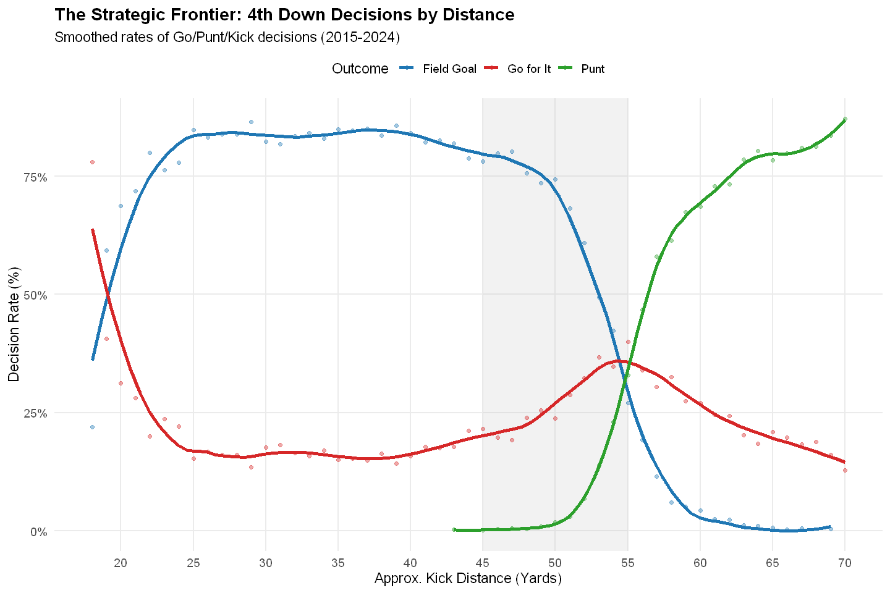{height="480"
width="720"}
:::
:::

::: {#b7f31fe0 .cell .code execution_count="48" vscode="{\"languageId\":\"r\"}"}
``` R
library(tidyverse)

# ==============================================================================
# The Analytics Revolution: Go vs. Kick Decision Rates (Era Comparison)
# ==============================================================================

# 1. Prepare Data
# We use the logic from your working code but filter for Punts/Go/Kick focus
strategy_era_compare <- decision %>%
  # Define Eras (Using robust %in% logic)
  mutate(
    Era = case_when(
      season %in% 2015:2017 ~ "(2015-2017)",
      season %in% 2022:2024 ~ "(2022-2024)",
      TRUE ~ NA_character_
    )
  ) %>%
  filter(!is.na(Era)) %>%
  
  # Filter for relevant field position
  filter(yardline_100 <= 80, yardline_100 >= 1) %>% 
  
  # EXCLUDE PUNTS: Focus strictly on the "Score Now" decision trade-off
  filter(action != "punt") %>% 
  
  mutate(
    Outcome = dplyr::case_when(
      action == "FG" ~ "Field Goal",
      action == "go_for_it" ~ "Go for It",
      TRUE ~ NA_character_
    ),
    approx_fg_dist = yardline_100 + 17
  ) %>%
  filter(!is.na(Outcome)) %>%
  
  # Group and Calculate Rates
  group_by(Era, approx_fg_dist, Outcome) %>%
  summarise(n = n(), .groups = "drop_last") %>%
  mutate(
    # Denominator = (Go + Kick). This visualizes the substitution effect.
    total_plays = sum(n), 
    rate = n / total_plays
  ) %>%
  ungroup() %>%
  # Filter out noisy buckets (e.g., deep territory where punts usually happen)
  filter(total_plays > 10)

# 2. Visualization
# Colors: Blue for Kick, Red for Go
outcome_cols <- c("Field Goal" = "#1f77b4", "Go for It" = "#d62728")

p_era_compare <- ggplot(strategy_era_compare, aes(x = approx_fg_dist, y = rate, color = Outcome, linetype = Era)) +
  
  # Highlight "No Man's Land" (50-60 yards)
  annotate("rect", xmin = 45, xmax = 55, ymin = -Inf, ymax = Inf, 
           fill = "grey", alpha = 0.15) +
  
  # Smooth Lines
  geom_smooth(method = "loess", span = 0.5, size = 1.5, se = FALSE) +
  
  # Formatting
  scale_color_manual(values = outcome_cols) +
  scale_linetype_manual(values = c("(2015-2017)" = "dotted", "(2022-2024)" = "solid")) +
  scale_y_continuous(labels = scales::percent, limits = c(0, 1)) +
  scale_x_continuous(breaks = seq(20, 80, 5)) +
  
  labs(
    title = "The Strategic Shift: Go vs. Kick (Conditional)",
    subtitle = "Decision rates excluding Punts.",
    x = "Approx. Kick Distance (Yards)",
    y = "Decision Rate (as % of Go + Kick attempts)",
    color = "Decision",
    linetype = "Era"
  ) +
  theme_minimal(base_size = 14) +
  theme(
    legend.position = "bottom",
    legend.box = "vertical",
    plot.title = element_text(face = "bold"),
    panel.grid.minor = element_blank()
  )

# Display
options(repr.plot.width = 12, repr.plot.height = 8)
print(p_era_compare)

# Save
if(exists("reports_dir")) {
  ggsave(filename = file.path(reports_dir, "strategic_shift_direct_compare.png"), 
         plot = p_era_compare, width = 12, height = 8)
}
```

::: {.output .stream .stderr}
    `geom_smooth()` using formula = 'y ~ x'
    Warning message:
    "Removed 8 rows containing missing values or values outside the scale range
    (`geom_smooth()`)."
    `geom_smooth()` using formula = 'y ~ x'
    Warning message:
    "Removed 8 rows containing missing values or values outside the scale range
    (`geom_smooth()`)."
:::

::: {.output .display_data}
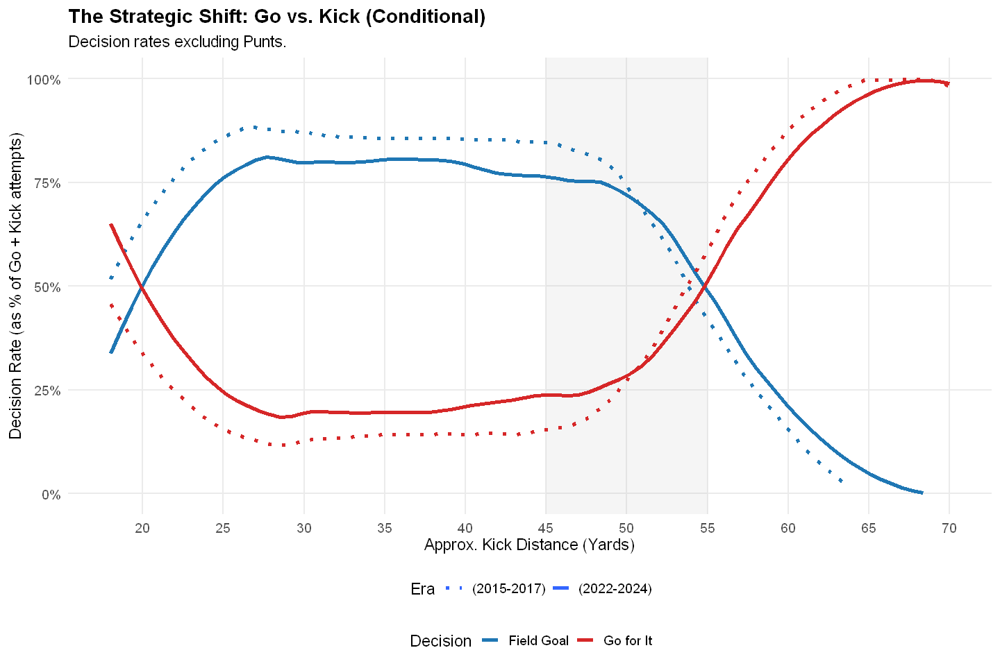{height="480"
width="720"}
:::
:::

::: {#eef958e7 .cell .code execution_count="53" vscode="{\"languageId\":\"r\"}"}
``` R
library(tidyverse)

# ==============================================================================
# The Rational Choice: EPA Trends by Field Position
# ==============================================================================

# 1. Prepare Data
# Filter for 4th downs with valid EPA
epa_data <- decision %>%
  filter( !is.na(epa), !is.na(yardline_100)) %>%
  # Focus on the decision zone (Own 40 to Goal Line)
  filter(yardline_100 <= 60, yardline_100 >= 1) %>%
  mutate(
    # Create Clean Labels
    Decision = case_when(
      action == "FG" ~ "Field Goal",
      action == "punt" ~ "Punt",
      action %in% c("go_for_it", "run", "pass") ~ "Go for It",
      TRUE ~ NA_character_
    ),
    approx_fg_dist = yardline_100 + 17
  ) %>%
  filter(!is.na(Decision))


# 2. Calculate Mean EPA per Yard Line (Pre-smoothing aggregation)
# This reduces noise from extreme outliers before the Loess smooth
epa_summary <- epa_data %>%
  group_by(Decision, approx_fg_dist) %>%
  summarise(
    n = n(),
    mean_epa = mean(epa, na.rm = TRUE),
    .groups = "drop"
  ) %>%
  filter(n > 5) # Remove noisy/rare yardlines

# 3. Visualization
# Define Palette (Consistent with previous)
decision_cols <- c("Go for It" = "#d62728", "Field Goal" = "#1f77b4", "Punt" = "#2ca02c")

p_epa_smooth <- ggplot(epa_summary, aes(x = approx_fg_dist, y = mean_epa, color = Decision)) +
  
  # Highlight "No Man's Land" (33-42 yard line)
  annotate("rect", xmin = 45, xmax = 55, ymin = -Inf, ymax = Inf, 
           fill = "grey", alpha = 0.2) +
  
  # Reference Line (0 EPA)
  geom_hline(yintercept = 0, linetype = "solid", color = "black", size = 0.5) +
  
  # Smoothed Lines (Loess)
  geom_smooth(method = "loess", span = 0.4, size = 1.5, se = FALSE) +
  
  # Points (Optional: Shows the raw averages behind the smooth)
  geom_point(alpha = 0.3, size = 1.5) +
  
  # Formatting
  scale_color_manual(values = decision_cols) +
  labs(
    title = "Rationality Check: Realized Expected Points (EPA) by Decision",
    subtitle = "Comparing the value of Go/Kick/Punt by field position (4th downs, 2015-2024)",
    x = "Approx. Kick Distance (Yards)",
    y = "Average Expected Points Added (EPA)"
  ) +
  theme_minimal(base_size = 14) +
  theme(
    legend.position = "top",
    plot.title = element_text(face = "bold"),
    panel.grid.minor = element_blank()
  )

# Display
options(repr.plot.width = 12, repr.plot.height = 8)
print(p_epa_smooth)

# Save
if(exists("reports_dir")) {
  ggsave(filename = file.path(reports_dir, "epa_landscape_smoothed.png"), 
         plot = p_epa_smooth, width = 12, height = 8)
}
```

::: {.output .stream .stderr}
    `geom_smooth()` using formula = 'y ~ x'
    `geom_smooth()` using formula = 'y ~ x'
:::

::: {.output .display_data}
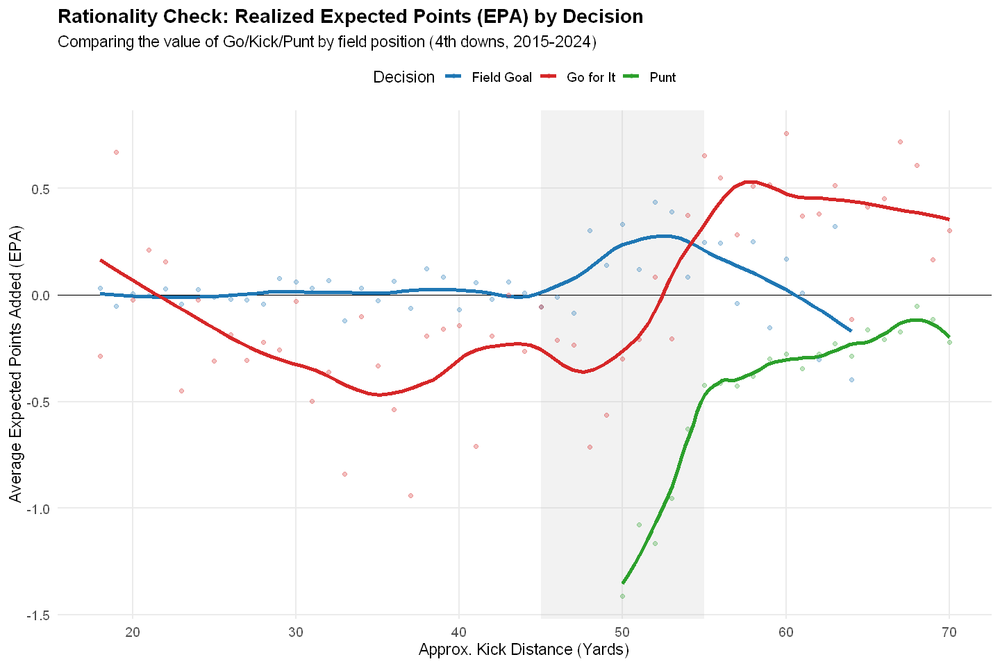{height="480"
width="720"}
:::
:::

::: {#0a2750f3 .cell .code execution_count="55" vscode="{\"languageId\":\"r\"}"}
``` R
library(tidyverse)

# ==============================================================================
# The Rational Choice: EPA Trends by Field Position
# ==============================================================================

# 1. Prepare Data
# Filter for 4th downs with valid EPA
epa_data <- decision %>%
  filter( !is.na(epa), !is.na(yardline_100)) %>%
  # Focus on the decision zone (Own 40 to Goal Line)
  filter(yardline_100 <= 60, yardline_100 >= 1) %>%
  mutate(
    # Create Clean Labels
    Decision = case_when(
      action == "FG" ~ "Field Goal",
      action == "punt" ~ "Punt",
      action %in% c("go_for_it", "run", "pass") ~ "Go for It",
      TRUE ~ NA_character_
    ),
    approx_fg_dist = yardline_100 + 17
  ) %>%
  #filter out go_for_it plays with very long to-go distances
  filter(!(Decision == "Go for It" & ydstogo > 5)) %>%
  filter(!is.na(Decision))


# 2. Calculate Mean EPA per Yard Line (Pre-smoothing aggregation)
# This reduces noise from extreme outliers before the Loess smooth
epa_summary <- epa_data %>%
  group_by(Decision, approx_fg_dist) %>%
  summarise(
    n = n(),
    mean_epa = mean(epa, na.rm = TRUE),
    .groups = "drop"
  ) %>%
  filter(n > 5) # Remove noisy/rare yardlines

# 3. Visualization
# Define Palette (Consistent with previous)
decision_cols <- c("Go for It" = "#d62728", "Field Goal" = "#1f77b4", "Punt" = "#2ca02c")

p_epa_smooth <- ggplot(epa_summary, aes(x = approx_fg_dist, y = mean_epa, color = Decision)) +
  
  # Highlight "No Man's Land" (33-42 yard line)
  annotate("rect", xmin = 45, xmax = 55, ymin = -Inf, ymax = Inf, 
           fill = "grey", alpha = 0.2) +
  
  # Reference Line (0 EPA)
  geom_hline(yintercept = 0, linetype = "solid", color = "black", size = 0.5) +
  
  # Smoothed Lines (Loess)
  geom_smooth(method = "loess", span = 0.4, size = 1.5, se = FALSE) +
  
  # Points (Optional: Shows the raw averages behind the smooth)
  geom_point(alpha = 0.3, size = 1.5) +
  
  # Formatting
  scale_color_manual(values = decision_cols) +
  labs(
    title = "Rationality Check: Realized Expected Points (EPA) by Decision",
    subtitle = "Comparing the value of Go/Kick/Punt by field position (4th downs, 2015-2024)\n*Excludes Go attempts with more than 5 yards to go.",
    x = "Approx. Kick Distance (Yards)",
    y = "Average Expected Points Added (EPA)"
  ) +
  theme_minimal(base_size = 14) +
  theme(
    legend.position = "top",
    plot.title = element_text(face = "bold"),
    panel.grid.minor = element_blank()
  )

# Display
options(repr.plot.width = 12, repr.plot.height = 8)
print(p_epa_smooth)

# Save
if(exists("reports_dir")) {
  ggsave(filename = file.path(reports_dir, "epa_landscape_smoothed.png"), 
         plot = p_epa_smooth, width = 12, height = 8)
}
```

::: {.output .stream .stderr}
    `geom_smooth()` using formula = 'y ~ x'
    `geom_smooth()` using formula = 'y ~ x'
:::

::: {.output .display_data}
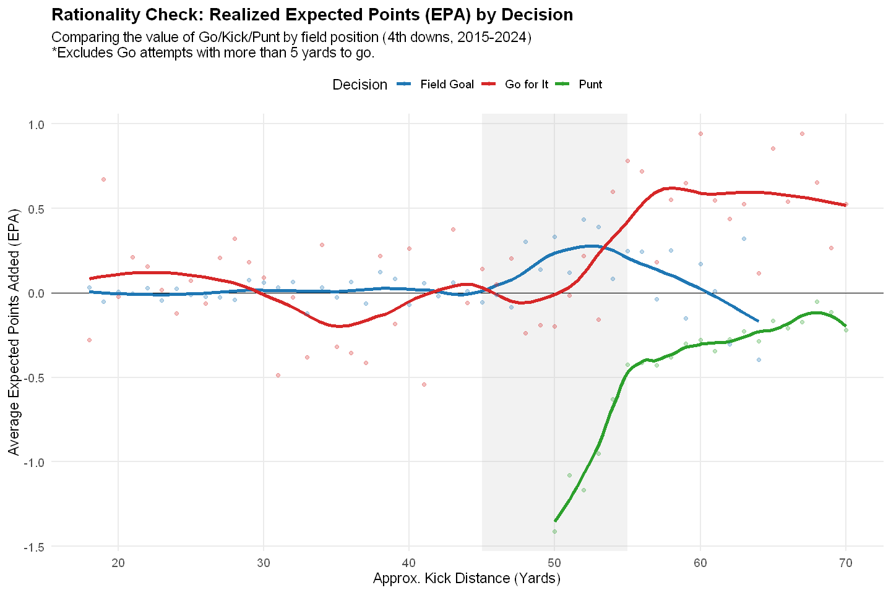{height="480"
width="720"}
:::
:::

::: {#24921a33 .cell .code execution_count="6" vscode="{\"languageId\":\"r\"}"}
``` R
# 1. Prepare Data
# Using the 'decision' dataframe from your earlier step
strategy_check <- decision %>%
  filter(yardline_100 <= 65, yardline_100 >= 00) %>% # Focus on relevant zone
  mutate(
    # Convert Action to Binary "Go" (1) vs "Kick/Punt" (0)
    is_go = ifelse(action == "FG", 1, 0),
    # Approximate FG Distance for context (Yardline + 18)
    approx_fg_dist = yardline_100 + 17 
  ) %>%
  group_by(approx_fg_dist) %>%
  summarise(
    n = n(),
    go_rate = mean(is_go),
    .groups = "drop"
  ) %>%
  filter(n > 20) # Filter noisy bins

# 2. Visualization
ggplot(strategy_check, aes(x = approx_fg_dist, y = go_rate)) +
  # Highlight "No Man's Land" (33-42 yard line / ~50-60 yd FG)
  annotate("rect", xmin = 50, xmax = 60, ymin = -Inf, ymax = Inf, 
           fill = "#d62728", alpha = 0.1) +
  geom_smooth(method = "loess", span = 0.3, color = "black", se = FALSE) +
  geom_point(color = "#1f77b4", size = 3) +
  geom_vline(xintercept = 55, linetype = "dashed") + # Peak of No Man's Land
  scale_y_continuous(labels = scales::percent) +
  labs(
    title = "Strategic Censoring: The 'No Man's Land' Spike",
    subtitle = "Coaches aggressively 'Go for It' in Long FG range (Red Zone)",
    x = "Distance to Endzone (Yardline)",
    y = "Rate of Going for It (Run/Pass)",
    caption = "Red Zone = Approx 50-60 yard Field Goal range"
  ) +
  theme_minimal(base_size = 14) +
  theme(plot.title = element_text(face = "bold"))
```

::: {.output .stream .stderr}
    `geom_smooth()` using formula = 'y ~ x'
:::

::: {.output .display_data}
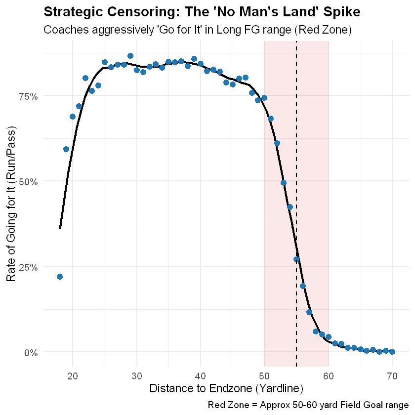{height="420"
width="420"}
:::
:::

::: {#b90a1a6b .cell .code execution_count="16" vscode="{\"languageId\":\"r\"}"}
``` R
# ==============================================================================
# 4th Down Decision Analysis: Side-by-Side Splits (Using 'decision' dataframe)
# ==============================================================================

# 1. Directory Setup
reports_attempt_dir <- file.path(reports_dir, 'attempt_pi')
if (!dir.exists(reports_attempt_dir)) dir.create(reports_attempt_dir, recursive = TRUE, showWarnings = FALSE)
fig_dir <- file.path(reports_attempt_dir, 'figs')
if (!dir.exists(fig_dir)) dir.create(fig_dir, recursive = TRUE, showWarnings = FALSE)

# 2. Prep Data for Plotting
# We use your pre-calculated 'decision' dataframe.
# We create a clean 'play_label' for the legend/plot (Capitalized)
plot_base <- decision %>%
  dplyr::mutate(
    play_label = dplyr::case_when(
      action == 'go_for_it' ~ 'Go',
      action == 'punt' ~ 'Punt',
      action == 'FG' ~ 'FG',
      TRUE ~ action
    )
  )

# 3. Define Cutoffs
cutoffs <- c(50, 40, 30, 20)

# 4. Loop and Generate 4 Separate Plots
cat("Generating decision plots with Sample Sizes (N)...\n")
options(repr.plot.width = 12, repr.plot.height = 8)

for (cut in cutoffs) {
  
  # --- A. Calculate Upper Subset (>= Cut) ---
  data_ge <- plot_base %>% dplyr::filter(kick_distance >= cut)
  n_ge <- nrow(data_ge)
  label_ge <- paste0(">=", cut, " Yards\n(N = ", format(n_ge, big.mark=","), ")")
  
  rates_ge <- data_ge %>%
    dplyr::group_by(season, play_label) %>%
    dplyr::summarise(n = dplyr::n(), .groups = 'drop') %>%
    dplyr::group_by(season) %>%
    dplyr::mutate(total_season = sum(n), pct = n / total_season, subset = label_ge) %>%
    dplyr::ungroup()
  
  # --- B. Calculate Lower Subset (< Cut) ---
  data_lt <- plot_base %>% dplyr::filter(kick_distance < cut)
  n_lt <- nrow(data_lt)
  label_lt <- paste0("< ", cut, " Yards\n(N = ", format(n_lt, big.mark=","), ")")
  
  rates_lt <- data_lt %>%
    dplyr::group_by(season, play_label) %>%
    dplyr::summarise(n = dplyr::n(), .groups = 'drop') %>%
    dplyr::group_by(season) %>%
    dplyr::mutate(total_season = sum(n), pct = n / total_season, subset = label_lt) %>%
    dplyr::ungroup()
  
  # --- C. Combine ---
  plot_data <- dplyr::bind_rows(rates_ge, rates_lt)
  
  # Force Factor Order (>= Left, < Right)
  plot_data$subset <- factor(plot_data$subset, levels = c(label_ge, label_lt))
  
  # --- D. Plot ---
  p <- ggplot2::ggplot(plot_data, ggplot2::aes(x = season, y = pct, colour = play_label, group = play_label)) +
    ggplot2::geom_line(linewidth = 1.2) +
    ggplot2::geom_point(size = 2) +
    ggplot2::facet_wrap(~subset, ncol = 2, scales = "free_y") +
    ggplot2::scale_x_continuous(breaks = sort(unique(plot_data$season))) +
    ggplot2::scale_y_continuous(labels = scales::percent_format(accuracy = 1)) +
    # Explicit colors for consistency
    ggplot2::scale_color_manual(values = c("FG" = "#1f77b4", "Go" = "#d62728", "Punt" = "#2ca02c")) +
    ggplot2::labs(
      title = paste0('4th Down Decision Rates: Split at ', cut, ' Yards'),
      subtitle = 'Comparing "Go" vs FG vs Punt frequencies by Season',
      x = 'Season', y = 'Percent of Plays', colour = 'Decision'
    ) +
    ggplot2::theme_bw(base_size = 14) +
    ggplot2::theme(
      legend.position = 'bottom',
      axis.text.x = ggplot2::element_text(angle = 45, hjust = 1),
      strip.background = ggplot2::element_rect(fill = "#f0f0f0"),
      strip.text = ggplot2::element_text(face = "bold")
    )
  
  # Save
  filename <- paste0('decision_rates_split_', cut, '_with_N.png')
  ggplot2::ggsave(filename = file.path(fig_dir, filename), plot = p, width = 12, height = 8)
  
  print(p)
}
```

::: {.output .stream .stdout}
    Generating decision plots with Sample Sizes (N)...
:::

::: {.output .display_data}
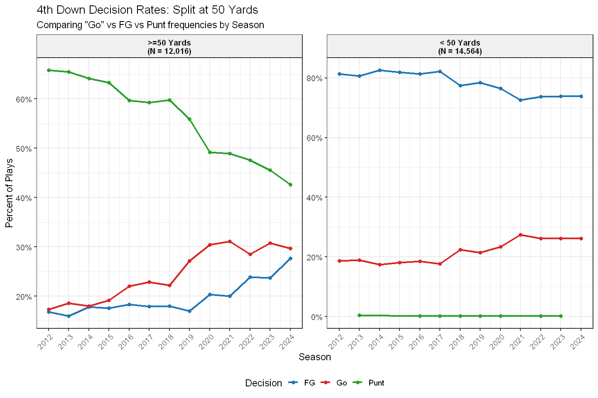{height="480"
width="720"}
:::

::: {.output .display_data}
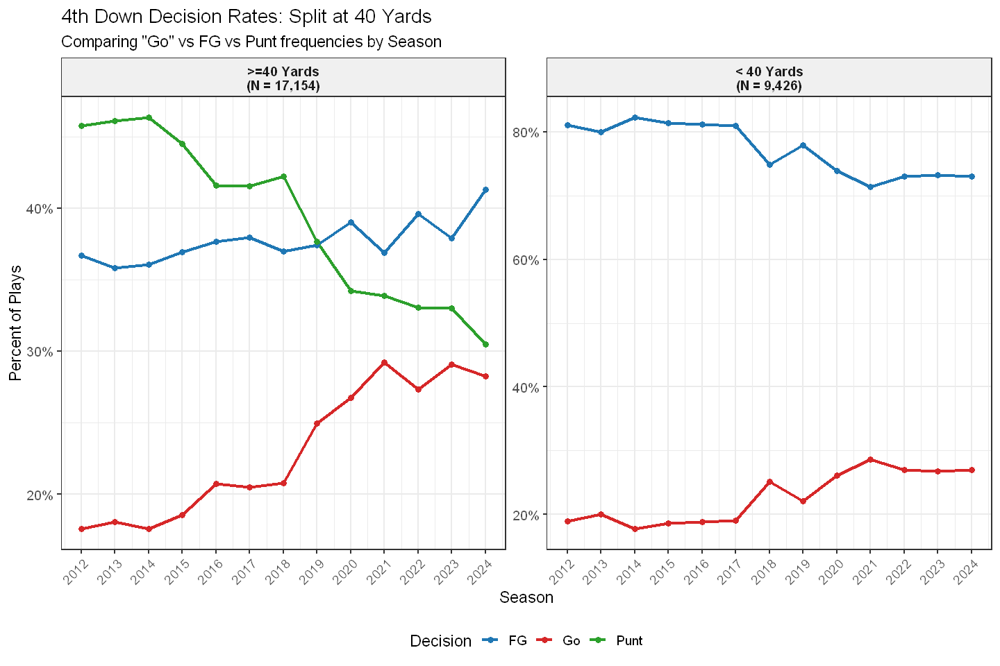{height="480"
width="720"}
:::

::: {.output .display_data}
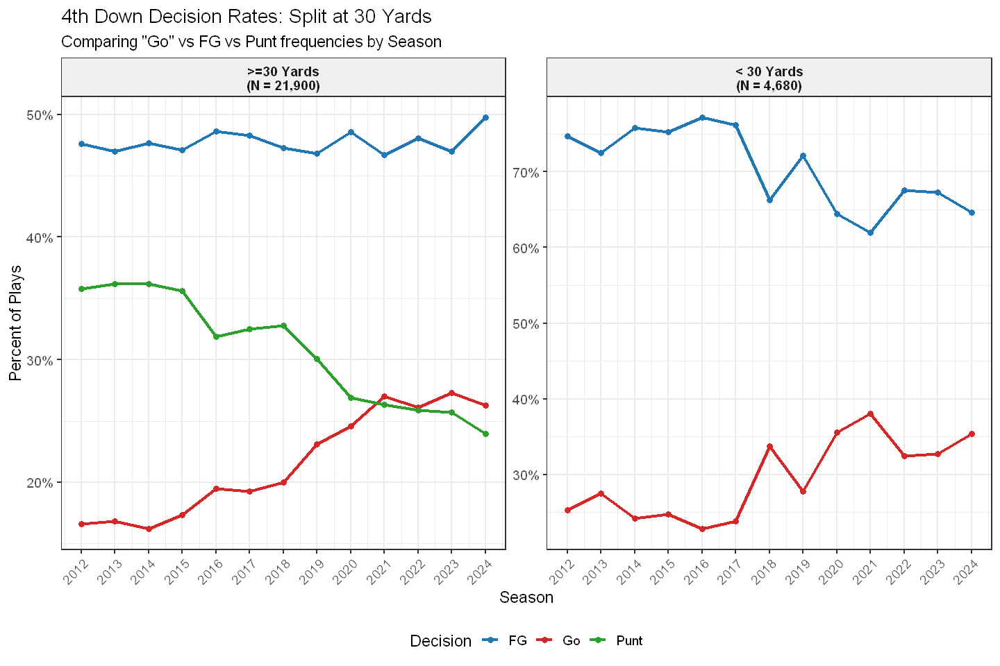{height="480"
width="720"}
:::

::: {.output .display_data}
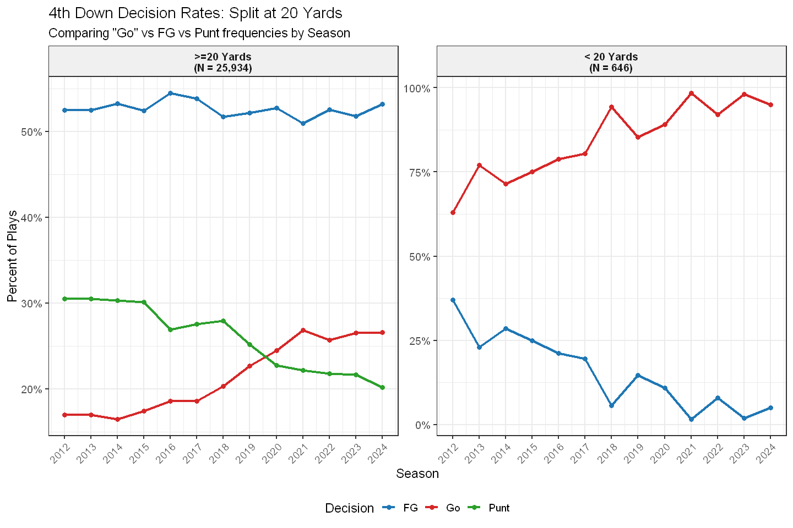{height="480"
width="720"}
:::
:::

::: {#7ff4ccf1 .cell .code execution_count="38" vscode="{\"languageId\":\"r\"}"}
``` R
# ==============================================================================
# 4th Down Decision Analysis by Specific Distance Buckets
# ==============================================================================

# 1. Directory Setup
reports_attempt_dir <- file.path(reports_dir, 'attempt_pi')
if (!dir.exists(reports_attempt_dir)) dir.create(reports_attempt_dir, recursive = TRUE, showWarnings = FALSE)
fig_dir <- file.path(reports_attempt_dir, 'figs')
if (!dir.exists(fig_dir)) dir.create(fig_dir, recursive = TRUE, showWarnings = FALSE)

# 2. Base Data Preparation
# - Filter for 4th down
# - Combine Pass/Run into "Go"
# - Exclude PATs
fg_base <- fg_all %>%
  dplyr::filter(is_pat == 0L, play_type_original %in% c('field_goal','pass','run','punt')) %>%
  dplyr::mutate(
    play_type = dplyr::case_when(
      play_type_original == 'field_goal' ~ 'FG',
      play_type_original %in% c('pass', 'run') ~ 'Go', # Combined Category
      play_type_original == 'punt' ~ 'Punt',
      TRUE ~ play_type_original
    )
  ) %>%
  dplyr::filter(!is.na(kick_distance))

# 3. Define Buckets
# List of lists containing the Label and the Filter Logic
buckets <- list(
  list(id = "50_65", label = "50-65 Yards", func = function(d) d >= 50 & d <= 65),
  list(id = "40_49", label = "40-49 Yards", func = function(d) d >= 40 & d <= 49),
  list(id = "30_39", label = "30-39 Yards", func = function(d) d >= 30 & d <= 39),
  list(id = "18_29", label = "18-29 Yards", func = function(d) d >= 18 & d <= 29),
  list(id = "34_49", label = "34-49 Yards", func = function(d) d >= 34 & d <= 49)
)

# 4. Loop and Generate 4 Separate Plots
cat("Generating decision plots for distance buckets...\n")

# Set width to 14 inches for wide display in notebook
options(repr.plot.width = 10, repr.plot.height = 10)

for (b in buckets) {
  
  # --- A. Filter Data for Bucket ---
  bucket_data <- fg_base %>%
    dplyr::filter(b$func(kick_distance))
  
  # --- B. Calculate Rates ---
  rates <- bucket_data %>%
    dplyr::group_by(season, play_type) %>%
    dplyr::summarise(n = dplyr::n(), .groups = 'drop') %>%
    dplyr::group_by(season) %>%
    dplyr::mutate(total = sum(n), pct = n / total) %>%
    dplyr::ungroup()
  
  # --- C. Plot ---
  p <- ggplot2::ggplot(rates, ggplot2::aes(x = season, y = pct, colour = play_type, group = play_type)) +
    ggplot2::geom_line(linewidth = 1.5) +
    ggplot2::geom_point(size = 3) +
    ggplot2::scale_x_continuous(breaks = sort(unique(rates$season))) +
    ggplot2::scale_y_continuous(labels = scales::percent_format(accuracy = 1), limits = c(0, 1)) +
    ggplot2::scale_color_manual(values = c("FG" = "#1f77b4", "Go" = "#d62728", "Punt" = "#2ca02c")) +
    ggplot2::labs(
      title = paste0('4th Down Decision Rates: ', b$label),
      subtitle = paste0('Trends in "Go" vs FG vs Punt (N = ', sum(rates$n), ' plays)'),
      x = 'Season', y = 'Percent of Plays', colour = 'Decision'
    ) +
    ggplot2::theme_bw(base_size = 16) + # Increased font size
    ggplot2::theme(
      legend.position = 'bottom',
      plot.title = ggplot2::element_text(face = "bold"),
      axis.text.x = ggplot2::element_text(angle = 45, hjust = 1)
    )
  
  # --- D. Save ---
  filename <- paste0('decision_rates_bucket_', b$id, '.png')
  # Saving wide format (10x10)
  ggplot2::ggsave(filename = file.path(fig_dir, filename), plot = p, width = 10, height = 10)
  
  # Print to notebook
  print(p)
}
```

::: {.output .stream .stdout}
    Generating decision plots for distance buckets...
:::

::: {.output .display_data}
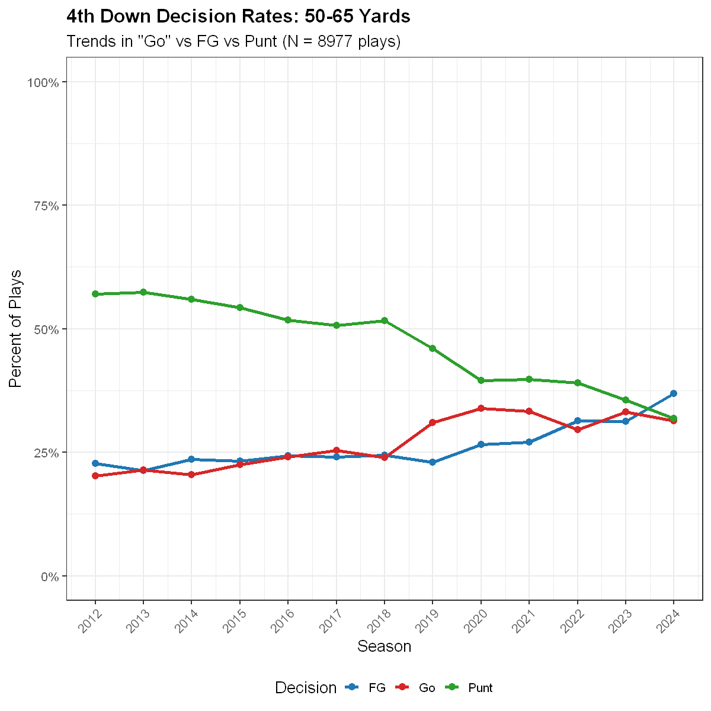{height="600"
width="600"}
:::

::: {.output .display_data}
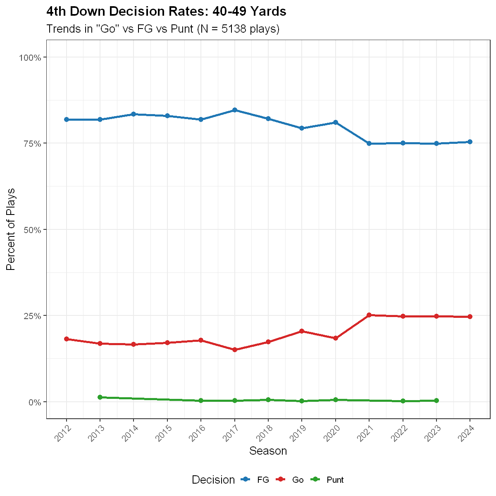{height="600"
width="600"}
:::

::: {.output .display_data}
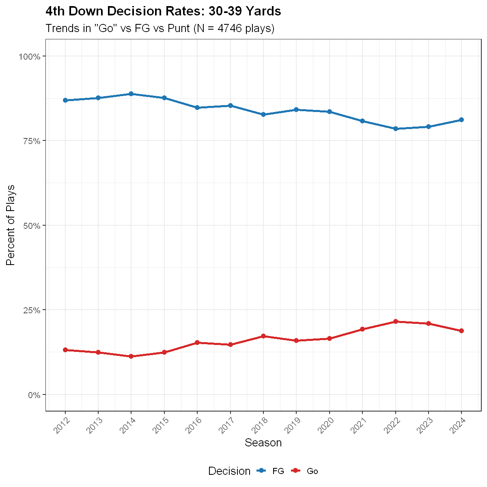{height="600"
width="600"}
:::

::: {.output .display_data}
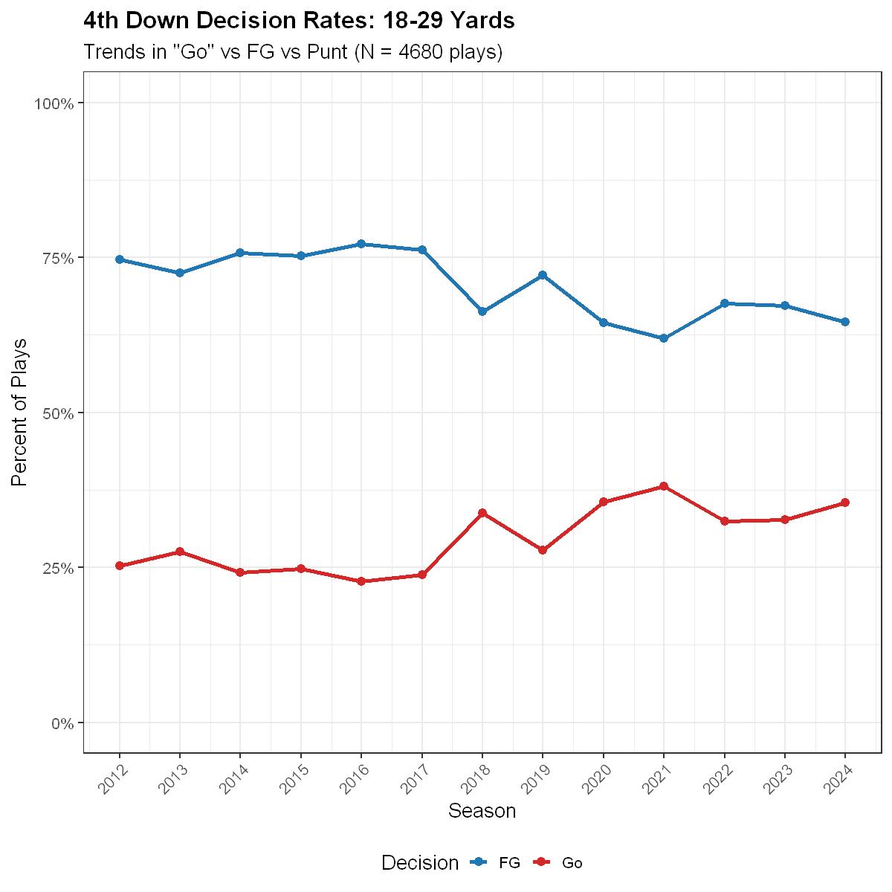{height="600"
width="600"}
:::

::: {.output .display_data}
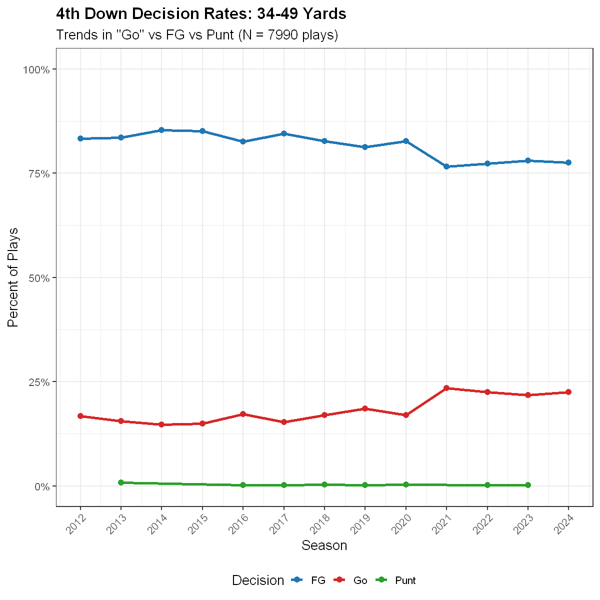{height="600"
width="600"}
:::
:::

::: {#81a29e92 .cell .code execution_count="29" vscode="{\"languageId\":\"r\"}"}
``` R
# ==============================================================================
# 1. Data Preparation & Aggregation
# ==============================================================================

# Filter for Field Goals only (exclude PATs)
fg_trends_data <- fg_all %>%
  dplyr::filter(play_type_original == 'field_goal', is_pat == 0) %>%
  dplyr::filter(!is.na(kick_distance), !is.na(kick_made))

# Calculate Season Stats with Error Margins
season_stats <- fg_trends_data %>%
  dplyr::group_by(season) %>%
  dplyr::summarise(
    n_kicks = dplyr::n(),
    
    # Metric 1: Average Distance
    avg_distance = mean(kick_distance, na.rm = TRUE),
    sd_distance = sd(kick_distance, na.rm = TRUE),
    se_distance = sd_distance / sqrt(n_kicks),
    moe_distance = 1.96 * se_distance,
    
    # Metric 2: Overall Make %
    make_pct = mean(kick_made, na.rm = TRUE),
    se_make = sqrt((make_pct * (1 - make_pct)) / n_kicks),
    moe_make = 1.96 * se_make,
    
    # Metric 3: Make % for 50+ Yards
    n_50_plus = sum(kick_distance >= 50, na.rm = TRUE),
    make_pct_50_plus = mean(kick_made[kick_distance >= 50], na.rm = TRUE),
    se_make_50 = sqrt((make_pct_50_plus * (1 - make_pct_50_plus)) / n_50_plus),
    moe_make_50 = 1.96 * se_make_50,
    
    .groups = "drop"
  )

cat("\n--- Season Statistics with Margins of Error ---\n")
print(season_stats)

# ==============================================================================
# 2. Plotting
# ==============================================================================

# Shared Theme
my_theme <- theme_minimal(base_size = 14) +
  theme(
    plot.title = element_text(face = "bold"),
    axis.title.x = element_blank(),
    panel.grid.minor = element_blank()
  )

# --- Plot 1: Average Kicking Distance (30-40y Range) ---
p1 <- ggplot(season_stats, aes(x = season, y = avg_distance)) +
  geom_line(color = "#1f77b4", size = 1.2) +
  geom_point(color = "#1f77b4", size = 2.5) +
  #geom_errorbar(aes(ymin = avg_distance - moe_distance, ymax = avg_distance + moe_distance), 
  #              width = 0.2, color = "#1f77b4", alpha = 0.7) +
  geom_smooth(method = "lm", se = FALSE, linetype = "dashed", color = "grey50", alpha = 0.5) +
  scale_x_continuous(breaks = unique(season_stats$season)) +
  # Requested Range: 30-40
  coord_cartesian(ylim = c(30, 40)) + 
  labs(
    title = "Avg Kick Distance",
    subtitle = "Mean distance of all attempts",
    y = "Yards"
  ) +
  my_theme

# --- Plot 2: Overall Make Percentage (80-90% Range) ---
p2 <- ggplot(season_stats, aes(x = season, y = make_pct)) +
  geom_line(color = "#2ca02c", size = 1.2) +
  geom_point(color = "#2ca02c", size = 2.5) +
  #geom_errorbar(aes(ymin = make_pct - moe_make, ymax = make_pct + moe_make), 
  #              width = 0.2, color = "#2ca02c", alpha = 0.7) +
  scale_x_continuous(breaks = unique(season_stats$season)) +
  # Requested Range: 80-90%
  coord_cartesian(ylim = c(0.80, 0.90)) +
  scale_y_continuous(labels = scales::percent_format(accuracy = 1)) +
  labs(
    title = "Overall Make %",
    subtitle = "Success rate for all attempts",
    y = "Make %"
  ) +
  my_theme

# --- Plot 3: Kicks Attempted from 50+ Yards (Count) ---
p3 <- ggplot(season_stats, aes(x = season, y = n_50_plus)) +
  geom_line(color = "#ff7f0e", size = 1.2) +
  geom_point(color = "#ff7f0e", size = 2.5) +
  scale_x_continuous(breaks = unique(season_stats$season)) +
  labs(
    title = "Volume: 50+ Attempts",
    subtitle = "Total deep kicks per season",
    y = "Count"
  ) +
  my_theme

# --- Plot 4: Make Percentage from 50+ Yards (55-70% Range) ---
p4 <- ggplot(season_stats, aes(x = season, y = make_pct_50_plus)) +
  geom_line(color = "#d62728", size = 1.2) +
  geom_point(color = "#d62728", size = 2.5) +
  #geom_errorbar(aes(ymin = make_pct_50_plus - moe_make_50, ymax = make_pct_50_plus + moe_make_50), 
  #              width = 0.2, color = "#d62728", alpha = 0.7) +
  geom_smooth(method = "lm", se = FALSE, linetype = "dashed", color = "grey50", alpha = 0.5) +
  scale_x_continuous(breaks = unique(season_stats$season)) +
  # Requested Range: 55-70%
  coord_cartesian(ylim = c(0.55, 0.75)) + # Extended slightly to 0.75 to capture upper CIs
  scale_y_continuous(labels = scales::percent_format(accuracy = 1)) +
  labs(
    title = "Accuracy: 50+ Yards",
    subtitle = "Success rate for deep kicks",
    y = "Make % (50+)"
  ) +
  my_theme +
  theme(axis.title.x = element_text())

# ==============================================================================
# 3. Display & Save
# ==============================================================================

# Combine plots in a grid (2x2)
combined_plot <- (p1 + p2) / (p3 + p4)

# Set display options
options(repr.plot.width = 14, repr.plot.height = 10)
print(combined_plot)

# Save
if(exists("reports_dir")) {
  ggsave(filename = file.path(reports_dir, "season_kicking_trends_detailed.png"), 
         plot = combined_plot, width = 12, height = 10)
}
```

::: {.output .stream .stdout}

    --- Season Statistics with Margins of Error ---
    # A tibble: 13 × 13
       season n_kicks avg_distance sd_distance se_distance moe_distance make_pct
        <dbl>   <int>        <dbl>       <dbl>       <dbl>        <dbl>    <dbl>
     1   2012    1052         37.7        10.2       0.314        0.616    0.841
     2   2013    1042         37.5        10.2       0.317        0.622    0.866
     3   2014    1023         37.7        10.3       0.323        0.634    0.841
     4   2015    1033         38.1        10.3       0.319        0.626    0.849
     5   2016    1050         37.7        10.2       0.315        0.617    0.848
     6   2017    1065         38.2        10.1       0.310        0.608    0.843
     7   2018     989         38.6        10.0       0.318        0.623    0.844
     8   2019    1018         38.1        10.1       0.316        0.619    0.818
     9   2020    1015         38.9        10.4       0.326        0.639    0.846
    10   2021    1076         38.6        10.3       0.314        0.616    0.853
    11   2022    1105         39.2        10.6       0.320        0.627    0.854
    12   2023    1107         39.1        10.6       0.318        0.623    0.858
    13   2024    1166         39.9        10.8       0.316        0.620    0.842
    # ℹ 6 more variables: se_make <dbl>, moe_make <dbl>, n_50_plus <int>,
    #   make_pct_50_plus <dbl>, se_make_50 <dbl>, moe_make_50 <dbl>
:::

::: {.output .stream .stderr}
    `geom_smooth()` using formula = 'y ~ x'
    `geom_smooth()` using formula = 'y ~ x'
    `geom_smooth()` using formula = 'y ~ x'
    `geom_smooth()` using formula = 'y ~ x'
:::

::: {.output .display_data}
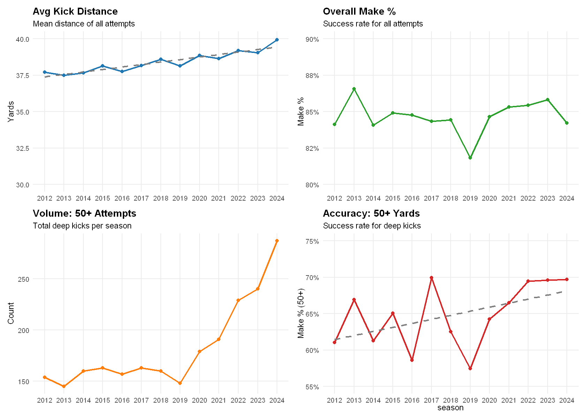{height="600"
width="840"}
:::
:::

::: {#63c8a23a .cell .code execution_count="20" vscode="{\"languageId\":\"r\"}"}
``` R

# 1. Prepare Data
# Filter for Field Goals in the specific target seasons
dist_comp_data <- fg_all %>%
  dplyr::filter(
    play_type_original == 'field_goal',
    is_pat == 0, # Exclude PATs
    season %in% c(2015, 2024),
    !is.na(kick_distance)
  ) %>%
  dplyr::mutate(season = factor(season)) # Make season a factor for plotting

# 2. Calculate Means for Annotation
season_means <- dist_comp_data %>%
  group_by(season) %>%
  summarise(mean_dist = mean(kick_distance), .groups = "drop")

print(season_means)

# 3. Generate Plot
p_dist_comp <- ggplot(dist_comp_data, aes(x = kick_distance, fill = season)) +
  # Density curves with transparency
  geom_density(alpha = 0.4, color = NA) +
  # Add mean lines
  geom_vline(data = season_means, aes(xintercept = mean_dist, color = season), 
             linetype = "dashed", size = 1) +
  # Custom colors
  scale_fill_manual(values = c("2015" = "#1f77b4", "2024" = "#d62728")) +
  scale_color_manual(values = c("2015" = "#1f77b4", "2024" = "#d62728")) +
  # Formatting
  labs(
    title = "Shift in Kicking Strategy: 2015 vs. 2024",
    subtitle = "Distribution of Field Goal Attempt Distances",
    x = "Kick Distance (Yards)",
    y = "Density"
  ) +
  theme_minimal(base_size = 14) +
  theme(
    legend.position = "top",
    plot.title = element_text(face = "bold")
  )

# 4. Display & Save
options(repr.plot.width = 10, repr.plot.height = 6)
print(p_dist_comp)

if(exists("reports_dir")) {
  ggsave(filename = file.path(reports_dir, "kick_distance_distribution_15vs24.png"), 
         plot = p_dist_comp, width = 10, height = 6)
}
```

::: {.output .stream .stdout}
    # A tibble: 2 × 2
      season mean_dist
      <fct>      <dbl>
    1 2015        38.1
    2 2024        39.9
:::

::: {.output .display_data}
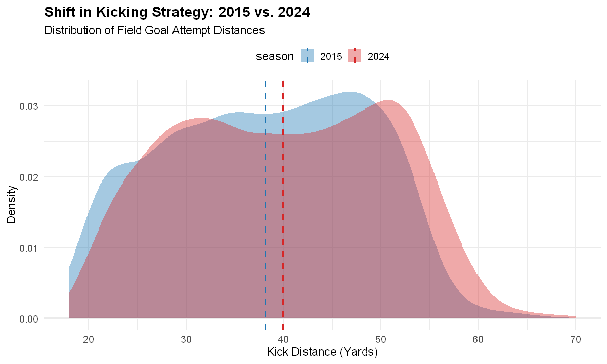{height="360"
width="600"}
:::
:::

::: {#94084424 .cell .code execution_count="24" vscode="{\"languageId\":\"r\"}"}
``` R

# 1. Prepare Data
# Filter for the years of interest
anim_data <- fg_all %>%
  dplyr::filter(
    play_type_original == 'field_goal',
    is_pat == 0,
    season >= 2015,
    season <= 2024,
    !is.na(kick_distance)
  ) %>%
  dplyr::mutate(season = as.integer(season))

# 2. Create the Base Plot
# We use geom_density to show the shape of the distribution
p_anim <- ggplot(anim_data, aes(x = kick_distance)) +
  # Static background shadow (optional: shows the overall average for context)
  geom_density(data = anim_data %>% select(-season), 
               aes(x = kick_distance), 
               fill = "grey", alpha = 0.2, color = NA) +
  # The moving distribution
  geom_density(fill = "#1f77b4", alpha = 0.7, color = "black") +
  geom_vline(aes(xintercept = mean(kick_distance)), linetype = "dashed") +
  scale_x_continuous(limits = c(15, 65), breaks = seq(20, 60, 10)) +
  labs(
    title = "Evolution of Kick Distance: {closest_state}",
    subtitle = "Grey = 10-Year Average | Blue = Current Season",
    x = "Kick Distance (Yards)",
    y = "Density"
  ) +
  theme_minimal(base_size = 16) +
  theme(
    plot.title = element_text(face = "bold", size = 20),
    panel.grid.minor = element_blank()
  )

# 3. Animate
# transition_states: Splits the data by 'season' and tweens between them
anim <- p_anim + 
  transition_states(season, transition_length = 2, state_length = 1) +
  ease_aes('cubic-in-out') # Smooths the transition

# 4. Render and Save
# Adjust 'fps' and 'duration' to control speed
animate(anim, renderer = gifski_renderer(), height = 600, width = 800, fps = 20, duration = 10)

# Save to file
if(exists("reports_dir")) {
  anim_save(file.path(reports_dir, "kick_distance_evolution_15_24.gif"))
}
```

::: {.output .stream .stderr}
    Warning message:
    "Removed 8 rows containing non-finite outside the scale range
    (`stat_density()`)."
    Warning message:
    "Removed 8 rows containing non-finite outside the scale range
    (`stat_density()`)."
:::
:::

::: {#cc602df6 .cell .code execution_count="24" vscode="{\"languageId\":\"r\"}"}
``` R
# Construct B-spline basis for kick_distance as in ref_modeling
bs_X <- splines2::bSpline(
  x = decision$kick_distance,
  knots = c(28,38,48,58),
  degree = 3,
  intercept = FALSE,
  Boundary.knots = c(18,70)
)
colnames(bs_X) <- paste0('bs_', seq_len(ncol(bs_X)))

# Time spline on game_seconds_remaining (natural cubic)
ns_time <- splines::ns(decision$game_seconds_remaining, df = 4)
colnames(ns_time) <- paste0('nst_', seq_len(ncol(ns_time)))

# Bind base design
X <- cbind(decision, as.data.frame(bs_X), as.data.frame(ns_time))

# assume decision already has quarter_seconds_remaining and qtr (or qtr equivalent)
# 1) Quarter-time features
X$quarter_sec <- as.numeric(ifelse('quarter_seconds_remaining' %in% names(X), X$quarter_seconds_remaining,
                                   ifelse('quarter_seconds_remaining' %in% names(decision), decision$quarter_seconds_remaining, NA_real_)))

# safe log transform: log(1 + seconds left in quarter)
X$log_qtr_time <- log1p(pmax(X$quarter_sec, 0))

# 2) Quarter flags (2nd and 4th)
# If your 'qtr' variable is named differently, adjust accordingly
X$q2_flag <- as.integer(as.integer(X$qtr) == 2)
X$q4_flag <- as.integer(as.integer(X$qtr) == 4)

# 3) Quarter-specific time terms (explicit interaction columns)
X$q2_log_time <- X$q2_flag * X$log_qtr_time
X$q4_log_time <- X$q4_flag * X$log_qtr_time

# 4) Interactions between score flags and quarter-log-time
score_vars <- c('go_ahead', 'one_score_down', 'to_tie', 'extend_lead', 'two_score_down')

# create named interaction column strings to add to base_terms (if you prefer formula-level interactions you can skip creating columns)
score_q2_interacts <- paste0(score_vars, ':q2_log_time')  # e.g. "go_ahead:q2_log_time"
score_q4_interacts <- paste0(score_vars, ':q4_log_time')

# If you prefer concrete columns (safer if you want to check numeric stability), you can also materialize them:
for (sv in score_vars) {
  if (sv %in% names(X)) {
    X[[paste0(sv, '_x_q2_log')]] <- X[[sv]] * X$q2_log_time
    X[[paste0(sv, '_x_q4_log')]] <- X[[sv]] * X$q4_log_time
  } else {
    # create zero/NA column to keep shapes consistent in case of missing flags
    X[[paste0(sv, '_x_q2_log')]] <- NA_real_
    X[[paste0(sv, '_x_q4_log')]] <- NA_real_
  }
}


# NOTE: We intentionally do NOT create bs * wind/temp interaction columns here.
# Those interactions were removed per request to simplify base terms.

# Rolling-origin OOF: train on seasons <= (s-1), predict s, starting s = 2015 (data back to 2012)
stopifnot('season' %in% names(X))
SEASONS_ALL <- sort(unique(X$season))
SEASONS_OOF <- SEASONS_ALL[SEASONS_ALL >= 2015]

# Prepare model formula components
bs_terms <- paste0('bs_', seq_len(ncol(bs_X)))
ns_t_terms <- paste0('nst_', seq_len(ncol(ns_time)))

# keep numeric season for indexing and factor season for modeling
X$season_num <- as.integer(X$season)
X$season <- factor(X$season_num)

base_terms <- c(
  bs_terms,
  ns_t_terms,
  'wind_z','temp_z','ydstogo', 'leverage_rules',
  'indoors','is_turf','high_altitude',
  'go_ahead', 'one_score_down', 'to_tie', 'extend_lead', 'two_score_down'
)


# ensure action is a factor for multinomial modeling (levels: go_for_it, punt, FG)
if (!'action' %in% names(X)) X$action <- ifelse(X$attempt_fg == 1, 'FG', 'go_for_it')
X$action <- factor(X$action, levels = c('go_for_it','punt','FG'))

# Multinomial model formula (action: go_for_it, punt, FG)
form_str_multi <- paste('action ~', paste(unique(base_terms), collapse = ' + '))
form_multinom <- as.formula(form_str_multi)
```
:::

::: {#618cb8a0 .cell .code execution_count="25" vscode="{\"languageId\":\"r\"}"}
``` R
# Helper: Effective Sample Size
effective_sample_size <- function(w) {
  w <- w[is.finite(w)]
  if (!length(w)) return(NA_real_)
  (sum(w)^2) / sum(w^2)
}

all_preds    <- list()
metrics_rows <- list()

for (s in SEASONS_OOF) {
  window <- 3L
  start_season   <- max(min(SEASONS_ALL), s - window)
  train_seasons  <- seq(start_season, s - 1)
  train_idx <- which(X$season_num %in% train_seasons)
  test_idx  <- which(X$season_num == s)
  if (length(train_idx) < 100 || length(test_idx) == 0) next

  train <- X[train_idx, , drop = FALSE]
  test  <- X[test_idx,  , drop = FALSE]

  # --- Fit multinomial (action ~ ...)
  m_multi <- tryCatch(nnet::multinom(form_multinom, data = train, trace = FALSE),
                      error = function(e) NULL)

  # --- Predict FG probability on test
  p_multi <- rep(NA_real_, nrow(test))
  preds_multi <- NULL
  if (!is.null(m_multi)) {
    preds_multi <- tryCatch(predict(m_multi, newdata = test, type = "probs"),
                            error = function(e) NULL)
    if (!is.null(preds_multi) && "FG" %in% colnames(preds_multi)) {
      p_multi <- as.numeric(preds_multi[, "FG"])
    }
  }

  # --- Binary truth for FG attempt
  y_bin <- test$attempt_fg

  # --- Attempt model metrics (unweighted)
  auc_multi     <- tryCatch({ pROC::auc(y_bin, p_multi) |> as.numeric() }, error = function(e) NA_real_)
  brier_multi   <- brier(y_bin, p_multi)
  logloss_multi <- logloss(y_bin, p_multi)

  # ================== IPW (stabilized; UNTRIMMED) ==================
  # Numerically safe clamp for probabilities (prevents Inf/NaN weights only)
  # This is NOT "capping weights"—it just avoids divide-by-zero.
  eps <- .Machine$double.eps^0.5  # ~1e-8 on most systems
  p_clip_multi <- pmin(pmax(p_multi, eps), 1 - eps)

  # Stabilizer = prevalence in TRAIN window
  target_multi <- mean(train$attempt_fg, na.rm = TRUE)

  # Raw stabilized IPW (linear, positive)
  w_multi_raw <- ifelse(
    y_bin == 1L,
    target_multi / p_clip_multi,
    (1 - target_multi) / (1 - p_clip_multi)
  )

  # No trimming (as requested)
  w_multi_trim <- w_multi_raw   # keep raw

  # Hajek normalization (mean weight = 1 within this test fold)
  w_multi_hajek <- w_multi_trim / mean(w_multi_trim, na.rm = TRUE)

  # ESS diagnostics (all rows + A=1 rows that feed outcome model)
  ess_raw_all    <- effective_sample_size(w_multi_raw)
  ess_hajek_all  <- effective_sample_size(w_multi_hajek)

  a1 <- which(y_bin == 1L)
  ess_raw_A1    <- effective_sample_size(w_multi_raw[a1])
  ess_hajek_A1  <- effective_sample_size(w_multi_hajek[a1])

  # For quick tails debugging later (optional)
  w_multi_log <- log1p(w_multi_trim)
  # ================================================================

  # --- Predicted action label (argmax)
  act_pred <- if (!is.null(preds_multi)) tryCatch({
    apply(preds_multi, 1, function(row) {
      cols <- colnames(preds_multi); cols[which.max(row)]
    })
  }, error = function(e) rep(NA_character_, nrow(test))) else rep(NA_character_, nrow(test))

  # --- Collect per-row outputs
  fold_preds <- tibble::tibble(
    season = s,
    game_id = test$game_id,
    play_id = test$play_id,
    attempt_fg = y_bin,
    action_actual = as.character(test$action),
    action_pred   = as.character(act_pred),
    p_hat_multinom = p_multi,
    p_hat_clip_multinom = p_clip_multi,
    p_target_multinom = target_multi,
    weight_multinom_raw   = w_multi_raw,
    weight_multinom_hajek = w_multi_hajek,  # <-- use THIS in downstream success model (weights=)
    weight_multinom_log   = w_multi_log
  )
  all_preds[[as.character(s)]] <- fold_preds

  # --- Record metrics (+ ESS diagnostics)
  metrics_rows[[paste0("multinom_", s)]] <- tibble::tibble(
    season = s,
    model  = "multinom",
    auc    = auc_multi,
    brier  = brier_multi,
    logloss= logloss_multi,
    aic = NA_real_,
    bic = NA_real_,
    ess_all_raw   = ess_raw_all,
    ess_all_hajek = ess_hajek_all,
    ess_A1_raw    = ess_raw_A1,
    ess_A1_hajek  = ess_hajek_A1
  )
}

# Bind fold-level predictions
preds_oof <- dplyr::bind_rows(all_preds)

# Make join keys character to avoid mismatches
preds_oof <- preds_oof %>%
  dplyr::mutate(game_id = as.character(game_id), play_id = as.character(play_id))

# Attach auxiliary columns from X (if present)
if (all(c("game_id","play_id") %in% names(X))) {
  ctx <- X %>%
    dplyr::select(dplyr::any_of(c(
      "game_id","play_id","kick_distance","kick_result",
      "game_seconds_remaining","score_differential","ydstogo"
    ))) %>%
    dplyr::mutate(game_id = as.character(game_id), play_id = as.character(play_id)) %>%
    dplyr::distinct(game_id, play_id, .keep_all = TRUE)
  preds_oof <- preds_oof %>% dplyr::left_join(ctx, by = c("game_id","play_id"))
}

# Guarantee presence of requested columns (fill NA if absent)
req_cols <- c("kick_distance","kick_result","game_seconds_remaining","score_differential")
for (col in req_cols) if (!col %in% names(preds_oof)) preds_oof[[col]] <- NA

metrics_oof <- dplyr::bind_rows(metrics_rows)

# Persist outputs
readr::write_csv(preds_oof, file.path(reports_attempt_dir, "attempt_pi_oof_predictions.csv"))
readr::write_csv(metrics_oof, file.path(reports_attempt_dir, "attempt_pi_metrics_by_season.csv"))

# Calibration summary by distance & time bins (using multinomial FG prob)
calib <- preds_oof %>%
  dplyr::mutate(
    dist_bin = cut(kick_distance, breaks = seq(15, 70, 5), include.lowest = TRUE, right = FALSE),
    time_bin = cut(game_seconds_remaining, breaks = c(0,60,120,300,900,1800,3600),
                   include.lowest = TRUE, right = FALSE)
  ) %>%
  dplyr::group_by(dist_bin, time_bin) %>%
  dplyr::summarise(
    n   = dplyr::n(),
    obs = mean(attempt_fg, na.rm = TRUE),
    est = mean(p_hat_multinom, na.rm = TRUE),
    abs_err = abs(est - obs),
    .groups = "drop"
  )

readr::write_csv(calib, file.path(reports_attempt_dir, "attempt_pi_calibration.csv"))

list(head(metrics_oof, 10), head(calib, 10))
```

::: {.output .stream .stderr}
    Setting levels: control = 0, case = 1

    Setting direction: controls < cases

    Setting levels: control = 0, case = 1

    Setting direction: controls < cases

    Setting levels: control = 0, case = 1

    Setting direction: controls < cases

    Setting levels: control = 0, case = 1

    Setting direction: controls < cases

    Setting levels: control = 0, case = 1

    Setting direction: controls < cases

    Setting levels: control = 0, case = 1

    Setting direction: controls < cases

    Setting levels: control = 0, case = 1

    Setting direction: controls < cases

    Setting levels: control = 0, case = 1

    Setting direction: controls < cases

    Setting levels: control = 0, case = 1

    Setting direction: controls < cases

    Setting levels: control = 0, case = 1

    Setting direction: controls < cases
:::

::: {.output .display_data}
1. 
A tibble: 10 × 11

| season &lt;dbl&gt; | model &lt;chr&gt; | auc &lt;dbl&gt; | brier &lt;dbl&gt; | logloss &lt;dbl&gt; | aic &lt;dbl&gt; | bic &lt;dbl&gt; | ess_all_raw &lt;dbl&gt; | ess_all_hajek &lt;dbl&gt; | ess_A1_raw &lt;dbl&gt; | ess_A1_hajek &lt;dbl&gt; |
|---|---|---|---|---|---|---|---|---|---|---|
| 2015 | multinom | 0.9603138 | 0.07633518 | 0.2495578 | NA | NA | 181.217759 | 181.217759 |  63.348108 |  63.348108 |
| 2016 | multinom | 0.9557895 | 0.08015524 | 0.2603282 | NA | NA | 117.143476 | 117.143476 | 125.508456 | 125.508456 |
| 2017 | multinom | 0.9567478 | 0.08000588 | 0.2613217 | NA | NA | 123.948475 | 123.948475 |  48.894390 |  48.894390 |
| 2018 | multinom | 0.9569950 | 0.08119374 | 0.2614976 | NA | NA | 158.955553 | 158.955553 |  63.196431 |  63.196431 |
| 2019 | multinom | 0.9507547 | 0.08905035 | 0.2826874 | NA | NA | 268.915789 | 268.915789 |  93.156610 |  93.156610 |
| 2020 | multinom | 0.9440797 | 0.09478269 | 0.3011590 | NA | NA |   1.519772 |   1.519772 |   1.223993 |   1.223993 |
| 2021 | multinom | 0.9378135 | 0.10011864 | 0.3151768 | NA | NA | 215.615709 | 215.615709 | 120.106459 | 120.106459 |
| 2022 | multinom | 0.9376087 | 0.10097724 | 0.3142194 | NA | NA | 215.700066 | 215.700066 | 196.123295 | 196.123295 |
| 2023 | multinom | 0.9431689 | 0.09538734 | 0.3006712 | NA | NA | 392.076204 | 392.076204 | 239.654471 | 239.654471 |
| 2024 | multinom | 0.9402298 | 0.09822320 | 0.3130596 | NA | NA |  29.941120 |  29.941120 |  13.395032 |  13.395032 |


2. 
A tibble: 10 × 6

| dist_bin &lt;fct&gt; | time_bin &lt;fct&gt; | n &lt;int&gt; | obs &lt;dbl&gt; | est &lt;dbl&gt; | abs_err &lt;dbl&gt; |
|---|---|---|---|---|---|
| [15,20) | [0,60)            |  17 | 0.1176471 | 0.03724958 | 0.080397480 |
| [15,20) | [60,120)          |  15 | 0.2000000 | 0.08130794 | 0.118692060 |
| [15,20) | [120,300)         |  31 | 0.1290323 | 0.04346081 | 0.085571453 |
| [15,20) | [300,900)         |  84 | 0.1428571 | 0.10617050 | 0.036686641 |
| [15,20) | [900,1.8e+03)     |  96 | 0.0625000 | 0.20954976 | 0.147049762 |
| [15,20) | [1.8e+03,3.6e+03] | 254 | 0.1023622 | 0.21707308 | 0.114710879 |
| [20,25) | [0,60)            |  59 | 0.3898305 | 0.56495410 | 0.175123588 |
| [20,25) | [60,120)          |  42 | 0.3809524 | 0.45417789 | 0.073225510 |
| [20,25) | [120,300)         | 116 | 0.5603448 | 0.53194805 | 0.028396780 |
| [20,25) | [300,900)         | 227 | 0.6343612 | 0.64299932 | 0.008638082 |
:::
:::

::: {#9c7a3b9f .cell .code execution_count="26" vscode="{\"languageId\":\"r\"}"}
``` R
# ================== CLIP p̂, BUILD IPW, HÁJEK, 3*SD CAP, RE-HÁJEK, DIAGNOSTICS ==================
clip_min <- 0.02
clip_max <- 0.98

stopifnot(all(c("p_hat_multinom","p_target_multinom","attempt_fg") %in% names(preds_oof)))

ess <- function(w) {
  w <- w[is.finite(w)]
  if (!length(w)) return(NA_real_)
  (sum(w)^2) / sum(w^2)
}

# 1) Clip propensities and compute stabilized IPW (raw)
preds_oof <- preds_oof %>%
  dplyr::mutate(
    p_hat_attempt_clipped = pmin(pmax(p_hat_multinom, clip_min), clip_max),
    w_ipw_raw = ifelse(
      attempt_fg == 1L,
      p_target_multinom / p_hat_attempt_clipped,
      (1 - p_target_multinom) / (1 - p_hat_attempt_clipped)
    )
  )

# 2) Hájek-normalize within season (clip-only baseline)
preds_oof <- preds_oof %>%
  dplyr::group_by(season) %>%
  dplyr::mutate(
    w_clip_hajek = w_ipw_raw / mean(w_ipw_raw, na.rm = TRUE)  # mean ≈ 1 per season
  ) %>%
  dplyr::ungroup()

# 3) Compute 3*SD cap on the clip-hajek weights, apply, then RE-Hájek
preds_oof <- preds_oof %>%
  dplyr::group_by(season) %>%
  dplyr::mutate(
    w_mean = mean(w_clip_hajek, na.rm = TRUE),   # ~1
    w_sd   = sd(w_clip_hajek,   na.rm = TRUE),
    w_cap  = w_mean + 3*w_sd,
    w_clip_hajek_capped = pmin(w_clip_hajek, w_cap),
    # RE-Hájek to restore mean=1 after capping
    w_ipw_final = w_clip_hajek_capped / mean(w_clip_hajek_capped, na.rm = TRUE)
  ) %>%
  dplyr::ungroup() %>%
  dplyr::select(-w_mean, -w_sd, -w_cap)

# 4) Diagnostics (AFTER re-Hájek)
diag_overall <- dplyr::bind_rows(
  preds_oof %>% dplyr::summarise(
    which="clip_only",
    n = dplyr::n(),
    min  = min(w_clip_hajek, na.rm=TRUE),
    mean = mean(w_clip_hajek, na.rm=TRUE),
    sd   = sd(w_clip_hajek,   na.rm=TRUE),
    p99  = quantile(w_clip_hajek, 0.99, na.rm=TRUE),
    max  = max(w_clip_hajek, na.rm=TRUE),
    ess  = ess(w_clip_hajek),
    ess_frac = ess / n
  ),
  preds_oof %>% dplyr::summarise(
    which="clip_then_3sd_rehajek",
    n = dplyr::n(),
    min  = min(w_ipw_final, na.rm=TRUE),
    mean = mean(w_ipw_final, na.rm=TRUE),
    sd   = sd(w_ipw_final,   na.rm=TRUE),
    p99  = quantile(w_ipw_final, 0.99, na.rm=TRUE),
    max  = max(w_ipw_final, na.rm=TRUE),
    ess  = ess(w_ipw_final),
    ess_frac = ess / n
  )
)

diag_byA <- dplyr::bind_rows(
  preds_oof %>% dplyr::group_by(which="clip_only", attempt_fg) %>%
    dplyr::summarise(
      n   = dplyr::n(),
      ess = ess(w_clip_hajek),
      ess_frac = ess / n,
      p99 = quantile(w_clip_hajek, 0.99, na.rm=TRUE),
      max = max(w_clip_hajek, na.rm=TRUE),
      .groups="drop"
    ),
  preds_oof %>% dplyr::group_by(which="clip_then_3sd_rehajek", attempt_fg) %>%
    dplyr::summarise(
      n   = dplyr::n(),
      ess = ess(w_ipw_final),
      ess_frac = ess / n,
      p99 = quantile(w_ipw_final, 0.99, na.rm=TRUE),
      max = max(w_ipw_final, na.rm=TRUE),
      .groups="drop"
    )
)

diag_by_dist <- preds_oof %>%
  dplyr::mutate(
    dist_bin = cut(kick_distance, breaks = seq(15, 70, 5),
                   include.lowest = TRUE, right = FALSE)
  ) %>%
  dplyr::group_by(dist_bin) %>%
  dplyr::summarise(
    n = dplyr::n(),
    ess_clip_only = ess(w_clip_hajek),
    ess_final     = ess(w_ipw_final),
    .groups="drop"
  )

# (Optional) Persist
# readr::write_csv(diag_overall, file.path(reports_attempt_dir, "attempt_ipw_diag_overall.csv"))
# readr::write_csv(diag_byA,     file.path(reports_attempt_dir, "attempt_ipw_diag_byA.csv"))
# readr::write_csv(diag_by_dist, file.path(reports_attempt_dir, "attempt_ipw_diag_by_dist.csv"))

list(diag_overall, diag_byA, diag_by_dist)
```

::: {.output .display_data}
1. 
A tibble: 2 × 9

| which &lt;chr&gt; | n &lt;int&gt; | min &lt;dbl&gt; | mean &lt;dbl&gt; | sd &lt;dbl&gt; | p99 &lt;dbl&gt; | max &lt;dbl&gt; | ess &lt;dbl&gt; | ess_frac &lt;dbl&gt; |
|---|---|---|---|---|---|---|---|---|
| clip_only             | 20605 | 0.5240166 | 1 | 1.924042 | 7.852527 | 30.680433 | 4382.405 | 0.2126865 |
| clip_then_3sd_rehajek | 20605 | 0.5884871 | 1 | 1.048831 | 6.924129 |  8.552859 | 9811.934 | 0.4761919 |


2. 
A tibble: 4 × 7

| which &lt;chr&gt; | attempt_fg &lt;int&gt; | n &lt;int&gt; | ess &lt;dbl&gt; | ess_frac &lt;dbl&gt; | p99 &lt;dbl&gt; | max &lt;dbl&gt; |
|---|---|---|---|---|---|---|
| clip_only             | 0 |  9981 | 2146.603 | 0.2150689 | 9.146222 | 28.083896 |
| clip_only             | 1 | 10624 | 2248.037 | 0.2115998 | 6.177714 | 30.680433 |
| clip_then_3sd_rehajek | 0 |  9981 | 4374.960 | 0.4383288 | 7.387512 |  8.552859 |
| clip_then_3sd_rehajek | 1 | 10624 | 5670.260 | 0.5337218 | 6.666180 |  8.552859 |


3. 
A tibble: 11 × 4

| dist_bin &lt;fct&gt; | n &lt;int&gt; | ess_clip_only &lt;dbl&gt; | ess_final &lt;dbl&gt; |
|---|---|---|---|
| [15,20) |  497 | 224.8991 |  278.7287 |
| [20,25) | 1477 | 533.9153 |  755.6501 |
| [25,30) | 1652 | 394.8651 |  779.0558 |
| [30,35) | 1824 | 441.1382 |  871.7380 |
| [35,40) | 1852 | 429.9045 |  866.4357 |
| [40,45) | 1923 | 371.8962 |  864.0027 |
| [45,50) | 2078 | 461.3541 | 1017.5245 |
| [50,55) | 2174 | 988.4432 | 1357.6578 |
| [55,60) | 2193 | 583.0219 | 1022.2748 |
| [60,65) | 2159 | 208.4233 |  766.3539 |
| [65,70] | 2776 | 468.6894 | 1965.6422 |
:::
:::

::: {#7d181e80 .cell .code execution_count="27" vscode="{\"languageId\":\"r\"}"}
``` R
# Diagnostic: formula, coefficients, VIF, calibration by decile and score-group
try({
  message('Formula:'); print(form_str_multi)
  message('Num base terms: ', length(unique(base_terms)))

  # Re-fit on full X for inspection (safe try)
  full_fit <- tryCatch(nnet::multinom(form_multinom, data = X, trace = FALSE), error = function(e) { message('full fit failed: ', e$message); NULL })
  if (!is.null(full_fit)) {
    message('Coefficient summary (top magnitude per class):')
    coefs <- coef(full_fit)            # matrix classes x predictors
    # Convert to long table and show top absolute coeffs
    coef_tbl <- as.data.frame(coefs) %>%
      tibble::rownames_to_column('class') %>%
      tidyr::pivot_longer(-class, names_to = 'term', values_to = 'est') %>%
      dplyr::mutate(abs_est = abs(est)) %>%
      dplyr::arrange(dplyr::desc(abs_est))
    print(head(coef_tbl, 30))

    # VIF via a proxy linear model on the model matrix (multicollinearity check)
    if (!requireNamespace('car', quietly = TRUE)) install.packages('car')
    mm <- stats::model.matrix(as.formula(paste('attempt_fg ~', paste(unique(base_terms), collapse = ' + '))), data = X)
    lm_proxy <- tryCatch(stats::lm(X$attempt_fg ~ mm - 1), error = function(e) NULL)
    if (!is.null(lm_proxy)) {
      vif_vals <- tryCatch(car::vif(lm_proxy), error = function(e) { message('vif failed: ', e$message); NULL })
      if (!is.null(vif_vals)) {
        print(head(sort(vif_vals, decreasing = TRUE), 30))
      }
    }
  }

  # Calibration by decile (using preds_oof already produced)
  if (exists('preds_oof')) {
    preds_oof <- preds_oof %>% dplyr::mutate(p_hat = p_hat_multinom)
    preds_oof <- preds_oof %>% dplyr::mutate(decile = ntile(p_hat, 10))
    calib_dec <- preds_oof %>%
      dplyr::group_by(decile) %>%
      dplyr::summarise(n = dplyr::n(), obs = mean(attempt_fg, na.rm = TRUE), est = mean(p_hat, na.rm = TRUE), .groups = 'drop')
    print(calib_dec)

    # Calibration by decile × score flag (example: go_ahead)
    calib_group <- preds_oof %>%
      dplyr::group_by(decile, go_ahead) %>%
      dplyr::summarise(n = dplyr::n(), obs = mean(attempt_fg, na.rm = TRUE), est = mean(p_hat, na.rm = TRUE), .groups = 'drop')
    print(head(calib_group, 30))

    # quick calibration plot
    if (requireNamespace('ggplot2', quietly = TRUE)) {
      p_cal <- ggplot2::ggplot(calib_dec, ggplot2::aes(x = est, y = obs)) +
        ggplot2::geom_point() + ggplot2::geom_abline(slope = 1, intercept = 0, linetype = 'dashed', color = 'grey50') +
        ggplot2::labs(title = 'Calibration by decile', x = 'Estimated (mean decile)', y = 'Observed')
      print(p_cal)
    }
  }
}, silent = TRUE)
```

::: {.output .stream .stderr}
    Formula:
:::

::: {.output .stream .stdout}
    [1] "action ~ bs_1 + bs_2 + bs_3 + bs_4 + bs_5 + bs_6 + bs_7 + nst_1 + nst_2 + nst_3 + nst_4 + wind_z + temp_z + ydstogo + leverage_rules + indoors + is_turf + high_altitude + go_ahead + one_score_down + to_tie + extend_lead + two_score_down"
:::

::: {.output .stream .stderr}
    Num base terms: 23

    Coefficient summary (top magnitude per class):
:::

::: {.output .stream .stdout}
    # A tibble: 30 × 4
       class term              est abs_est
       <chr> <chr>           <dbl>   <dbl>
     1 punt  (Intercept)    -22.5    22.5 
     2 punt  bs_7            18.6    18.6 
     3 punt  bs_5            18.5    18.5 
     4 punt  bs_6            17.3    17.3 
     5 punt  bs_1            14.3    14.3 
     6 punt  bs_2           -13.9    13.9 
     7 punt  bs_4            11.9    11.9 
     8 punt  bs_3             9.85    9.85
     9 FG    (Intercept)     -7.18    7.18
    10 FG    leverage_rules   5.66    5.66
    # ℹ 20 more rows
:::

::: {.output .stream .stderr}
    Warning message in vif.default(lm_proxy):
    "No intercept: vifs may not be sensible."
    vif failed: model contains fewer than 2 terms
:::

::: {.output .stream .stdout}
    # A tibble: 10 × 4
       decile     n      obs      est
        <int> <int>    <dbl>    <dbl>
     1      1  2061 0.000970 0.000933
     2      2  2061 0.00776  0.00650 
     3      3  2061 0.0388   0.0392  
     4      4  2061 0.208    0.192   
     5      5  2061 0.490    0.476   
     6      6  2060 0.683    0.715   
     7      7  2060 0.828    0.859   
     8      8  2060 0.933    0.935   
     9      9  2060 0.978    0.973   
    10     10  2060 0.990    0.993   
:::
:::

::: {#18c92338 .cell .code execution_count="28" vscode="{\"languageId\":\"r\"}"}
``` R
# Plots — Calibration (distance/time) and AUC by season (multinom only)
ensure_dir <- function(p) if (!dir.exists(p)) dir.create(p, recursive = TRUE, showWarnings = FALSE)
fig_dir <- file.path(reports_dir, 'attempt_pi', 'figs')
ensure_dir(fig_dir)

# Use preds_oof directly; it should already contain kick_distance and game_seconds_remaining
# Coerce numeric types and build safe bins; avoid re-joining X to prevent type-mismatch errors
cal_long <- preds_oof %>%
  dplyr::mutate(
    p_hat = p_hat_multinom,
    model = 'multinom',
    kd = as.numeric(kick_distance),
    tsec = as.numeric(game_seconds_remaining),
    # cut will return NA for NA inputs; it's safe once kd/tsec are numeric
    dist_bin = cut(kd, breaks = seq(15,70,5), include.lowest = TRUE, right = FALSE),
    time_bin = cut(tsec, breaks = c(0,60,120,300,900,1800,3600), include.lowest = TRUE, right = FALSE)
  )

# Ensure dist_bin/time_bin are factors with stable levels even if some are all NA
dist_levels <- if (!is.null(levels(cal_long$dist_bin))) levels(cal_long$dist_bin) else character(0)
time_levels <- if (!is.null(levels(cal_long$time_bin))) levels(cal_long$time_bin) else character(0)

# Summaries for calibration (multinom only)
dist_calib <- cal_long %>%
  dplyr::group_by(model, dist_bin) %>%
  dplyr::summarise(
    n = dplyr::n(),
    obs = mean(attempt_fg, na.rm = TRUE),
    est = mean(p_hat, na.rm = TRUE),
    .groups = 'drop'
  ) %>%
  dplyr::mutate(dist_bin = factor(dist_bin, levels = dist_levels))

time_calib <- cal_long %>%
  dplyr::group_by(model, time_bin) %>%
  dplyr::summarise(
    n = dplyr::n(),
    obs = mean(attempt_fg, na.rm = TRUE),
    est = mean(p_hat, na.rm = TRUE),
    .groups = 'drop'
  ) %>%
  dplyr::mutate(time_bin = factor(time_bin, levels = time_levels))

# Theme for readability
theme_readable <- ggplot2::theme_minimal(base_size = 14) +
  ggplot2::theme(
    axis.text.x = ggplot2::element_text(angle = 45, hjust = 1, size = 11),
    axis.text.y = ggplot2::element_text(size = 12),
    legend.position = 'right',
    legend.title = ggplot2::element_blank(),
    plot.title = ggplot2::element_text(size = 16, face = 'bold')
  )

# Combined distance calibration (observed solid, estimated dashed)
p_dist <- ggplot2::ggplot(dist_calib, ggplot2::aes(x = dist_bin, group = 1)) +
  ggplot2::geom_line(ggplot2::aes(y = obs), colour = '#2b8cbe', size = 1.1) +
  ggplot2::geom_point(ggplot2::aes(y = obs), colour = '#2b8cbe', size = 2) +
  ggplot2::geom_line(ggplot2::aes(y = est), colour = '#f03b20', linetype = "dashed", size = 1) +
  ggplot2::geom_point(ggplot2::aes(y = est), colour = '#f03b20', shape = 1, size = 2) +
  ggplot2::labs(title = 'Attempt π calibration by distance (multinom)', x = 'Kick distance bin (yds)', y = 'Observed vs Estimated') +
  theme_readable

# Faceted distance plot (single model)
p_dist_facet <- ggplot2::ggplot(dist_calib, ggplot2::aes(x = dist_bin, group = 1)) +
  ggplot2::geom_line(ggplot2::aes(y = obs), colour = '#2b8cbe', size = 1.1) +
  ggplot2::geom_point(ggplot2::aes(y = obs), colour = '#2b8cbe', size = 2) +
  ggplot2::geom_line(ggplot2::aes(y = est), colour = '#f03b20', linetype = 'dashed', size = 1) +
  ggplot2::geom_point(ggplot2::aes(y = est), colour = '#f03b20', shape = 1, size = 2) +
  ggplot2::labs(title = 'Attempt π calibration by distance (multinom — faceted)', x = 'Kick distance bin (yds)', y = 'Observed vs Estimated') +
  theme_readable

# Save high-res and vector versions
ggplot2::ggsave(filename = file.path(fig_dir, 'calibration_distance.png'), plot = p_dist, width = 12, height = 7, dpi = 300)
GG <- ggplot2::ggsave(filename = file.path(fig_dir, 'calibration_distance.pdf'), plot = p_dist, width = 12, height = 7)

ggplot2::ggsave(filename = file.path(fig_dir, 'calibration_distance_facet.png'), plot = p_dist_facet, width = 10, height = 8, dpi = 300)

# Print combined plot
p_dist

# Combined time calibration
p_time <- ggplot2::ggplot(time_calib, ggplot2::aes(x = time_bin, group = 1)) +
  ggplot2::geom_line(ggplot2::aes(y = obs), colour = '#2b8cbe', size = 1.1) +
  ggplot2::geom_point(ggplot2::aes(y = obs), colour = '#2b8cbe', size = 2) +
  ggplot2::geom_line(ggplot2::aes(y = est), colour = '#f03b20', linetype = "dashed", size = 1) +
  ggplot2::geom_point(ggplot2::aes(y = est), colour = '#f03b20', shape = 1, size = 2) +
  ggplot2::labs(title = 'Attempt π calibration by time (multinom)', x = 'Game seconds remaining (bins)', y = 'Observed vs Estimated') +
  theme_readable

# Faceted time plot
p_time_facet <- ggplot2::ggplot(time_calib, ggplot2::aes(x = time_bin, group = 1)) +
  ggplot2::geom_line(ggplot2::aes(y = obs), colour = '#2b8cbe', size = 1.1) +
  ggplot2::geom_point(ggplot2::aes(y = obs), colour = '#2b8cbe', size = 2) +
  ggplot2::geom_line(ggplot2::aes(y = est), colour = '#f03b20', linetype = 'dashed', size = 1) +
  ggplot2::geom_point(ggplot2::aes(y = est), colour = '#f03b20', shape = 1, size = 2) +
  ggplot2::labs(title = 'Attempt π calibration by time (multinom — faceted)', x = 'Game seconds remaining (bins)', y = 'Observed vs Estimated') +
  theme_readable

ggplot2::ggsave(filename = file.path(fig_dir, 'calibration_time.png'), plot = p_time, width = 12, height = 7, dpi = 300)
GG <- ggplot2::ggsave(filename = file.path(fig_dir, 'calibration_time_facet.png'), plot = p_time_facet, width = 10, height = 8, dpi = 300)

# AUC by season (multinom only)
auc_by_season <- metrics_oof %>% dplyr::filter(model == 'multinom') %>% dplyr::arrange(season)
p_auc <- ggplot2::ggplot(auc_by_season, ggplot2::aes(x = season, y = auc)) +
  ggplot2::geom_line(size = 1, colour = '#1b9e77') +
  ggplot2::geom_point(size = 3, colour = '#1b9e77') +
  ggplot2::scale_x_continuous(breaks = sort(unique(auc_by_season$season))) +
  ggplot2::scale_y_continuous(limits = c(0,1)) +
  ggplot2::labs(title = 'AUC by season — Attempt π (multinom)', x = 'Season', y = 'AUC') +
  theme_readable

ggplot2::ggsave(filename = file.path(fig_dir, 'auc_by_season.png'), plot = p_auc, width = 10, height = 5, dpi = 300)
GG <- ggplot2::ggsave(filename = file.path(fig_dir, 'auc_by_season.pdf'), plot = p_auc, width = 10, height = 5)

p_auc
```

::: {.output .display_data}
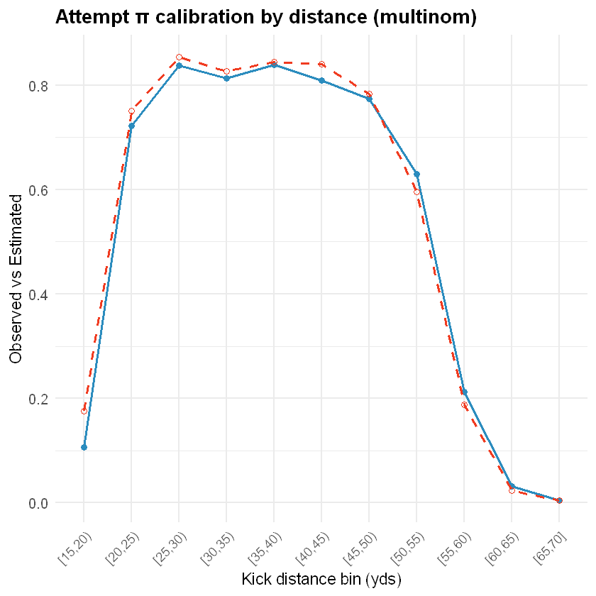{height="420"
width="420"}
:::

::: {.output .display_data}
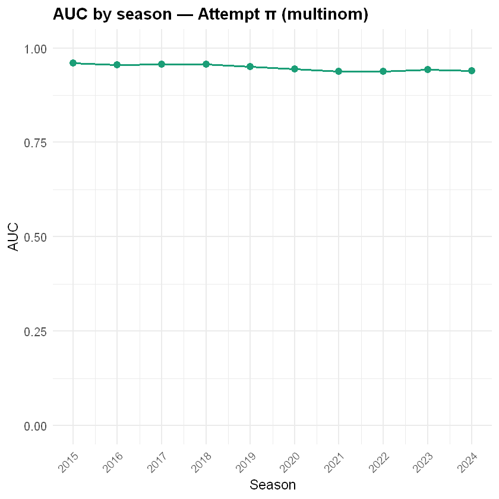{height="420"
width="420"}
:::
:::

::: {#39439974 .cell .code execution_count="29" vscode="{\"languageId\":\"r\"}"}
``` R
# ================== FINAL WEIGHT DIAGNOSTICS & EXPORT (using w_ipw_final) ==================
options(scipen = 999)

# Sanity: ensure final weights exist
stopifnot("w_ipw_final" %in% names(preds_oof))


# ---------- Helper: ESS ----------
ess <- function(w) {
  w <- w[is.finite(w)]
  if (!length(w)) return(NA_real_)
  (sum(w)^2) / sum(w^2)
}

# ---------- Overall & by-group summaries (final weights) ----------
summary_overall <- preds_oof %>%
  dplyr::summarise(
    n    = dplyr::n(),
    min  = min(w_ipw_final, na.rm = TRUE),
    mean = mean(w_ipw_final, na.rm = TRUE),
    sd   = sd(w_ipw_final,   na.rm = TRUE),
    p95  = quantile(w_ipw_final, 0.95, na.rm = TRUE),
    p99  = quantile(w_ipw_final, 0.99, na.rm = TRUE),
    max  = max(w_ipw_final,  na.rm = TRUE),
    ess  = ess(w_ipw_final),
    ess_frac = ess / n
  )

summary_byA <- preds_oof %>%
  dplyr::group_by(action_actual) %>%
  dplyr::summarise(
    n    = dplyr::n(),
    mean = mean(w_ipw_final, na.rm=TRUE),
    sd   = sd(w_ipw_final,   na.rm=TRUE),
    p99  = quantile(w_ipw_final, 0.99, na.rm=TRUE),
    max  = max(w_ipw_final,  na.rm=TRUE),
    ess  = ess(w_ipw_final),
    ess_frac = ess / n,
    .groups = "drop"
  )

summary_by_dist <- preds_oof %>%
  dplyr::mutate(
    dist_bin = cut(kick_distance, breaks = seq(15, 70, 5),
                   include.lowest = TRUE, right = FALSE)
  ) %>%
  dplyr::group_by(dist_bin) %>%
  dplyr::summarise(
    n    = dplyr::n(),
    ess  = ess(w_ipw_final),
    ess_frac = ess / n,
    p99  = quantile(w_ipw_final, 0.99, na.rm=TRUE),
    max  = max(w_ipw_final,  na.rm=TRUE),
    .groups = "drop"
  )

# ---------- Top-5 plays per season by final weight ----------
top5_by_season <- preds_oof %>%
  dplyr::arrange(season, dplyr::desc(w_ipw_final)) %>%
  dplyr::group_by(season) %>%
  dplyr::slice_head(n = 5) %>%
  dplyr::ungroup() %>%
  dplyr::select(
    season, game_id, play_id,
    action_actual, action_pred,
    score_differential, ydstogo, kick_distance, game_seconds_remaining,
    p_hat_multinom, w_ipw_final
  )

# ---------- Plots: distributions for final weights ----------
ensure_dir <- function(p) if (!dir.exists(p)) dir.create(p, recursive = TRUE, showWarnings = FALSE)
ensure_dir(reports_attempt_dir)
fig_dir <- file.path(reports_attempt_dir, "figs"); ensure_dir(fig_dir)

plot_df <- preds_oof %>% dplyr::select(action_actual, w_ipw_final)

# Histogram (final Hajek weights)
p_hist_final <- ggplot2::ggplot(plot_df, ggplot2::aes(x = w_ipw_final)) +
  ggplot2::geom_histogram(bins = 60, colour = "white") +
  ggplot2::facet_wrap(~ action_actual, scales = "free_x") +
  ggplot2::labs(title = "Final stabilized IPW (clip→3SD cap→re-Hájek)",
                x = "Final Hájek weight (mean≈1 per season)", y = "Count") +
  ggplot2::theme_minimal(base_size = 12)

# Density of log1p(final) for tail shape
p_dens_final <- ggplot2::ggplot(plot_df %>% dplyr::mutate(lw = log1p(w_ipw_final)),
                                ggplot2::aes(x = lw)) +
  ggplot2::geom_density(adjust = 1) +
  ggplot2::facet_wrap(~ action_actual, scales = "free") +
  ggplot2::labs(title = "log1p(Final Hájek weight) density",
                x = "log1p(weight)", y = "Density") +
  ggplot2::theme_minimal(base_size = 12)

ggplot2::ggsave(file.path(fig_dir, "weight_hist_final.png"),  p_hist_final,  width = 12, height = 6, dpi = 200)
ggplot2::ggsave(file.path(fig_dir, "weight_density_log1p_final.png"), p_dens_final, width = 12, height = 6, dpi = 200)

# ---------- Save outputs ----------
# 1) Save the updated preds_oof with final weights
readr::write_csv(preds_oof, file.path(reports_attempt_dir, "attempt_pi_oof_predictions_final.csv"))

# 2) Save summaries and top-5 table
readr::write_csv(summary_overall,  file.path(reports_attempt_dir, "attempt_ipw_final_overall.csv"))
readr::write_csv(summary_byA,      file.path(reports_attempt_dir, "attempt_ipw_final_byA.csv"))
readr::write_csv(summary_by_dist,  file.path(reports_attempt_dir, "attempt_ipw_final_by_dist.csv"))
readr::write_csv(top5_by_season,   file.path(reports_attempt_dir, "attempt_pi_top5_by_season.csv"))

# ---------- Return a compact list for interactive runs ----------
list(
  summary_overall = summary_overall,
  summary_byA     = summary_byA,
  summary_by_dist = summary_by_dist,
  top5_by_season  = top5_by_season
)
```

::: {.output .display_data}
$summary_overall
:   
A tibble: 1 × 9

| n &lt;int&gt; | min &lt;dbl&gt; | mean &lt;dbl&gt; | sd &lt;dbl&gt; | p95 &lt;dbl&gt; | p99 &lt;dbl&gt; | max &lt;dbl&gt; | ess &lt;dbl&gt; | ess_frac &lt;dbl&gt; |
|---|---|---|---|---|---|---|---|---|
| 20605 | 0.5884871 | 1 | 1.048831 | 2.574147 | 6.924129 | 8.552859 | 9811.934 | 0.4761919 |


$summary_byA
:   
A tibble: 3 × 8

| action_actual &lt;chr&gt; | n &lt;int&gt; | mean &lt;dbl&gt; | sd &lt;dbl&gt; | p99 &lt;dbl&gt; | max &lt;dbl&gt; | ess &lt;dbl&gt; | ess_frac &lt;dbl&gt; |
|---|---|---|---|---|---|---|---|
| FG        | 10624 | 0.9465039 | 0.8847243 | 6.666180 | 8.552859 | 5670.260 | 0.5337218 |
| go_for_it |  5053 | 1.4189856 | 1.5553810 | 7.910248 | 8.552859 | 2295.519 | 0.4542883 |
| punt      |  4928 | 0.6857160 | 0.3834118 | 2.110831 | 8.063326 | 3754.452 | 0.7618612 |


$summary_by_dist
:   
A tibble: 11 × 6

| dist_bin &lt;fct&gt; | n &lt;int&gt; | ess &lt;dbl&gt; | ess_frac &lt;dbl&gt; | p99 &lt;dbl&gt; | max &lt;dbl&gt; |
|---|---|---|---|---|---|
| [15,20) |  497 |  278.7287 | 0.5608224 | 4.9145074 | 7.912282 |
| [20,25) | 1477 |  755.6501 | 0.5116114 | 6.9241289 | 8.552859 |
| [25,30) | 1652 |  779.0558 | 0.4715834 | 6.9241289 | 8.552859 |
| [30,35) | 1824 |  871.7380 | 0.4779265 | 7.3801028 | 8.552859 |
| [35,40) | 1852 |  866.4357 | 0.4678378 | 7.1511865 | 8.552859 |
| [40,45) | 1923 |  864.0027 | 0.4492994 | 7.6232858 | 8.552859 |
| [45,50) | 2078 | 1017.5245 | 0.4896653 | 7.3875118 | 8.552859 |
| [50,55) | 2174 | 1357.6578 | 0.6244976 | 5.3672769 | 8.552859 |
| [55,60) | 2193 | 1022.2748 | 0.4661536 | 7.3875118 | 8.552859 |
| [60,65) | 2159 |  766.3539 | 0.3549578 | 7.7187449 | 8.552859 |
| [65,70] | 2776 | 1965.6422 | 0.7080844 | 0.6385009 | 8.173702 |


$top5_by_season
:   
A tibble: 50 × 11

| season &lt;dbl&gt; | game_id &lt;chr&gt; | play_id &lt;chr&gt; | action_actual &lt;chr&gt; | action_pred &lt;chr&gt; | score_differential &lt;dbl&gt; | ydstogo &lt;dbl&gt; | kick_distance &lt;dbl&gt; | game_seconds_remaining &lt;dbl&gt; | p_hat_multinom &lt;dbl&gt; | w_ipw_final &lt;dbl&gt; |
|---|---|---|---|---|---|---|---|---|---|---|
| 2015 | 2015_03_TB_HOU  | 1201 | FG | punt      |  -7 |  4 | 58 | 2480 | 0.058886076 | 7.912282 |
| 2015 | 2015_04_KC_CIN  | 3886 | FG | go_for_it | -18 |  7 | 51 |  159 | 0.035840171 | 7.912282 |
| 2015 | 2015_05_PIT_SD  | 1978 | FG | punt      |   4 |  3 | 60 | 1807 | 0.048567234 | 7.912282 |
| 2015 | 2015_05_STL_GB  | 3736 | FG | punt      | -11 |  7 | 63 |  208 | 0.007232974 | 7.912282 |
| 2015 | 2015_07_CLE_STL | 1969 | FG | punt      |   7 |  3 | 63 | 1809 | 0.016344480 | 7.912282 |
| 2016 | 2016_02_ATL_OAK | 2148 | FG | punt      |  -6 | 10 | 58 | 1802 | 0.086865395 | 7.387512 |
| 2016 | 2016_03_ARI_BUF | 4079 | FG | punt      | -17 | 24 | 60 |  641 | 0.007824888 | 7.387512 |
| 2016 | 2016_06_CLE_TEN | 2131 | FG | punt      |   1 |  3 | 58 | 1802 | 0.084830507 | 7.387512 |
| 2016 | 2016_06_DEN_SD  | 2818 | FG | punt      | -16 | 11 | 56 |  914 | 0.075031622 | 7.387512 |
| 2016 | 2016_09_DEN_OAK | 2359 | FG | go_for_it | -13 |  3 | 55 | 1802 | 0.072761473 | 7.387512 |
| 2017 | 2017_03_NO_CAR  | 2951 | FG | punt      |  14 |  3 | 56 |  542 | 0.058512749 | 8.552859 |
| 2017 | 2017_04_PIT_BAL | 2161 | FG | go_for_it | -19 |  4 | 62 | 1802 | 0.004518103 | 8.552859 |
| 2017 | 2017_06_MIA_ATL | 1805 | FG | punt      |  17 |  9 | 59 | 1802 | 0.051189614 | 8.552859 |
| 2017 | 2017_07_NO_GB   | 2123 | FG | punt      |   7 | 20 | 59 | 1806 | 0.021580016 | 8.552859 |
| 2017 | 2017_09_DEN_PHI | 1358 | FG | go_for_it | -14 |  2 | 53 | 2470 | 0.068785484 | 8.552859 |
| 2018 | 2018_05_OAK_LAC | 1951 | FG | go_for_it | -14 |  4 | 57 | 1811 | 0.051946914 | 6.924129 |
| 2018 | 2018_07_NYG_ATL | 3934 | FG | go_for_it |   8 |  3 | 56 |  120 | 0.069112939 | 6.924129 |
| 2018 | 2018_09_HOU_DEN | 1971 | FG | punt      |  -3 |  9 | 62 | 1822 | 0.061986638 | 6.924129 |
| 2018 | 2018_14_PHI_DAL | 1968 | FG | punt      |   3 | 11 | 62 | 1801 | 0.055047467 | 6.924129 |
| 2018 | 2018_16_BAL_LAC | 2113 | FG | punt      |   3 |  7 | 65 | 1803 | 0.005909155 | 6.924129 |
| 2019 | 2019_01_DEN_OAK | 1840 | FG | punt      | -14 | 20 | 64 | 1805 | 0.011073282 | 7.910248 |
| 2019 | 2019_01_PIT_NE  | 2369 | FG | go_for_it | -20 |  1 | 19 | 1519 | 0.076744427 | 7.910248 |
| 2019 | 2019_03_CIN_BUF | 2494 | FG | punt      |  14 | 10 | 62 | 1807 | 0.017443361 | 7.910248 |
| 2019 | 2019_04_TB_LA   | 2582 | FG | go_for_it | -14 |  1 | 58 | 1807 | 0.019280078 | 7.910248 |
| 2019 | 2019_05_NYJ_PHI | 1135 | FG | go_for_it | -14 |  3 | 55 | 2575 | 0.045061198 | 7.910248 |
| 2020 | 2020_01_HOU_KC  | 3852 | FG | go_for_it |  11 |  1 | 19 |   33 | 0.041286190 | 6.835626 |
| 2020 | 2020_01_NYJ_BUF | 4130 | FG | go_for_it |  14 |  1 | 19 |  198 | 0.073448909 | 6.835626 |
| 2020 | 2020_05_CIN_BAL | 2315 | FG | punt      |  17 | 10 | 61 | 1802 | 0.035629064 | 6.835626 |
| 2020 | 2020_07_CAR_NO  | 3610 | FG | punt      |  -3 | 19 | 65 |  120 | 0.027138197 | 6.835626 |
| 2020 | 2020_09_HOU_JAX | 2073 | FG | punt      |  -7 |  4 | 59 | 1803 | 0.058495282 | 6.835626 |
| 2021 | 2021_01_DAL_TB  | 2376 | FG | punt      |  -5 | 31 | 60 | 1820 | 0.041521973 | 7.718745 |
| 2021 | 2021_02_MIN_ARI | 2189 | FG | punt      |  -2 | 10 | 62 | 1801 | 0.072603058 | 7.718745 |
| 2021 | 2021_03_ARI_JAX | 1975 | FG | punt      |   0 | 10 | 68 | 1802 | 0.013289449 | 7.718745 |
| 2021 | 2021_05_MIA_TB  | 2232 | FG | punt      |  14 | 10 | 60 | 1805 | 0.051285911 | 7.718745 |
| 2021 | 2021_05_SF_ARI  | 1904 | FG | punt      |  10 | 22 | 61 | 1801 | 0.031441216 | 7.718745 |
| 2022 | 2022_01_DEN_SEA | 3884 | FG | go_for_it |  -1 |  5 | 64 |   20 | 0.081842428 | 7.416057 |
| 2022 | 2022_01_PIT_CIN | 465  | FG | punt      |  -7 | 17 | 59 | 3141 | 0.022699677 | 7.416057 |
| 2022 | 2022_05_LV_KC   | 2013 | FG | go_for_it | -13 |  3 | 59 | 1803 | 0.020835708 | 7.416057 |
| 2022 | 2022_06_BUF_KC  | 2348 | FG | go_for_it |  -3 |  1 | 62 | 1801 | 0.028928239 | 7.416057 |
| 2022 | 2022_08_BAL_TB  | 2102 | FG | punt      |  -7 | 10 | 61 | 1804 | 0.048049643 | 7.416057 |
| 2023 | 2023_02_BAL_CIN | 774  | FG | punt      |   7 | 10 | 59 | 2903 | 0.057446541 | 6.666180 |
| 2023 | 2023_02_MIN_PHI | 2019 | FG | punt      |   3 | 10 | 61 | 1804 | 0.066289486 | 6.666180 |
| 2023 | 2023_03_DAL_ARI | 2479 | FG | punt      |   8 |  8 | 62 | 1804 | 0.033006537 | 6.666180 |
| 2023 | 2023_03_NYG_SF  | 2039 | FG | go_for_it | -14 |  3 | 57 | 1818 | 0.037287371 | 6.666180 |
| 2023 | 2023_04_DET_GB  | 4040 | FG | go_for_it | -17 |  7 | 50 |  176 | 0.094414968 | 6.666180 |
| 2024 | 2024_03_BAL_DAL | 679  | FG | punt      |  -7 | 12 | 65 | 3098 | 0.004426056 | 8.173702 |
| 2024 | 2024_03_HOU_MIN | 3961 | FG | punt      |  24 |  5 | 58 |  288 | 0.044994105 | 8.173702 |
| 2024 | 2024_03_LAC_PIT | 1887 | FG | go_for_it |  -3 |  4 | 62 | 1806 | 0.070279855 | 8.173702 |
| 2024 | 2024_04_KC_LAC  | 2144 | FG | punt      |  -3 | 10 | 65 | 1804 | 0.032216366 | 8.173702 |
| 2024 | 2024_04_NE_SF   | 2112 | FG | punt      | -20 | 16 | 63 | 1803 | 0.025136140 | 8.173702 |
:::
:::
